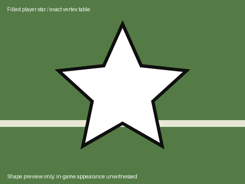

# Beta 65 job D — filled player star

Branch: `astra/b65-star`. Implementation commit: `9f0a9be2`;
proofs/pin/wiring commit: `0e9dc12a`.
No push, xemu, GUI display, audio, network, disc build or retail-file write.

## Delivered

The existing star option now draws a filled opaque white five-point star with
the same near-black edge. The ten perimeter points, white radius 108/notch 51,
dark scale 1.125, interpolated foot position, and heights 5/5.5 are unchanged.
The only generated-runtime change is the existing four-byte inset at
`0x31E650`: 0.58 becomes 0.0. All 456 generated bytes still fit the same five
474-byte pinned spans, including padding. No new cave, table, mutable state,
allocation, asset replacement or `.text` store was introduced.

Each 22-vertex strip now contains ten filled triangles, consistently wound
after triangle-strip parity, and ten zero-area triangles at the repeated
centre. The nondegenerate triangles tile the entire star polygon and share
exact endpoints. The separate white/dark heights preserve the earlier depth
separation; no coplanar backing or overlapping fill was added. The 128-byte
controller material is still copied to aligned stack storage, with only
diffuse, texture and culling bits changed. Both passes are opaque.

The existing `0x64F21` wrapper still runs retail circles first, visits at most
22 active entities, follows entity `+0x3C` to record `+0x53 bit 0`, and emits
one dark/white pair per eligible tagged entity. Untagged entities emit none.
HUD, initialization, coach camera and the preceding replay-camera branch are
preserved. Recorded replay packets still do not serialize the added stars.
All mode behavior is inherited; there is no new mode-specific hook.

`status()` retains its dispatcher-compatible names: `retail`, `legacy`,
`applied`, `foreign`. Exact beta-58–60 gate-only, thin-v1 and bold-v2 outline
installations are `legacy`; only the filled renderer is `applied`.
`read_settings()` identifies `gate_only`, `thin_v1`, `bold_contrast_v2`, or
`filled_contrast_v3`, reports `white_star_filled` for the new shape, and marks
older patches for upgrade. Modified/padded/foreign sites refuse before writes.
Both outline fixtures are original authored runtime bytes, not retail code.

Applying an outline upgrade through the real build dispatcher produces the
same bytes as installing Filled on retail, then becomes a no-op on repetition.
The bold-outline upgrade changes 23 bytes total: the nonzero inset bytes plus
the `.text` section digest. A retail install changes 481 bytes including its
digest; all changes stay inside declared sites and section digest fields.

| Recomputed value, retail plus this patch only | Digest |
| --- | --- |
| XBE SHA-256 | `b76cbde88ec2244fdc513f5c2befe51b6deaa41f18db619bc34560302cf50d5f` |
| `.text` section SHA-1 | `d5cd93d3d90b70715b6f5f8982d9b4a43b1e9c5e` |
| Exact geometry table SHA-256 | `048139c681671049ccf4802cdef45fe1eac19a2e22225214c59c96e053116130` |

Filled replaces Outline; no optional style switch. Existing ADVANCED feature
classification and presets stay Basic off / Advanced and Experimental on.
MyCareer creation/signing tag assignment is outside this job. The Rosters
column, tag bit, roster writer and retail controller graphics are unchanged.

## Preview and bounded proof



`tools/player_star/render_preview.py` reads the installed float table from
`CAVES` and rasterizes its exact strip triangles with Pillow. The 480x360 PNG
is an intended-shape preview, not an in-game screenshot or replacement texture.

`reports/gameplay_tuning/nfl2k5_star_filled_proof.json` records an offline probe
of the pinned retail disc, opened read-only. Vick, Crumpler and Finneran are
tagged **in proof memory only** using the existing roster writer; the actual
relocator and full-record copy execute on those real records. One real
untagged record joins the synthetic on-field lineup as a negative control.
The result is three filled white stars and three dark backings, no untagged
star, the same ordinary controlled-player model, and valid section digests.

PROVED: actual CPU execution of the queue, decoder, model-selection routine,
tag walk, material copy, position/vertex arithmetic, inline vertex submission
and flush. The fixture protects the entire `.text` section against runtime
writes and verifies stack and nonvolatile-register preservation. It now also
executes the retail replay-camera branch before the frame hook (predicate
stubbed), records each submitted entity, and checks material alignment and
world-space calling convention.

The tests exercise mode words 0–8 with zero, one and two controlled players,
all 22 tagged slots, other tag bits, inactive/null records and bodies, HUD off,
coach visibility, replay-camera skipping, shared material preservation, and
corrupt-cycle termination at 22 visits. This is a CPU-state matrix, not nine
played modes. Maximum visible work remains 44 strips / 968 vertices for 22
tagged players. No measured frame-time claim is made.

UNWITNESSED: GPU setup/binding and final rasterization, clipping/depth on real
turf, camera-distance readability, actual practice/franchise/replay sessions,
and frame-time impact. GPU/services/model allocation and replay recording are
bounded stubs. The earlier outline witness does not witness this filled pass.

## Cave and integration evidence

The new full explicit scan decoded 1,627,635 instructions/data items and found
no external reference into any selected byte and no other owner's overlap.
The bounded oracle again reports `unknown` for all five existing spans:
250,000 instructions, 2,782,776 references, 176,300 unresolved observations,
instruction budget exhausted. Only this writer's existing reservation is
excluded from its query; all other ownership and retail reachability evidence
remains. This is not a certificate of freedom for indirect/computed paths.
See `tools/player_star/AUDIT.md` and
`reports/gameplay_tuning/nfl2k5_star_filled_cave_audit.json`.

The protected release manifest still pins the beta-64 star source. Its
default source guard correctly rejects the new fingerprint; Claude must
regenerate it from the integrated tree. The test-only helper verifies the
parent beta-64 source, observes the actual filled writer and checks the full
unchanged reservation coverage. It retains all parent reservations and marks
parent disc evidence historical. It neither writes a release manifest nor
pretends a new disc build occurred.

`WIRING.md` supplies the protected Build-panel wording replacement, the
complete existing-option capability row and its tiny copy-only CLI binding,
and the manifest regeneration requirement. The product build already uses
Filled through the existing dispatcher. No new BuildPlan field or allowlist
entry is needed. The full registry's existing file validation first fails on
missing `docs/research/apf_audio.md`; the merged 140-row structure and every
new star-row local path/command-module reference validate separately. The
new registry row and CLI command require Claude's integration and are not
claimed installed here.

## Commands and results

All tests were run as standalone Python scripts against read-only retail
inputs. The six successful suites below ran 606 tests with no skips.

```sh
python3 tools/player_star/build_runtime.py --check
QT_QPA_PLATFORM=offscreen python3 tests/mod_editor/test_nfl2k5_player_star.py
python3 tests/mod_editor/test_nfl2k5_player_star_draw.py
python3 tests/mod_editor/test_xbe_patch_memory_writes.py
python3 tests/mod_editor/test_xbe_patch_cave_references.py
python3 tests/mod_editor/test_nfl2k5_owner_pairwise_composition.py
python3 tools/player_star/audit.py --oracle --output reports/gameplay_tuning/nfl2k5_star_filled_cave_audit.json
python3 tests/mod_editor/test_nfl2k5_cave_oracle.py
python3 tools/player_star/refresh_gate_manifest.py --output .scratch/star-filled-manifest.json
NFL2K5_CAVE_MANIFEST=.scratch/star-filled-manifest.json python3 tests/mod_editor/test_nfl2k5_cave_oracle.py
python3 tools/player_star/probe.py '/media/noah/Storage/for codex 1.0/ESPN NFL 2K5 (USA).xiso.iso' --tags 88 96 100 --json reports/gameplay_tuning/nfl2k5_star_filled_proof.json
python3 tools/player_star/render_preview.py
python3 packaging/repin.py --apply
git diff --check
```

The probe refuses an existing output JSON; choose a fresh proof filename on
rerun. No `--output-image` was used. The manifest scratch file is not shipped.

- Assembly: `Star runtime is reproducible.`
- Star roster/UI suite: `Ran 14 tests in 2.249s — OK`, no skips.
- Draw/upgrade/composition suite: `Ran 19 tests in 223.532s — OK`, no skips.
  Includes this filled writer paired with all 25 integration owners in both
  orders, plus the earlier actual gameplay stack composition.
- XBE memory-write gate: `Ran 111 tests in 1284.550s — OK`, no skips.
- XBE cave-reference gate: `Ran 123 tests in 1447.733s — OK`, no skips.
- Full owner pairwise suite: `Ran 310 tests in 1915.430s — OK`, no skips.
- Default oracle suite: `Ran 29 tests in 355.691s — FAILED (errors=2)`.
  Both errors are `stale reservation source: mod_editor/core/nfl2k5_player_star.py;
  regenerate manifest`; they are not reachability or ownership failures.
- Oracle with observed scratch manifest: `Ran 29 tests in 350.021s — OK`,
  no skips. All reservations retained; parent resource-build evidence is
  historical, not a newly executed disc build.
- Audit: no external explicit references or other-owner overlap; all five
  bounded oracle queries `unknown`, with the limitations above.
- Probe: `source_status=retail`, `fixed_status=applied`, `filled_stars=3`,
  `contrast_backings=3`, `copy=null`.
- Repin: `applied 1 pin update(s)` in `mod_editor/core/providers.py` only.
- Final `git diff --check`: passed. The disposable manifest and its receipt
  were removed after verification; the helper can reproduce them on this branch.

## Noah's witness

Tag a player in **Rosters**, enable **Show a star under selected players** in
Build & Share, and build. Boot that output fresh. Look at his feet in a game
and in practice, while he is both controlled and CPU-controlled. The entire
centre should be white and the five points should keep the dark edge across
bright turf and yard lines. Check motion, both field directions, substitutions,
and that the ordinary colored circle still follows controller selection.

Turn HUD off and verify the star hides with the indicators. Check coach
camera and replay transitions: the existing replay-camera exclusion and
absence from serialized replay packets should remain. Check a new franchise
using the tagged roster; existing saves need their own tags. Watch for gaps,
flicker, floating height, stale stars or noticeable frame-time changes.

The MyCareer runtime session owns automatically tagging the created/signed
MyPlayer. Once it sets the same record bit, this renderer handles that player
like every other tagged player.
