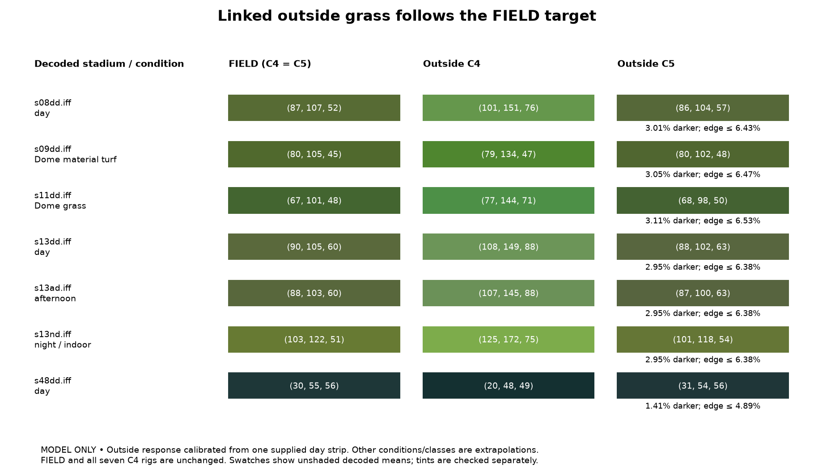

# Beta 71 C5: outside grass follows the field

**PROVED offline:** final pins, decoder read-back, every grass-bearing bundle under all seven rigs, colour suites, page tests, strict registry validation and provider repin pass. Field resources and all seven C4 rigs remain exact. Final in-game appearance is **UNWITNESSED**.

## Delivery

- Base: `astra/b71-c4-day-afternoon`, `5eac51c7b2986bad2f2971135333de7cc82675fe`. Branch: `astra/b71-c5-sidelines`. Incremental bundle: `.scratch/astra-b71-c5.bundle`, requiring that base. No push.
- Commits live in `.scratch/astra-c5.git`, with read-only object alternates to the shared repository. This keeps all Git writes inside the authorized worktree; the shared linked-worktree HEAD remains at the base. Use the bundle for integration. Original C4 reports and inherited wiring are archived in `reports/b71_c5/INHERITED_*`.
- The RC96 bullet contains no reporter names. Option remains EXPERIMENTAL and Off in every preset. No scorebug, widescreen, build-dispatcher, rig, executable-code or reservation change. No emulator, GUI display, audio or network was opened. No disc was built or retail payload saved.

## Implementation

The former outside rule could only raise palette value toward the field-map mean. It shared FIELD slider values while retaining a different drawn response and separate coloured vertex tints. C5 instead derives an outside map from each decoded FIELD mean (or its material +0x18 word) using a separately calibrated outside response. The inverse cancels the per-condition light gain and FIELD screen factor, so the same map follows every rig without adding preview conditions to cache identity.

At full linked match, the target is 0.97 × FIELD map / outside response, with an 8% blend toward neutral map chroma to absorb quantization. Texture value variation remains. Outside vertex RGB becomes neutral with shade at least 246/255; alpha, indices, mip layout, geometry and all other surfaces keep their C4 data. Every separate outside material +0x14/+0x18 word in the inventory is already neutral white and is preserved. The bluer-green s48/s50/s51 palettes are included through hue 180; FIELD grading itself keeps its old cutoff and bytes.

The Colour & lighting page now shows its own outside swatch against the current FIELD prediction. Linked controls follow FIELD; unlinking restores the independently saved hue, saturation and brightness. The match blend applies only while linked. Retail/reset, master Off, project persistence and custom refit receipts are tested. The transform revision participates in the settings digest, so an old baked-grade receipt cannot silently reuse C4 bytes; rebuild from original retail.

## Predictions before and after

The outside calibration uses the supplied disc g day strip (101,151,76), V 0.592, H 100°, and independently decoded C4 s08dd outside mean (175.8333,218.8282,85.7385). This does not change FIELD calibration. The outside response ratios are (1.173736, 1.414872, 1.487325). Night, dome, afternoon and other outside conditions extrapolate this single surface calibration. No shader/render equivalence is claimed.

Table RGB values are rounded decoded-mean predictions, not the median references used by C4’s UI. FIELD is identical before and after. V and S use fractional predictions; both fractional and rounded RGB bounds also pass.

| Bundle / condition | FIELD C4 = C5 | Outside C4 | Outside C5 | FIELD V / S | C5 outside V / S | Darker, unshaded / darkest vertex |
|---|---|---|---|---|---|---|
| s08dd.iff / day | (87, 107, 52) | (101, 151, 76) | (86, 104, 57) | 0.419 / 0.510 | 0.407 / 0.452 | 3.01% / 6.43% |
| s09dd.iff / dome material turf | (80, 105, 45) | (79, 134, 47) | (80, 102, 48) | 0.413 / 0.571 | 0.401 / 0.533 | 3.05% / 6.47% |
| s11dd.iff / dome grass | (67, 101, 48) | (77, 144, 71) | (68, 98, 50) | 0.398 / 0.524 | 0.386 / 0.490 | 3.11% / 6.53% |
| s13dd.iff / day | (90, 105, 60) | (108, 149, 88) | (88, 102, 63) | 0.414 / 0.433 | 0.401 / 0.381 | 2.95% / 6.38% |
| s13ad.iff / afternoon | (88, 103, 60) | (107, 145, 88) | (87, 100, 63) | 0.402 / 0.417 | 0.391 / 0.363 | 2.95% / 6.38% |
| s13nd.iff / night_indoor | (103, 122, 51) | (125, 172, 75) | (101, 118, 54) | 0.478 / 0.582 | 0.464 / 0.543 | 2.95% / 6.38% |
| s48dd.iff / day | (30, 55, 56) | (20, 48, 49) | (31, 54, 56) | 0.221 / 0.474 | 0.218 / 0.445 | 1.41% / 4.89% |



Across 381 grass-bearing bundles × seven rigs, the unshaded outside mean is 1.397% to 3.122% darker. Including every outside vertex tint, the largest drop is 6.541%. No fractional or rounded prediction is brighter or more saturated than FIELD. The 96 remaining bundles have no green outside entries and remain C4-exact; their names are recorded in the decoder proof. These are mean-colour bounds, not guarantees for every grass blade, texture texel or rendered pixel.

## Decoder, pins and scope

All 477 complete bundle records and seven rig records reproduce. 381 bundle hashes change, solely within the compressed field-scene resource. The independently decoded C4/C5 difference is restricted to outside palette RGB and outside vertex RGB in every bundle. The normal, divots and shared Fldd tint sites are exact C4; wrappers, span lengths and decoded sizes are preserved; no default field refit is unfit. Seven representative C4 bundles are also rebuilt against their old pins for before/after swatches.

`reports/b71_c5/all-decoder-proof.json` contains per-bundle decoded means, tints, seven-condition predictions, changed-byte counts and hashes. `delivery-scope.json` checks every pin record and unchanged rig functions/constants. The complete applied XBE equals C4 byte-for-byte, and replay is exact. **No rig changed, so the two detached XBE gates were not rerun.** The inherited release cave manifest still needs normal integration fingerprint regeneration; no reservation changes are requested.

Final colour-pins file SHA-256: `244dc1edd173de8acf2f6cafbfacaa5b7a09d5abc1bda277201369dd28262c15`. Final owner SHA-256: `2b053c0cd12c084f8533879a76fe5e55ea643a5fa3ca72025f60dd4b903e5bdb`.

## Completed checks

| Check | Result | Seconds |
|---|---|---:|
| [final_decoder_and_pins](reports/b71_c5/final_decoder_and_pins.log) | PASS | 911.297 |
| [all_default_pins_final](reports/b71_c5/all_default_pins_final.log) | PASS | 290.928 |
| [colour_legacy_release](reports/b71_c5/colour_legacy_release.log) | PASS (10 tests) | 7.051 |
| [colour_controls_release](reports/b71_c5/colour_controls_release.log) | PASS (11 tests) | 31.714 |
| [colour_gui_release](reports/b71_c5/colour_gui_release.log) | PASS (6 tests) | 3.109 |
| [build_panel](reports/b71_c5/build_panel.log) | PASS (13 tests) | 3.223 |
| [build_settings](reports/b71_c5/build_settings.log) | PASS (17 tests) | 2.241 |
| [mod_build](reports/b71_c5/mod_build.log) | PASS (13 tests) | 2.915 |
| [providers](reports/b71_c5/providers.log) | PASS (33 tests) | 3.749 |
| [provider_integrity](reports/b71_c5/provider_integrity.log) | PASS (8 tests) | 10.048 |
| [phase1_packaging](reports/b71_c5/phase1_packaging.log) | PASS (23 tests) | 3.313 |
| [registry_final](reports/b71_c5/registry_final.log) | PASS | 0.147 |
| [registry_projected](reports/b71_c5/registry_projected.log) | PASS | 0.244 |
| [builder_source_final](reports/b71_c5/builder_source_final.log) | PASS | 0.032 |
| [scope_audit](reports/b71_c5/scope_audit.log) | PASS | 0.186 |
| [repin_final](reports/b71_c5/repin_final.log) | PASS | 21.2 |
| [repin_handoff](reports/b71_c5/repin_handoff.log) | PASS | 9.942 |
| [swatches](reports/b71_c5/swatches.log) | PASS | 1.366 |

Exact commands, UTC times, exit codes and complete output links are in [CHECKS.md](reports/b71_c5/CHECKS.md). Every touched test file ran standalone. The final all-default-pins verifier independently recompresses the retail inventory after the final pin rebuild.

### Earlier attempts

- The first controls run found tuple/list receipt round-trip inequality and insufficient saturation margin after RGB rounding. Receipts now store JSON lists; the model checks both fractional and rounded colour, including dim alternate rigs and edge shades.
- Inventory preflight exposed outside snow without green entries, then blue-green grass outside the old hue cutoff. Snow-white surfaces retain C4 data. The named outside material now includes blue-green hues; FIELD target measurement includes them while its grading stays exact. Final full-inventory proofs pass.
- Strict registry initially lacked the inherited `docs/research/apf_audio.md` evidence. The same C3/C4 metadata inventory was hydrated as real local copies (75 documents, no retail payloads), excluded from commits. Strict validation now passes. Intermediate pin runs are retained only as superseded evidence.

## Prepared test-disc builder

`reports/b71_c5/build_testdisc71.py` follows the A5/C4 builder pattern. It was AST-checked and compiled, **never imported or executed**, including plan-only mode.

- Name: **NFL 2K5 MOD TEST 2026-09-15k (sidelines + day tuning + scorebug v2 + widescreen)**.
- Advanced preset `softdrink_advanced`; `scorebug=True`, `scorebug_runtime=True`, `modern_color=True`, `widescreen=True`.
- Original retail xiso source; outputs under `/home/noah/2K5 Mod Studio Builds`. Existing named outputs are refused. Access is checked before pruning oldest test ISOs to leave room for at most three; every `.2k5patch` archive is preserved and checked.
- Reads back scorebug resources/runtime, modern-colour XBE and all 477 bundle pins, all seven rigs, immutable night pin and widescreen 16:9. Exports the patch and retains the colour recipe sidecar. Incomplete disc output is cleaned up; a verified disc survives patch-export failure.

Integrator command (not run here):

```sh
PYTHONPATH=. QT_QPA_PLATFORM=offscreen python3 -u reports/b71_c5/build_testdisc71.py
```

## Integration and witness

`WIRING.md` supplies four exact prose replacements for the protected existing registry row; no functional wiring or new capability rows are needed. Both the unchanged registry and the proposed metadata projection validate strictly. Apply that prose and regenerate the inherited cave-manifest fingerprints during integration.

In-game witness still needed: compare FIELD, both sidelines and grass behind both end zones in day, afternoon, night and dome games at matched camera, weather and resolution. Include Denver, Arrowhead, Indianapolis, Detroit material turf and a blue-green stadium variant. Check texture detail and transitions at boundary lines, then confirm unlinked custom outside colour. The supplied day sample calibrates a prediction; it does not prove final appearance, far-field shading, weather response or other shader/display effects.
