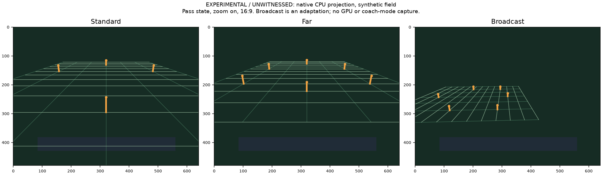

# Camera v5: selectable Broadcast sideline view

2026-09-08. **EXPERIMENTAL / UNWITNESSED.** No game boot, display, audio,
network access, disc build or whole archive read was used.

## Result and boundary

Camera v5 adds **Broadcast** after Custom in the existing in-game Camera
options. Selecting it leaves Coach Mode and player control assignments
unchanged in bounded native instruction fixtures. Standard remains the v4
startup/game-entry default, Far keeps its v4 framing, and both MyCareer
implementations compose with the new session choice. No Build switch or
preset policy changed.

**The exact coach-toggle television shot sequence is not proved.** The new
row uses a following adaptation of a proved retail sideline descriptor. The
retail TV row contains multiple descriptor types, inherited eye positions and
separate scripted shots; exposing those pointers verbatim does not initialize
a reliable ordinary gameplay view. This report closes the selectable sideline
implementation and records the remaining part of the brief's research goal
without claiming an exact coach-mode camera unlock or played acceptance.

The implementation is in `mod_editor/core/nfl2k5_camera.py`, version 5.
`WIRING.md` supplies the protected UI/comment/manifest handoff. Existing
dispatcher and BuildPlan plumbing already consume this owner's request tuple.

## Evidence and inputs

The only game executable read was the 11,948,032-byte USA `default.xbe` at
the brief's extracted path, SHA-256:

```text
73105b17a3161c546fea792a1c84ce37f9966a67c416f474cdbfab74b911a4a9
```

Research used the read-only function ledger/pseudo-C corpus, checked against
Capstone disassembly and bounded Unicorn execution of this executable. Corpus
function names are address labels, not recovered source symbols. Earlier
camera/Far/v2 reports, the RC86 changelog, allocator scale-out, MyCareer and
integration reports supplied the prior behavior and constraints. Historical
retail camera-options inspection remains a retail-only six-choice map.

Committed receipts:

- [Projection JSON](docs/mod_editor/nfl2k5_camera_broadcast_proof.v5.json): 156 native projection
  cases, exact patch receipt, native evidence bytes/hashes, false runtime and
  exact-coach-director claims.
- [Projection PNG](docs/mod_editor/nfl2k5_camera_broadcast_projection.v5.png): native CPU
  projection of a synthetic field, Standard/Far/Broadcast comparison. It is
  explicitly labelled as a schematic, not a GPU or gameplay capture.
- [Public context fixture](tests/fixtures/nfl2k5_camera_context.v5.json): small pinned menu/setup
  contexts for the public synthetic executable fixture.

## PROVED: Coach Mode, camera selection and control are separate

| Native span | Established behavior |
| --- | --- |
| `501D78`, callbacks `149320/149340/149360` | Coach Mode menu toggles/reads `E6002C`. The toggle does not select a camera row. |
| `63810` | Effective Coach Mode reads that flag, excluding modes 0/3 and First Person. It has no camera-row input. |
| `156870`, refresh `156A60 -> 1569C0` | Effective Coach Mode clears body-control bindings and five control fields. Controller team assignments at `E5FE88 + port*28` survive. Native fixtures verify this for Standard, Far and Broadcast, with Coach Mode both off and on. |
| `18FBE0` | A separate coach-command route is gated by the effective Coach Mode query. It does not test camera row 7. This is not a complete semantic map of every play-call command. |
| `A5B20` | Ordinary rows 0..5 and 7 set active/pending camera rows. Entering/leaving row 6 has separate First Person coach/audio/pivot side effects. |
| `A5490` | Native session/spectator selection is separate from body binding. v4's existing `A54C3` marker keeps the session choice; v5 preserves it. |
| `27AEB0`, `27AF00`, `27B400` | Native session restore and explicit row-7 fallback exist. The latter is reached from the zero-connected-assigned-controller path (`ED960/ED510`), not direct proof of the coach-toggle workaround. |

The menu test executes the actual enum, session setter `2C6960`, and active
row setter. Only scene-dependent frame/preview calls are seams in that census.
For both directions, all seven choices and both Coach Mode flag values, it
checks the full 736-byte settings block, all 224 controller-team bytes, a
write hook on the Coach Mode flag, balanced stack and native return value.
Only the selected camera setting changes. The separate control-binding test
executes the real binding function with a bounded actor/control chain; its
second-pass replacement-actor lookup is the explicitly empty seam.

PROVED is limited to these native boundaries. Human team ownership remaining
assigned supports independent play calling, but every live play-call, audible,
timeout, multiplayer and controller path still requires Noah's witness.

## PROVED: the native TV row is not one self-contained gameplay record

The engine table at `4F03F8` contains eight rows of 29 `(flags, descriptor*)`
entries. Row 7's native gameplay recipients include:

| State | Native descriptor | Type / inherited-eye flag | Relevant native values |
| --- | --- | --- | --- |
| 1 | `A88500` | 1 / 0 | Presentation setup `A4610` |
| 8 | `A87FB0` | 0 / 0 | Eye `(5250,1650,200)`, lens 80 |
| 9 | `A880A0` | 1 / 0 | Framing word 500, eye `(0,300,-5000)` |
| 10, 14 | `A88050` | 1 / 0 | Framing word 1000, eye `(0,350,-5500)` |
| 11 | `A88000` | 0 / 0 | Eye `(5250,1650,200)`, lens 180 |
| 12 | `A884B0` | 2 / 0 | Lens 35, eye offset `(0,1750,-4500)` |
| 13 | `A880F0` | 1 / 1 | Framing word 2000, inherited eye |
| 15 | `A88280` | 1 / 1 | Framing word 800, inherited eye |
| 16 | `A88230` | 1 / 1 | Framing word 360, inherited eye |
| 17 | `A88140` | 0 / 1 | Lens 120, inherited eye |
| 18 | `A88190` | 1 / 1 | Framing word 2000, inherited eye |
| 19 | `A881E0` | 0 / 0 | Lens 120, eye `(5250,1650,200)`, setup `A40C0` |

The native copier `60090` preserves the previous descriptor eye at +0x30
when flag +0x04 is 1. The test supplies two different prior eyes to raw state
16 and obtains two different copied eyes. The new record initializes the
same explicit offset in both cases. A raw row-7 unlock would inherit whichever
view preceded it at that boundary.

In the native solver `5F760`, types 0/1 use absolute-world eye coordinates;
type 2 adds focus and target offsets. For type 1, the +0x20 word is a framing
denominator in native lens calculation, not a field-of-view angle. Describing
all TV +0x20 values as lens degrees would be incorrect.

Separate native scripted shots also exist: command 14's branch `A5FAC`
sets the mount around `(random sign * 5000,1800,focus.z)`, and command 22 sets
the same x/y with z=0. They use the separate mutable descriptor `A89770`.
**HYPOTHESIS:** this director and the inherited-eye records participate in the
specific coach-on/off view the expert described. The script dispatch inputs,
entire coach transition chain, shot choice and subsequent live updates are
not closed. No assertion equates command 14, row 7 or `A881E0` alone with
that exact observed workaround.

## Implemented adaptation and menu

The immutable owned record clones the complete 80 bytes at `A881E0`, changing
only two dwords: type at +0x00 from 0 to 2, and lens at +0x20 from 120 to 24.
The eye offset `(5250,1650,200)` cm, target `(0,0,0)`, flag 0, lag pointer
`4F0380`, setup callback `A40C0`, no frame callback, padding and other fields
remain exact. The setup caps target height at 100 cm; the authored target is 0.
Native following math supplies a sideline view that can initialize without a
preceding scripted shot.

States **1 and 8..19** of engine row 7 point to this record. All 13 original
table transition flags remain unchanged. All remaining 219 table entries and
all shared original TV records stay unchanged. The existing Standard/Far
descriptor edits, pass zoom, live growth limits and v4 first 64 wrapper bytes
remain unchanged. Broadcast's constant lens does not use the Standard/Far
optional pass zoom callbacks; both pass-zoom setting values have the same
Broadcast result in these fixtures. Pivot behavior is not separately added.

The active Camera enum row is `52B700`, linked by the Camera submenu through
`5036C8 -> 52B8A0`. Its native label table at `4F25BC` has the six ordinary
choices followed by First Person and Broadcast labels. Adjacency is not proof
of a retail seventh option: v5 explicitly changes the menu callbacks and
authors valid engine row-7 gameplay pointers.

| Edit | Behavior |
| --- | --- |
| `2C66A0` | Maximum enum index 5 becomes 7. |
| `2C66D5` | Native inclusive label-width bound includes Broadcast. The skipped First Person label may also contribute width. |
| `2C6B00` | Next: `0 -> 1 -> 2 -> 3 -> 4 -> 5 -> 7 -> 0`. |
| `2C6B40` | Previous reverses that cycle; neither callback enters 6. |

The wrappers return to native store/setter tails `2C6B0D` and `2C6B50`.
Label lookup, inclusive width walking, actual preview matrix construction,
snapshot and Cancel restoring Broadcast all execute in fixtures. Invalid
starting settings 6, 8 and `FFFFFFFF` normalize to a valid menu choice when
cycled. Existing fresh/saved settings and game-entry policy resets to Standard.

The shared submenu's callbacks and preview are proved. No independent
pause-only camera cycle was identified; a full live pause-menu navigation
chain has not been executed. The patch changes these shared callbacks only.
The existing native lookup test now checks all 87 Standard/Far/Broadcast
table recipients in each aspect, and executes the copier for their gameplay
records. Standard/Far's existing 480-case geometry proof also remains green.

## Allocation, refusal and composition

`REQUESTS` contains 160 RX and 80 RO bytes, both aligned to 16. Compared with
v4 that is +96 RX, +80 RO, **zero additional RW**. There is no retail cave,
runtime variable in `.text`, or allocator page-count change. In the complete
test union the camera children are `14DA830..14DA8D0` RX and
`1507800..1507850` RO. Addresses are derived from each sealed union, not fixed
in the writer. The grown XBE remains 12,300,288 bytes.

The complete union's allocator plan leaves 54,576 allocatable RX bytes,
4,096 allocatable RW bytes and 8,024 general RO bytes. The budget fixture is
updated only for this owner; unrelated planned rows remain unchanged.

`status` accepts exact retail or exact v5 bytes. Partial installs, altered
hooks/labels/menu bounds/context, modified record words, resealed forged RO
content, a missing union owner and old 64-byte v4 allocations refuse. Apply
checks before either install writer and is idempotent. Section digests and
allocator content seals are repinned by existing helpers. Receipts include
both named allocations, all 45 edits, version 5, seven menu indices,
`coach_mode_changed=false`, `runtime_witnessed=false` and
`exact_coach_director_proved=false`.

The complete request union and manifest builder already import camera's
requests in their owner lists. Both XBE gates now explicitly check the new
record/allocation. The pairwise matrix adds camera v5 against all 15 existing
partners, including both mutually exclusive MyCareer implementations, in both
orders with exact output/replay/status comparisons. Legacy MyCareer executes
its configured session-camera test; current MyCareer additionally executes
on-field player binding and the actual player-focus wrapper for home and away
with all seven camera choices. Neither MyCareer module was edited.

The new pure-XBE manifest run initially rejected unattributed raw byte
`B2319` (VA `C2319`). This was the existing anniversary roster repair: its
adapter captured `apply_xbe` before the observer wrapped the module function.
The test harness now wraps that alias through the same real function, with
no changed writer output or ownership exemption. The observed manifest then
passed its coverage, source-hash, ownership and allocator checks. The protected
release manifest remains untouched and must be regenerated by Claude.
The general oracle suite now separates resource-build evidence from mandatory
XBE ownership checks. Its resource-only test explicitly skips for this selected
observed XBE-only manifest; normal release manifests still require the
scorebug/runtime and season resource-build steps. No resource steps were
invented to satisfy the test.

## Verification

All commands run from this worktree. Tests are standalone unittest files;
native evidence tests skip precisely when the pinned executable or required
instruction libraries are absent. Every measured process stays below 2 GiB.

Each command below is `/usr/bin/time -v python3 tests/mod_editor/<file>`
(including the listed arguments). Rows marked **scratch** use
`NFL2K5_CAVE_MANIFEST=.scratch/broadcast-cam/observed-xbe-manifest.json`.
The Guardian observer uses
`NFL2K5_GUARDIAN_MANIFEST_OUTPUT=.scratch/broadcast-cam/observed-xbe-manifest.json`.
The existing camera-inspection suite additionally uses `PYTHONPATH=.`; its
unmodified standalone import otherwise cannot find `mod_editor`.

| File and arguments | Manifest | Tests | Result | Seconds | Peak KiB |
| --- | --- | ---: | --- | ---: | ---: |
| `test_nfl2k5_camera_broadcast.py` | n/a | 8 | OK | 63.816 | 344,772 |
| `test_nfl2k5_camera_far.py` | scratch | 16 | OK | 137.639 | 775,012 |
| `test_nfl2k5_owner_pairwise_composition.py -k camera_v5` | n/a | 15 | OK | 193.285 | 131,176 |
| `test_xbe_patch_memory_writes.py` | scratch | 95 | OK | 1697.635 | 341,588 |
| `test_xbe_patch_cave_references.py` | scratch | 107 | OK | 1978.141 | 522,280 |
| `test_nfl2k5_cave_oracle.py` | scratch | 29 | OK (skipped=1) | 439.269 | 909,516 |
| `test_nfl2k5_my_career_manifest.py` | scratch | 3 | OK | 7.727 | 135,556 |
| `test_nfl2k5_screen_hooks_manifest.py` | scratch | 3 | OK | 5.485 | 128,476 |
| `test_nfl2k5_defensive_try_manifest.py` | scratch | 3 | OK | 6.765 | 154,176 |
| `test_nfl2k5_music_playlist_manifest.py` | scratch | 2 | OK | 6.544 | 131,596 |
| `test_nfl2k5_widescreen_polish.py` | n/a | 13 | OK | 10.945 | 342,696 |
| `test_camera_inspection.py` | n/a | 17 | OK | 0.008 | 28,928 |
| `test_nfl2k5_guardian_manifest.py` | n/a | 1 | OK | 230.904 | 237,836 |

Total: **312 tests**, with one explicit resource-evidence skip;
largest measured process **909,516 KiB**, below 2 GiB.
Both complete XBE gates cover normal/reverse installation and their explicit
scale-out variants, including exact order equivalence. Source/section digests,
all 276 observed-manifest source fingerprints, the provider camera pin, Python
source parsing, `git diff --check` and the protected-file diff audit also pass.
The PNG/JSON generation used 288,796 KiB peak RSS. No XBE/disc build output is
retained; scratch consists of small research notes, logs and the manifest.

The projection command is:

```sh
python3 tools/nfl2k5_camera_broadcast_proof.py --json docs/mod_editor/nfl2k5_camera_broadcast_proof.v5.json --png docs/mod_editor/nfl2k5_camera_broadcast_projection.v5.png
```

It passes 13 states x 2 field directions x 2 pass-zoom choices x 3 aspects =
**156 cases**. At settled synthetic focus, the eye is `(5250,1650,+/-200)` cm,
distance 5506.814 cm, downward pitch 17.435309 degrees, native lens word 24,
native lens scale 1.33333337, vertical FOV 65.606093 degrees. Pitch computation
now includes both horizontal axes; Standard/Far have x=0 and are unaffected.

Seven synthetic samples cover focus, 700 cm behind it, both flats at x +/-1600
and z 500, both deeper receivers at z 2500, and deep middle at z 4000, with
receiver height 175 cm. All are inside the 640x480 projection and above the
bottom scorebar safe boundary y=381:

| Aspect | Sample x range | Sample y range |
| --- | --- | --- |
| 4:3 | 34.465..605.535 | 205.751..273.045 |
| 16:9 | 79.079..560.921 | 205.751..273.045 |
| 16:10 | 52.310..587.690 | 205.751..273.045 |



The initial lens 28 experiment put deep middle outside 4:3 (x=-13.125).
Lens 24 fixes that measured case. The figure was generated and visually
inspected. This is projection of explicit synthetic inputs, not a universal
claim about live receivers, stadium obstruction, ball tracking or culling.

## Noah's witness list and known gaps

1. In a rebuilt v5 image, enter Options / Camera. Verify Broadcast after
   Custom, both wrap directions, label fit and preview, no First Person entry,
   Cancel restoring the previous choice, and the same behavior from pause.
2. Start Exhibition, Practice and Franchise. Verify Standard starts as before;
   select Far and compare v4 framing; select Broadcast during the session.
   Enter another game and reload settings to verify the documented Standard
   reset. Check camera choice across replay and temporary menus.
3. With Coach Mode off throughout, run, pass, tackle and switch defenders in
   Broadcast. Check play calling, audibles, timeouts, controller team selection
   and two-player play. Repeat with Coach Mode on to confirm only its existing
   auto-control behavior changes; the camera option must not toggle it.
4. Exercise pre-snap, pass release, air ball, catch, interception, fumble,
   handoff, sacks and both field directions. Include deep sideline routes,
   flats, end-zone plays, kickoff/punt/field-goal/PAT and hurry-up. Watch for
   inherited/scripted overrides, abrupt cuts, lag, loss of ball or players,
   field/stands obstruction, sky/culling problems and scorebar overlap.
5. Check both camera-pivot options and pass zoom off/on at 4:3, 16:9 and 16:10.
   Constant Broadcast framing is intentional; visibility and control comfort
   at each aspect need a real game witness.
6. In current MyCareer and a supported legacy configured build, play home and
   away on offense and defense. Switch between Standard, Far and Broadcast;
   confirm MyPlayer control and focus remain, including on/off-field changes,
   presentation phases, game entry, pause, save/load and next fixture.
7. Compare the expert's actual coach-on/off TV view with this following
   adaptation. Record the play phase and prior view. Exact director matching,
   its script selection and persistent live behavior remain research gaps.

No game or GPU result was witnessed. Protected UI/release integration and
release manifest regeneration are the explicit handoff in `WIRING.md`; no
read-option, MyCareer, ESPN or coverage-trail implementation was changed.
