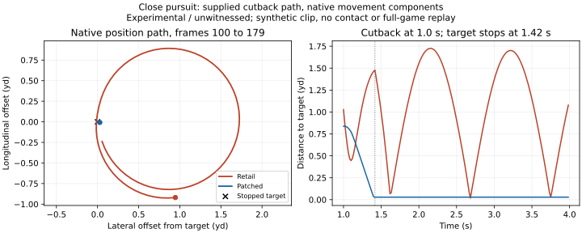

In the bounded native pursuit replay, full-throttle steering and a capped turn radius repeatedly carry a defender past a close opponent because the close-pursuit branch does not brake on arrival; the cause of Noah's full man-coverage symptom remains unproved.

# Defender circling: experimental owner and native evidence

**EXPERIMENTAL / UNWITNESSED. Ship opt-in, with `coverage_trail=False` in Basic,
Advanced and Experimental.** This is the brief's fallback for incomplete proof.
Noah has not played this change. It removes the reproduced pursuit orbit and
improves stationary arrival in the supplied man fixtures, but it is not evidence
that every reported DB circle is fixed. The crossing fixture also exposes an
early separation cost, documented below. Protected product wiring is specified
in [WIRING.md](WIRING.md), not implemented in shared product files here.

## Built

- `mod_editor/core/nfl2k5_coverage_trail.py`: fail-closed `status` and idempotent
  `apply(payload) -> (bytes, receipt)`, plus bounded inspect/new-file apply CLI.
- `tools/nfl2k5_coverage_trail.S`, its assembler and generated Python template:
  520 bytes including immutable constants in a 640-byte, 16-aligned RX
  reservation. Zero owner RW bytes and zero separate RO allocation.
- A single six-byte live hook at `0x2FC9F0`, pinned to `8b510cd94210`, returns to
  `0x2FC9F6`. The complete turn function, conversion helper, sine/cosine helper
  and ordinary movement descriptor are hashed prerequisites. All checks precede
  mutation; mixed hooks/code, foreign dependencies, stale seals and a missing
  union reservation refuse. Existing helpers repin section digests and seals.
- Complete allocator gate union, manifest builder recorder/owner/request lists,
  budget fixture and pairwise suite now include this owner. Both gate orders
  install and replay it. No protected file or another session's module changed.
- Standalone native and integrity suites, a frame fixture reusing the kickoff
  skeleton/sampler harness, and an exported 5,760-frame numerical receipt.
- A capability object and explicit protected dispatcher, preset, inverse retail
  checkbox, Build caption, packaging and manifest handoff in WIRING.

The runtime guard requires live-play phase 14, a CPU defender (`*steer == -1`)
with the exact ordinary descriptor `0x50F4EC`, no strafe/transition bits, no
queued special command, a known task and a live opposing target. Supported
callbacks are `1A4830`, `1A4CF0`, `1A4DD0`, `1F4360`, `1F48F0`, `2EAB60`, and
`2EB300`; their task target is at `+0x40`. In particular, `1A4DD0` can replace
its own task callback with `1A4830`, which is included and separately tested.

When the target is within three yards and the requested signed shortest turn
is at least 90 degrees, the hook supplies at least `32768/dt` turn units per
second. The original integrator performs the turn and updates body, animation
orientation and transform together. This is an immediate native pivot, not a
new target-selection algorithm. Within the native navigation arrival radius
of 32.004 world units (0.35 yd), a stationary opponent behind the defender
instead clears this tick's throttle. A subsequent planner tick can request
movement again. There is no owner timer or latch. The hook saves/restores x87
state and registers; writes are confined to scratch stack/consumed argument
and, on stationary arrival, the existing steer throttle. Retail orientation
writes remain native. Owned code and retail text are read/execute in Unicorn.

## PROVED: native mechanism and bounded controls

Retail evidence is the USA `default.xbe`, SHA-256
`73105b17a3161c546fea792a1c84ce37f9966a67c416f474cdbfab74b911a4a9`.
The executable is read with a 16 MiB cap. No disc or archive pack is read into
memory. Research used the supplied hub memos, existing coverage/kickoff reports,
the local Ghidra corpus and actual disassembly. Earlier hub prose describing a
lack of retail acceleration is superseded by the native locomotion evidence.

| Candidate cause | Evidence and conclusion |
| --- | --- |
| Repeated lapse rolls | The loop occurs with **zero RNG calls and zero `1ADB80` calls** in every ordinary-motion frame. Lapse re-rolling cannot cause this particular replayed orbit. It is not ruled out in other game states. |
| Turn cap plus overshoot | `2E8730` close pursuit sets throttle 1 at `2E87A1`; `237C90` supplies the ordinary speed/agility turn allowance; `2FC9F0` applies `round(dt * allowance)` to the signed shortest heading error. The native sampler and transform then carry the defender around the stopped target. In frames 100–179 the retail defender turns -441.84 degrees while moving at least 4.944 yd/s. The patched defender stays 0.029 yd away with zero movement and zero heading change in that interval. |
| Current-position chase rather than interception | The actual close branch already predicts `target position + target velocity * (distance/top_speed + 0.05)`. Frame 60's native pursuit aim is `(60.441, 1319.412)` while the target is `(0, 1400)`. The man planner `1A4830 -> 19E840 / 1A4170 -> 19E790 -> 1ADF90` also supplies prediction/arrival logic. A blanket current-position-chase explanation is contradicted by these paths. |
| Shipped acceleration reset | Every one of the 12 owner/route/direction combinations is byte-for-byte numerically identical with and without the actual `75CD5` acceleration hook/cave executed. Its CPU steering marker bypasses the controlled-player Speed envelope. Re-steering does not reset that ramp in these CPU cases. This does not mean the entire Advanced or Experimental preset was replayed. |
| Backpedal-to-run transition | The orbit occurs in the ordinary descriptor with the same straight synthetic clip and no transition, so a transition is not necessary for this pursuit orbit. Real backpedal/run assets and transitions were not replayed; their involvement in Noah's man bug remains open. |

The ordinary native movement controller, speed/Agility envelope, turn history,
clip selection, root sample and transform code run in both versions. The replay
calls the man planner `1A4830` or pursuit planner `2E8730`, then `1CD5D0`,
`28DFE0`, `218010`, and `28E360`. Each component has a two-million-instruction
limit and a verified return/stack ABI. **No reached stub leaves** are permitted
in these traces. Python supplies the opponent's path, but never corrects the
defender's position or heading after its single starting seed.

The x87 fixture explicitly supplies the architectural initialization control
word `0x37F`. Unicorn's default zero control word caused small fallback
rounding differences during development; initializing that fixture resolved
them without changing the runtime policy. A separate test preserves live x87
values and a `0x27F` caller control word. Controls also prove exact native
fallback for human control, offense, dead ball, unknown/no task, invalid or
same-team target, distance beyond three yards, forward requests, special
animation, queued lapse, strafe/transition, nonfinite geometry and invalid
step time/turn allowance. Moving targets at arrival retain movement. All seven
allowed callbacks, both turn signs and heading wrap are exercised.

## Replays and frame-by-frame receipt

[The numerical receipt](docs/mod_editor/nfl2k5_coverage_trail_frames.json) stores
all 240 frames for three supplied routes, two field directions, ramp off/on,
and retail/patched: **24 cases, 5,760 frames**. Each row includes defender and
target positions, the native aim, actual/requested heading, heading change,
native turn history, consumed allowance, input/final throttle, cached Speed,
movement command, measured displacement speed, gap, lapse words/call counts,
descriptor and selected clip. Fields are dictionary encoded by `columns`.
The exact receipt is reproduced by the standalone test without `--record`.

Inputs use 91.44 world units/yard and 60 Hz. The defender starts at `(100,1000)`
with heading 32768, effective Speed 0.9 and Agility 0.8. The opponent runs from
`(0,800)` at 600 units/s for 60 frames. Crossing then runs left at 480 units/s
for 100 frames and stops. Comeback reverses at 480 units/s for 35 frames and
stops. Cutback moves `(360,-480)` units/s for 25 frames and stops at `(150,1200)`.
Direction -1 rotates all positions/velocities and the initial heading by 180
degrees. Target paths are supplied inputs, not decoded retail route scripts.
The 25-bone fixture uses a 61-frame straight clip with native compressed root
sampling. Contact/tackles, the complete task scheduler and real animation assets
are outside this component loop. Thus overlap/arrival is not a proved tackle.

Tables show direction +1, ramp off. Ramp on reproduces these same numbers.
Headings use [-180,180); a wrap is not by itself a circle. The full receipt
includes the requested target and speed/rate for every frame.

### Pursuing safety, cutback then stop

Between frames 100 and 179, the retail position winds **-392.80 degrees around
the stationary target**, while the patched position winds zero degrees. The
test checks this spatial winding in both field directions, in addition to body
heading, distance and movement. The figure is derived from the committed receipt.

| Frame | Retail heading (deg) | Patch heading (deg) | Retail gap (yd) | Patch gap (yd) |
| --- | ---: | ---: | ---: | ---: |
| 60 | 9.98 | 162.15 | 1.027 | 0.837 |
| 75 | 92.87 | 151.02 | 1.078 | 0.409 |
| 85 | 148.05 | 146.42 | 1.479 | 0.029 |
| 95 | 169.45 | 146.42 | 0.360 | 0.029 |
| 120 | 52.15 | 146.42 | 1.554 | 0.029 |
| 160 | -169.12 | 146.42 | 0.086 | 0.029 |
| 179 | 85.76 | 146.42 | 1.319 | 0.029 |
| 239 | 112.08 | 146.42 | 1.078 | 0.029 |

At frame 179 retail is still moving 5.025 yd/s; the patch is stationary. The
native turn-history field can remain large while stopped, because it records
intent/history; actual heading delta and native displacement are both zero.
This is why the receipt records both rather than treating a turn request as
an executed turn. No loop threshold is inferred from heading alone.

### Man corner, crossing then stop

| Frame | Retail heading (deg) | Patch heading (deg) | Retail gap (yd) | Patch gap (yd) |
| --- | ---: | ---: | ---: | ---: |
| 60 | 4.00 | -143.65 | 0.579 | 2.150 |
| 75 | -69.69 | -134.65 | 0.782 | 0.725 |
| 85 | -111.21 | -20.19 | 0.683 | 0.100 |
| 95 | -104.17 | -81.72 | 0.092 | 0.074 |
| 120 | -101.59 | -99.31 | 0.150 | 0.096 |
| 160 | -106.68 | -90.65 | 0.053 | 0.092 |
| 179 | -5.59 | -90.65 | 1.370 | 0.092 |
| 239 | -45.62 | -90.65 | 1.953 | 0.092 |

### Man corner, comeback then stop

| Frame | Retail heading (deg) | Patch heading (deg) | Retail gap (yd) | Patch gap (yd) |
| --- | ---: | ---: | ---: | ---: |
| 60 | 5.80 | -178.32 | 0.578 | 2.136 |
| 75 | 82.87 | -178.53 | 1.791 | 1.486 |
| 85 | 138.85 | -178.59 | 2.610 | 0.837 |
| 95 | -164.32 | -178.62 | 2.821 | 0.159 |
| 120 | -90.00 | -174.91 | 2.452 | 0.136 |
| 160 | -90.00 | -174.91 | 2.327 | 0.136 |
| 179 | -90.00 | -174.91 | 2.322 | 0.136 |
| 239 | -90.00 | -174.91 | 2.445 | 0.136 |

**The retail man cases do not show the sustained orbit seen in pursuit.** They
show late turns, separation and imperfect stationary arrival. The patch reaches
the stopped receiver and has no moving tail loop, but this does not establish
the reported live man-coverage bug. It also changes early positioning: crossing
frame 60 is 2.150 yd away with the patch versus 0.579 yd retail; maximum gap
rises from 2.318 to 2.547 yd. This cost is a concrete reason to keep all presets
off, not present the intervention as a stock-feel fix by default.

### Genuine lapse control

The native `1A4720` lapse check is run in an eligible locomotion class
(`0x510458`) against the same target, with a supplied game clock and actual
native RNG state. Seed zero selects a bad angle; two subsequent high rolls do
not select another. The native `48B50` additive generator, `48B90` float wrapper,
`2E6730` probability lookup and `1ADB80` execute, with no substituted RNG leaf.

| Decision | RNG input seed | New native RNG words | New lapse calls | Queued command after decision |
| --- | ---: | --- | ---: | --- |
| 1 | 0 | 0, 0 | 1 | `0x12` |
| 2 | `0x700000` | `0x700000` | 0 | `0x12` |
| 3 | `0x700000` | `0x700000` | 0 | `0x12` |

Retail and patched actor bytes/RNG words match. This proves that a genuine lapse
can still be issued once, and that the new hook does not erase its command or
change probability/RNG. It is **not** a played lapse animation/recovery replay,
and it does not prove that every possible later lapse re-roll is suppressed.
Queued special commands bypass the recovery hook; the existing Pursuit slider
and lapse logic are unchanged.

## Validation

Environment: Python 3.12.3, Unicorn 2.1.4, Capstone 5.0.7, Linux x86-64.
Commands below ran standalone with plain unittest. Native evidence skips with
precise reasons if the pinned USA XBE, Unicorn or Capstone is absent. Template
reproduction skips when GNU as/ELF32 is unavailable. No Qt, game boot, emulator
session, renderer, audio or network was used; Unicorn executes bounded CPU
components only.

All these commands were measured with `/usr/bin/time -v`; durations below
are unittest durations and RSS is the process maximum. Every process stayed
below 2 GB. The largest was the oracle at 900.3 MiB.

| Command (prefix `python3`) | Result | Seconds | Peak RSS (MiB) |
| --- | --- | ---: | ---: |
| `tests/mod_editor/test_nfl2k5_coverage_trail.py` | 12 passed | 14.756 | 146.3 |
| `tests/mod_editor/test_nfl2k5_coverage_trail_unicorn.py --record` | 13 passed | 171.570 | 322.2 |
| `tests/mod_editor/test_nfl2k5_coverage_trail_unicorn.py` | 13 passed | 156.993 | 322.4 |
| `tests/mod_editor/test_xbe_patch_memory_writes.py` | 95 passed | 812.393 | 333.7 |
| `tests/mod_editor/test_xbe_patch_cave_references.py` | 107 passed | 939.530 | 514.0 |
| `tests/mod_editor/test_nfl2k5_owner_pairwise_composition.py` | 115 passed | 665.697 | 189.6 |
| `tests/mod_editor/test_nfl2k5_cave_oracle.py` | 28 passed | 205.753 | 900.3 |
| `tests/mod_editor/test_nfl2k5_allocator_scaleout.py` | 23 passed | 417.046 | 199.0 |

The oracle command used the environment override
`NFL2K5_CAVE_MANIFEST="$PWD/.scratch/coverage-trail-oracle-manifest.json"`.
The same native receipt also passed an earlier independent 13-test replay in
162.736 s; the final run above adds the explicit spatial-winding assertion.

Additional successful checks: `python3 tests/mod_editor/test_nfl2k5_allocator_scaleout.py PlannerTests -v` (5 tests, 0.331 s); `python3 tools/nfl2k5_coverage_trail_assemble.py --check`; `python3 tools/nfl2k5_xbe_space.py plan --requests tests/fixtures/nfl2k5_allocator_beta62_requests.json`; new-source compilation; SVG XML parsing; `git diff --check`; all protected-file bytes and existing manifest fingerprints compared with HEAD. The first allocator run correctly caught its old RX headroom expectation; the updated full 23-test suite above passes.

The first native control run exposed the uninitialized x87 fixture described
above; the corrected full matrix and independent replay pass. The first scratch
oracle run correctly refused its newly pinned owner source after that source
changed during development; the final scratch copy contains the final new owner
hashes. Every **existing** protected manifest fingerprint remains unchanged and
verified. The changed manifest builder is excluded by its existing
`source_fingerprints()` rule. No old fingerprint was refreshed to conceal drift.
The scratch manifest is a local source-pin extension, not a regenerated disc
manifest. Both gates separately project the actual sealed allocation union and
pin the new live hook, rejecting overlap with any other owner.

Capability validation passes the strict merged registry structure and all file
and module-command checks for the new object. Whole-registry file-check mode
already fails on unrelated missing `docs/research/apf_audio.md`; this job leaves
that unrelated evidence path alone. The standalone integrity suite explicitly
tests the new object's files/commands without weakening its checks. The budget
fixture's expected RX headroom was reduced by exactly 640 bytes; its RW and RO
expectations are unchanged.

The budget planner accepts all 45 fixture requests and reports a 12,300,288-byte
XBE, 53,865 total RX bytes free, and unchanged 4,096-byte scale-out RW headroom.
No disc or pack was copied. Root free space was about 99 GiB (over 100 decimal
GB), so this job deliberately uses bounded executable/component checks and
leaves the required merged real-disc manifest build to Claude. Scratch contains
only scripts, extracts, logs, JSON and the source-only bundle fallback, under
200 MB. No generated game executable is a deliverable.

## HYPOTHESIS and known gaps

1. The demonstrated turning/arrival mechanism may explain some community
   circling reports. It does not yet identify the cause of Noah's exact man
   coverage symptom. No captured offending play or continuous live match is
   available in this task. Native task transitions, real backpedal/run clips,
   assignment switches, contact, catch/tackle windows and lapse recovery remain
   untested together.
2. A fast pivot can look abrupt, affect separation or make close pursuit too
   strong. The three-yard/90-degree thresholds are deliberate experimental
   policy, not recovered constants proving the intended retail design. The
   0.35-yard arrival distance is reused from native navigation. No speed,
   perfect-coverage guarantee, new interception logic or lapse suppression is
   claimed. Legitimate user-controlled motion and special states bypass.
3. The cutback case includes a stop. It proves a stationary-target orbit after
   a moving cutback; it is not a survey of all continuously moving carriers,
   ratings, frame rates or collision contexts. The man examples show a real
   early-positioning tradeoff.
4. The final production presets, product UI, disc build and release manifest
   remain the protected integration task in WIRING. The research owner is ready
   for that opt-in integration; default-on is not justified by this evidence.

## Noah's witness list: two routes, two presets

Use the same teams, ratings, difficulty, Pursuit/Coverage values and offensive
play for each paired run. Keep acceleration enabled in both presets as shipped.
Compare a fresh build with `coverage_trail=True` against one rebuilt from base
with **Keep the retail coverage pursuit** checked (`coverage_trail=False`).
Leave the corner/safety under CPU control until the specified user-control test.
Record matched clips from snap through the break and catch/tackle opportunity.

| Preset | Receiver route and defender | Required observation |
| --- | --- | --- |
| Advanced | Crossing route against man corner | After the receiver crosses the corner's facing, no repeated circle; retain plausible separation. Check the first second especially for the early-gap regression seen in the fixture. |
| Advanced | Comeback against man corner | Follow the reversal and stop; check backpedal-to-run timing, turn appearance, arrival jitter and free separation. |
| Experimental | Same crossing play/coverage | Repeat the pair with this preset's actual combined options; ensure no new route mirroring or interception advantage. |
| Experimental | Same comeback play/coverage | Repeat the pair; watch animation, catch contest and collision/tackle behavior, not only final distance. |

For each row, repeat at least ten paired snaps, in both field directions and
with both a high-Agility and lower-Agility defender. Log circles per opportunity,
separation at the break, catches caused by separation and any unnatural pivot.
Then test a safety pursuing a ball carrier through a cutback, both continuing
to run and stopping; watch tackle initiation and stopping distance. Keep the
Pursuit slider at a setting that produces an actual mistake and verify a bad
angle can still happen followed by sensible recovery, rather than repeated
spins. User-control the defender, run a zone call, and exercise dead-ball/replay
transitions as controls. Reject default-on if any persistent loop, abrupt pivot,
new hitch, lost tackle, early separation regression or excessive coverage gain
appears. Noah's recorded play is required before changing the witness label.

## Source handoff

Git metadata for this isolated worktree is read-only. The brief's authorized
fallback is `.scratch/defender-circling.bundle`, containing a source-only commit
on `astra/r64-defender-circling` with prerequisite base
`77d1c49f682e380b75f1a7290a806a47845608a9`. The temporary repository uses that
base's object store read-only and explicitly stages/commits only this job's 19
paths. It does not modify the shared Git metadata or another worktree. The
bundle receipt records its commit ID, SHA-256 and exact paths. `ASTRA_BRIEF.md`,
`.scratch`, retail executables and packs are excluded from the commit. Nothing
is pushed. The source changes remain in this worktree for direct review.
