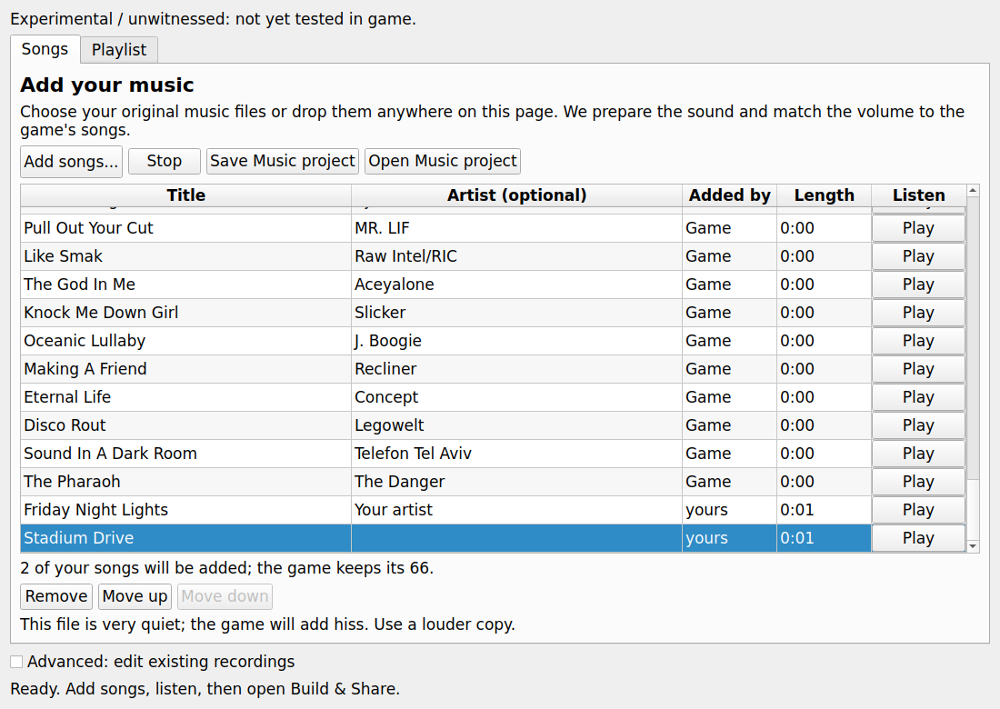
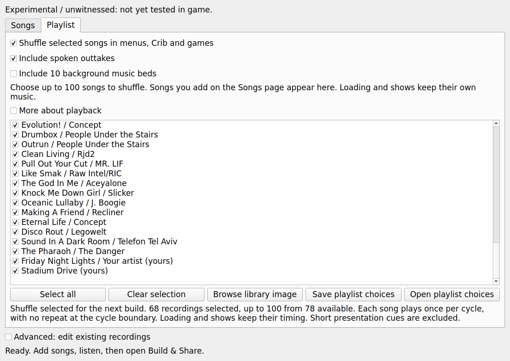

# Add your music: r64 Music simple

2026-09-08. Branch `astra/r64-music-simple`, base
`aed95b098cab62ff35693d2649267562fa0df8f5` (the full base is recorded in the commit parent).
**EXPERIMENTAL / UNWITNESSED.** No game, console emulator, visible GUI, audio
playback, network request or push was used. Qt rendering was offscreen.

## Delivered

The Music tab opens on **Songs**, with one **Add songs...** button accepting
multiple MP3, M4A, FLAC, OGG or WAV files and local file drops over the page,
table, headers and buttons. Stop or navigation cancels a preview that is still
being prepared, preventing a late player start. The game's 66 songs and additions share one list.
Added rows say **yours**; titles start from file names and can be edited along
with optional artists. Remove and Move up/down affect additions. Each row has
Play. The line below the list says exactly how many user songs Build will add
while retaining the game's 66. Busy/cancel/error reporting remains in the panel.

The existing Recordings page is behind **Advanced: edit existing recordings**.
Its replacement, original/current/mono playback, Restore, Undo, Redo, export,
project and build APIs remain available. Playlist follows added, removed,
renamed and reordered songs, preserving checks by stable song identity rather
than by the mutable row number. Its long playback explanation is now a closed
**More about playback** disclosure.

`conform_song` automatically decodes and resamples the full supplied song,
without trimming it to an existing recording or adding a long silence tail.
Native PCM16 at the game's rate needs no FFmpeg. Other inputs use the existing
bounded FFmpeg decoder with its high-quality resampler. Volume matching uses
the median non-silent RMS of the first three original jukebox songs, independent
of session replacements. Gain is capped at +12 dB and peaks at -1 dBFS, before
one PCM quantization. Silent input avoids division by zero and receives the
quiet-file advisory. Actual decoded frames enforce ten minutes; container
estimates do not incorrectly reject MP3 encoder delay at the limit.

Warnings are advisory for a source below 22,050 Hz, 8-bit sound, a bitrate below
64 kbps, and a requested volume boost above the cap. The quiet warning is:
**"This file is very quiet; the game will add hiss. Use a louder copy."**
Missing conversion tools produce one sentence naming FFmpeg, FFprobe and
`ffmpeg.org/download.html`. Corrupt, missing, changed or unsafe inputs continue
to refuse through bounded readers; a low-quality but valid song is accepted.

`encode_library_song` uses the existing library writer's encoder, 8,192-frame
chunks, and last-frame repetition for at most 63 final frames. Preview decodes
those encoded bytes. It never plays the input file. The same prepared PCM feeds
the unchanged `nfl2k5_music_library/v1` Build recipe: 59 retained jukebox indices
followed by authored additions. The seven menu songs stay in their existing
resource, and the library writer produces the matching stadium versions.

Imports are staged as complete batches before one manifest publication. Failed
later files, cancellation, stale tokens, damaged previews and failed publication
leave the current library intact. Successful batches become owned session files;
closing or accidentally reusing their prepared-batch object cannot delete them.
Recipes are immutable per revision, so a captured Build path cannot silently
change under a later edit. Service recreation reads its source-bound manifest.

Portable `.2k5music` v2 includes only prepared authored audio, titles, optional
artists, order, warning/fit metadata and Playlist choices. Duplicate prepared
audio is stored once. Import verifies the source identity, bounded members,
fit data, input hashes and reproduced encoded/decoded hashes before publication.
If the fixed-replacement session transaction fails, the accompanying library
manifest rolls back as well. Existing v1 projects still load; fixed-only API
saves still produce v1. Normal Studio project Build settings preserve their
existing local recipe-path contract; Music's own Save is the portable audio
container. The advanced Build music copy includes additions plus fixed edits.

The getting-started guide now has a five-step **Add your music** walkthrough
and **My song sounds crushed or like an old console** FAQ. It explains the
three causes supplied in the brief: already degraded input, a complete song
put into a short/different recording, and a quiet original. Newly written UI
and Music documentation use no em dashes.

## Protected integration

[WIRING.md](WIRING.md) contains the full integration inventory and
[the exact proposed patch](docs/mod_editor/music_simple_wiring.patch).
No protected file was edited. The patch connects the prepared recipe to existing
Build controls, handles lazy Build creation, mounts Songs from the existing audio
catalog without requiring the long fixed-replacement preparation scan, and
passes a v2 Music project's restored additions into the final Build plan.
The patch applies cleanly and its proposed functions are tested in memory.
Claude must apply it for the running Studio shell to receive these additions.
Existing Build options, fields, presets and manual library recipes keep their
contracts. No executable owner, allocation, cave reservation, dispatcher entry
or runtime memory budget changed.

## Offscreen screenshots

These are actual widget renders using generated, short synthetic recordings.
The game titles are the existing catalog text; the displayed near-zero game-song
lengths come from the tiny fixture, not from a real disc. Neither screenshot
was taken from a running game, and no sound was played.

## PROVED

- All five advertised file types decoded and prepared successfully from generated
  input. Native input worked with FFmpeg discovery disabled. Low-rate 8-bit and
  32-kbps examples imported with advisories; transient peaks stayed within the
  ceiling. A length crossing the encoder chunk boundary produced exact preview
  hashes. Over-ten-minute and over-200-total requests refused.
- The offscreen WAV/MP3 flow delivered a 61-entry recipe to the unchanged Build
  controls, with 59 retained records plus the two prepared additions. Title,
  optional artist, reorder/remove, stable Playlist checks, busy states, drag
  delivery to the table viewport and a stubbed player were exercised.
- The real library writer planned and rebuilt a small synthetic disc with a
  read-only retail executable as metadata evidence and entirely synthetic audio.
  All 59 retained jukebox recordings, both stored versions, remained byte exact.
  The seven menu recordings kept their boundaries. Both added stereo streams
  matched the editor's encoded hashes, including the MP3 conversion.
- Source/cancellation/publication rollback, service recreation, v1/v2 project
  persistence, metadata tampering, preview tampering, atomic fixed-plus-added
  project failure, native fallback and preservation of the existing APIs passed.
- The protected handoff tests cover lazy Build, normal saved Build settings,
  no-preparation source mounting, restored project additions reaching the private
  Build, conflicting project/library inputs refusing, and final validation before
  the output becomes visible. These tests use proposed functions in memory,
  not a claim that protected files were installed.

## Exact final tests

Each file ran separately with plain `python3`; the environment was offscreen.
The new service suite and both Qt suites were rerun after their final changes.
Logs and machine-readable results are in `.scratch/`, excluded from the commit.

| Command | Tests | Result |
| --- | ---: | --- |
| `QT_QPA_PLATFORM=offscreen python3 tests/mod_editor/test_music_simple.py` | 12 | PASS |
| `QT_QPA_PLATFORM=offscreen python3 tests/mod_editor/test_music_simple_qt.py` | 9 | PASS |
| `QT_QPA_PLATFORM=offscreen python3 tests/mod_editor/test_music_simple_wiring.py` | 3 | PASS |
| `QT_QPA_PLATFORM=offscreen python3 tests/mod_editor/test_music_service.py` | 10 | PASS |
| `QT_QPA_PLATFORM=offscreen python3 tests/mod_editor/test_music_panel_qt.py` | 9 | PASS |
| `QT_QPA_PLATFORM=offscreen python3 tests/mod_editor/test_music_conform.py` | 7 | PASS |
| `QT_QPA_PLATFORM=offscreen python3 tests/mod_editor/test_audio_conform.py` | 17 | PASS, 1 evidence skip |
| `QT_QPA_PLATFORM=offscreen python3 tests/mod_editor/test_nfl2k5_music_build.py` | 8 | PASS |
| `QT_QPA_PLATFORM=offscreen python3 tests/mod_editor/test_nfl2k5_music_banks.py` | 15 | PASS |
| `QT_QPA_PLATFORM=offscreen python3 tests/mod_editor/test_nfl2k5_music_catalog.py` | 4 | PASS |
| `QT_QPA_PLATFORM=offscreen python3 tests/mod_editor/test_music_playlist_project.py` | 4 | PASS |
| `QT_QPA_PLATFORM=offscreen python3 tests/mod_editor/test_nfl2k5_music_playlist_library.py` | 7 | PASS |
| `QT_QPA_PLATFORM=offscreen python3 tests/mod_editor/test_music_all_modes_wiring.py` | 4 | PASS |
| `QT_QPA_PLATFORM=offscreen python3 tests/test_xbox_ima_encoder.py` | 11 | PASS |
| `QT_QPA_PLATFORM=offscreen python3 tests/test_game_audio_convert.py` | 15 | PASS |

The 135 targeted tests completed with no failures: 134 passed and one skipped.
The existing audio-conform skip is precisely the absent
`reports/assets/nfl2k5_audo_import_capacity.json`. FFmpeg, FFprobe, PyQt5 and the
retail executable evidence were available, so the new tests had no skips.

The complete executable gates and manifest oracle also ran standalone:

| Command | Tests | Result |
| --- | ---: | --- |
| `QT_QPA_PLATFORM=offscreen python3 tests/mod_editor/test_xbe_patch_memory_writes.py` | 91 | PASS |
| `QT_QPA_PLATFORM=offscreen python3 tests/mod_editor/test_xbe_patch_cave_references.py` | 103 | PASS |
| `QT_QPA_PLATFORM=offscreen python3 tests/mod_editor/test_nfl2k5_cave_oracle.py` | 28 | 27 passed; 1 expected stale-manifest error |

**357 tests total: 355 passed, one existing evidence skip, and one expected
manifest error.** The exact oracle error is
`stale reservation source: mod_editor/core/mod_build.py; regenerate manifest`
in `test_retail_current_stack_owns_every_supplied_cave_and_runtime_flag`.
That protected source was verified byte-identical to the base commit. This is
the stale-source red gate described in the brief. Its validator was not weakened
and the protected manifest was not regenerated. The 91 memory-write and 103
cave-reference cases passed against the complete owner union in both orders
and both allocator configurations.

Additional checks passed: changed Python compilation, `git diff --check`,
`git apply --check docs/mod_editor/music_simple_wiring.patch`, and visual
inspection of both offscreen screenshots. A lean runtime smoke also passed:
MusicPanel construction, native song conform and the fallback encoder with
NumPy, Capstone and Unicorn imports unavailable and FFmpeg discovery disabled.
Every acceptance disc and generated
song lived in a TemporaryDirectory and was deleted. No real-disc build was
needed. The initial root disk check showed 96 GiB free, insufficient headroom
for a disposable full disc while preserving the brief's 100 GB floor. Scratch
contains only small source notes, logs, JSON and the authorized commit fallback.
No whole retail disc or archive pack was loaded into memory.

## HYPOTHESIS, decisions and known gaps

Audible improvement, console pitch/rate, hiss, transitions, display titles and
long playback remain untested in game. The brief's prior 35-dB codec measurement
is supplied context, not a measurement made in this session. Three original
songs provide a reproducible level reference; no claim says this guarantees equal
perceived loudness for every musical style or restores detail lost upstream.

The simple limit is **200 total songs, including the original 66**, leaving
134 additions. The game's songs retain their identity and order. Existing
archive, metadata, pack and portable-project byte budgets still apply. A very
large collection can hit those byte limits before its count limit; the existing
writer remains authoritative. The advanced API's larger bank bounds are unchanged.

The existing shuffle executable stores only **100 selected songs**. New songs
are checked by making room in that selection, and all other songs remain in the
library. For a single batch larger than 100, its newest 100 are checked. This is
an explicit boundary on the brief's "newly added songs appear checked" requirement:
checking all 134 at once would require an executable-owner change that this brief
forbids. The page and walkthrough disclose the limit; no invalid selection or
hidden runtime capacity increase is produced.

Other explicit boundaries: applying the protected shell/build handoff and release
packaging remain Claude's integration tasks. A normal Studio Save stores local
library paths; use Save Music project to move or share the added audio. Old recipe
revisions retain their prepared files in the session cache. Added songs use
Remove/Move, while shared Undo/Redo retains its existing fixed-recording scope.
The advanced fixed-span patch exporter directs added-song users to a Music
project or the finished Build & Share export, instead of silently dropping the
additions. Libraries reopened as already-grown disc sources keep the existing
catalog/authoring limitations; this flow is for the original 66-song source.
No macOS, Windows, packaged-build or audible game witness is claimed.

## Noah's witness list

Every item is **NOT WITNESSED**. After Claude installs the handoff, record the
source/output hashes, platform, project, song names, profile state and result.

1. Open a supported source for the first time, go directly to Music, and add
   MP3/M4A/FLAC/OGG/WAV without visiting Audio Cues. Drop files on text, the list,
   empty space and a Play button. Confirm a responsive progress/cancel flow.
2. Listen to each prepared preview, then hear the same identifiable song in the
   built game's jukebox and shared menu/Crib/game shuffle. Compare pitch, speed,
   detail, channel order, volume and hiss. Let each song finish and advance.
3. Compare a good original with an 8-bit/low-rate copy, a low-bitrate copy and a
   very quiet master. Confirm warnings remain advisory and a better original
   improves the result. Check fades, pauses and long quiet passages separately.
4. Rename and reorder two additions, deselect one, remove another, and rebuild.
   Confirm titles, ordering and choices match the editor and all 66 game songs
   remain. Check stadium playback of the added song as well as the jukebox.
5. Save/Open a Music project after moving the original input files, then move
   that project to another machine with the same game source. Confirm audio,
   titles, artist, warning text and Playlist choices survive. Reopen a v1 project
   and a normal Studio project to check their documented scope.
6. Build with existing Recordings replacements, roster/texture edits and other
   selected patches. Confirm they all survive the library rebuild. Check normal
   Build, v2 project selected from Build, and advanced Build music copy separately.
7. Exercise 0, 1, 2 and 100 selected songs, the 101st selection, a 134-addition
   batch, the 201st total song and a song just over 10 minutes. Verify the clear
   limits and that every imported but unselected song remains available.
8. On Linux, macOS and Windows, cancel mid-conversion, switch source, close during
   work, test a missing converter, restore/undo a fixed replacement, and try a
   failed save/build with an existing destination. Confirm no partial library or
   output, no unexpected playback, and no leftover file lock.

## Commit delivery

Initial explicit-path staging succeeded, but final staging failed because Git
could not create the worktree `index.lock`: **Read-only file system**. The brief's
authorized fallback is `.scratch/music-simple.bundle`. Its single commit is
based on the original HEAD and includes exactly the 13 deliverable paths,
using an isolated Git index/object directory inside this worktree's scratch
folder. The working files remain in place; the original worktree index may
retain the earlier staged revisions and HEAD remains unchanged.
`ASTRA_BRIEF.md` and `.scratch/` are excluded from the commit. No push was made.
The bundle's commit ID is reported in the final delivery message.
