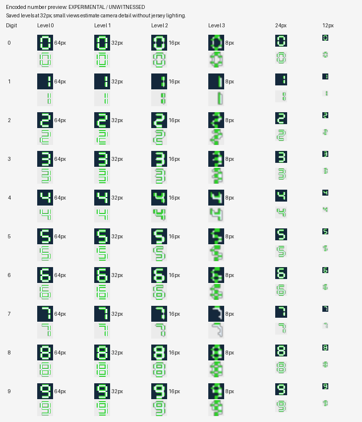
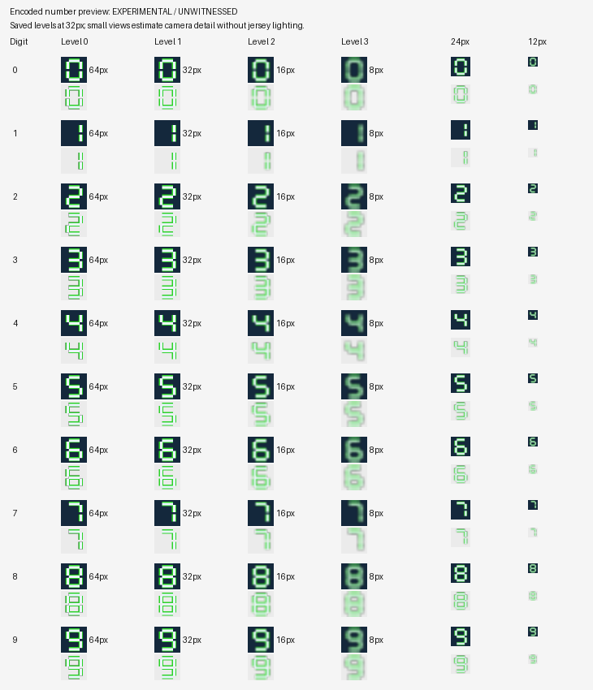

# r64 number-sheet quality

2026-09-07. Branch `astra/r64-number-sheet-quality`, base
`76434d6108a25ca7deac0160fb05f717badd7bd0`.
**EXPERIMENTAL / UNWITNESSED.** The digit encoder correction, encoded preview
renderer, author guidance, real-source proofs and exact protected integration
fixtures are implemented. Noah has not played this revision. The photographed
community symptom is not conclusively diagnosed without its source PNG/project
and a game sampling trace.

## Mechanism and evidence boundary

**PROVED:** the production digit writer rebuilt every declared mip. It did not
leave stale retail mips, and it already used one shared palette rather than a
separate palette per level. Its `make_mips` default selected the most frequent
RGBA tuple in each 2x2 footprint, breaking ties toward the globally rarer colour.
That is a region selector, not a coverage filter. A quarter-covered outline
becomes fully transparent; a half-outline/half-fill tie can become fully outline.
The error compounds as each selected level feeds the next. The generic bounded
palette fitter could then discard still more colours, trying down to two entries
until compressed bytes fit the original slot.

A 64x64 binary-alpha synthetic digit therefore remained binary-alpha at every
smaller level. The corrected encoded version carries intermediate alpha in its
32x32, 16x16 and 8x8 levels. A separately tested solid rectangle aligned on the
mip grid has zero old-filter coverage error; shifting that same rectangle by one
pixel creates error with exactly the same 64x64 canvas. Size alone cannot predict
quality. Thin outlines, fractional placement and soft edges change the winning
samples; repeated resizing also increases palette and compression pressure.

**PROVED:** Pillow's old RGBA Lanczos resize was already alpha aware, through an
8-bit premultiplied representation. Calling it a straight-alpha resize defect
would be inaccurate. The new float-channel implementation avoids that extra
8-bit premultiplication loss: resizing a constant `(45,210,40,1)` edge from 62x62
to 64x64 now retains those exact channels, whereas the old resize changes RGB.
Invisible magenta RGB does not bleed into visible white under either new filter.

**PROVED retail storage:** 24 exact, pinned texture spans were read for Cleveland
`05H0` and Seattle `26H0`, digits 1, 3, 5 and 8, across jersey, helmet and arm.
These are Morton-swizzled P8 indices with one 256-entry BGRA8888 palette,
including **8-bit alpha per entry**. The 64-pixel chain is 64/32/16/8; the
32-pixel retail chain sampled here is 32/16/8 (three levels). Every lower chain tested contains partial alpha.
The shared palette's storage and alpha policy are established; retail's original
palette-authoring algorithm is not known.

Examples of decoded retail partial-alpha pixel counts:

| Retail target | 64px | 32px | 16px | 8px |
| --- | ---: | ---: | ---: | ---: |
| Cleveland jersey 1 | 0 | 180 | 56 | 18 |
| Cleveland jersey 5 | 147 | 340 | 105 | 29 |
| Seattle jersey 3 | 158 | 434 | 117 | 29 |
| Seattle jersey 8 | 144 | 499 | 145 | 30 |

**HYPOTHESIS:** coverage destruction, outline-biased ties and aggressive palette
reduction can explain the reported clean-versus-blocky difference. The screenshot
shows jagged Seattle 38 and a cleaner Cleveland 51, but does not identify a
texture level, original cell boundaries, palette fit, game material or actual
source file. No screenshot is treated as a witness of this fix.

The decoder reads every stored texel exactly after decompression and unswizzling.
The preview is a flat, unlit estimate using straight-channel pixel-centre bilinear
sampling with clamped edges. It avoids Pillow's extra downscale antialiasing,
which could conceal a coarse selected mip. Camera-size columns assume trilinear
LOD `log2(base cell height / drawn cell height)`: for a 64px slot, 24px blends
levels 1 and 2 (32/16), while 12px blends levels 2 and 3 (16/8), each with a
fractional LOD of about 0.415. For 32px slots those pairs move up one level.
**The actual game camera's sampled levels are unknown.** UV derivatives, LOD bias,
alpha test, blend state, material and lighting require Noah's witness. Preview
columns showing individual levels are explicit texture inspections, not claims
that a particular camera selects them.

## Implemented pipeline

- `nfl2k5_digit_sheet.py` keeps all four layouts and the existing Team Kit return
  contract. It resizes the entire cell, including padding, in premultiplied float
  channels and returns ordinary straight-alpha PNG. Results now include detected
  layout, original cell size and slot size, plus resize, stretch, enlargement and
  cell-edge warnings. Fractional cells refuse with dimensions and exact divisors.
- `nfl2k5_digit_texture.py` generates each mip directly from the imported base
  using exact area footprints, with RGB weighted by alpha and alpha rounded only
  to the target's eight bits. No palette indices or rounded intermediate mip
  become the input to another level.
- One deterministic palette serves the complete chain. Each level has equal
  total influence; the palette protects up to sixteen authored opaque colours,
  reserves partial-coverage bands and transparent black, and maps in
  premultiplied colour space. Transparent, partial and opaque pixels cannot cross
  alpha classes. Artwork with many solid shades protects up to eight distinct
  representative colours and reports any solid colours actually approximated.
- The existing fixed-span compressor, source/descriptor pins, swizzler, gap
  preservation and independent round-trip validators remain in the writer.
  Digit families use the new policy and a 16-entry minimum *budget*. Simple art
  may naturally use fewer exact entries. Art that cannot fit while respecting
  this quality policy refuses, instead of silently falling to two colours.
  Nameplates and other generic users keep their old mip/palette policy.
- Receipts include filter identity, palette policy, alpha depth, quality budget,
  quantization losses, compression attempts when reduced, and the input and
  independently decoded RGBA SHA-256 of every level.
- `nfl2k5_digit_preview.py` invokes that same pinned writer for all ten split PNGs
  before staging, decodes the resulting texture spans and draws every saved level
  and two estimated small sizes on light and dark backgrounds. It reports
  approximation and refusal against the exact selected slot. The facade holds
  the active source/session lock for this operation.

The old real 1,568-byte regression fixture accepted per-pixel random RGBA only
through severe colour loss. That expectation conflicts with the requested
quality refusal. Its original generic quantizer tests remain intact. The real
compositor test now uses 256 spatially coherent solid colour tiles, exercises
256/128/64/32-entry overflow, and fits a 16-entry palette in **1,537 of 1,568
bytes**. A separate test retains the original random fixture and asserts its
explicit quality refusal. This intentional behavior change is not disguised as
an unchanged acceptance contract. The test now accepts explicit evidence paths
through environment variables and still skips precisely when unavailable.

A deliberately twice-resampled sheet cannot fit Seattle digit 0's 1,488-byte
body within the quality policy; real preview refuses before any Team Kit change.
This is preferable to promising that every font will fit every retail allocation.
Premultiplied-looking source RGB is preserved as authored and warned about, not
guessed/unpremultiplied; a valid PNG cannot reveal whether dark RGB was intentional.

## Real-source reproduction and before/after renders

The six cases are original geometric digits, with no external font or copied
retail art: crisp two-colour, soft outlined/off-grid, 62px cells, 66px cells,
8-bit indexed PNG with transparency, and RGBA with deliberately darkened edges.
All four layouts are checked for all six cases in portable tests.

The full real-source matrix uses `02H3` jersey digits 0-9 because its slots can
hold all six designs. Each case exports a real Team Kit from a real StudioSession,
replaces its ten PNGs, imports through the normal service, and compiles the staged
images through the production writer. Sixty old/new pairs are decoded. Each new
span is written with the production exact-offset writer into a bounded source
window read from the user's XISO, then closed, reopened and independently decoded.
Both guard regions and the source bytes remain identical. Undo removes all ten
changes in one action. The separate 1,568-byte regression additionally exercises
the public project compositor's preparation, input pinning, target binding and
independent verification, not only the texture builder.

The controlled before replay changes only the downstream mip and palette policy,
retaining the production wrapper/compressor and the same split PNG. Thus the
62/66px comparison isolates the encoding improvement, not the separate float
resize improvement. No disc image was published or game executable run.

Sum of squared alpha errors against direct area coverage, across digits 0-9
and lower levels 1-3 (smaller is better):

| Sheet | Before | After | Encoded palette entries |
| --- | ---: | ---: | ---: |
| Crisp | 24,526,253 | 0 | 20-51 |
| Soft / off-grid | 21,029,682 | 0 | 57-93 |
| 62px cells | 13,950,466 | 29,513 | 32-256 |
| 66px cells | 13,655,516 | 26,585 | 32-256 |
| Indexed PNG | 24,526,253 | 0 | 20-51 |
| Premultiplied-looking RGB | 21,029,682 | 0 | 62-101 |

Zero alpha error does not mean that wrong source RGB has been repaired or that
jersey rendering is proved. Resized sheets still require palette approximation.
Every one of the sixty encoded pairs improves total lower-level coverage error.

Crisp before (all ten digits, every stored level and small-size estimates):



The same encoded targets after correction:



All cases are retained as reviewable artifacts:

| Case | Before | After |
| --- | --- | --- |
| Soft / off-grid | [Before](docs/mod_editor/number_sheet_quality/soft_off_grid_before.png) | [After](docs/mod_editor/number_sheet_quality/soft_off_grid_after.png) |
| 62px cells | [Before](docs/mod_editor/number_sheet_quality/cell_62_before.png) | [After](docs/mod_editor/number_sheet_quality/cell_62_after.png) |
| 66px cells | [Before](docs/mod_editor/number_sheet_quality/cell_66_before.png) | [After](docs/mod_editor/number_sheet_quality/cell_66_after.png) |
| Indexed PNG | [Before](docs/mod_editor/number_sheet_quality/palette_png_before.png) | [After](docs/mod_editor/number_sheet_quality/palette_png_after.png) |
| Premultiplied-looking | [Before](docs/mod_editor/number_sheet_quality/premultiplied_looking_before.png) | [After](docs/mod_editor/number_sheet_quality/premultiplied_looking_after.png) |

[evidence.json](docs/mod_editor/number_sheet_quality/evidence.json) records the
24 retail formats/alpha distributions, all 120 synthetic texture span hashes,
shared palette hashes, every decoded mip RGBA hash and 32px sample hash, errors,
compression fits and contact-sheet PNG hashes. It contains no retail pixels or
palette payload. `tests/fixtures/number_sheet_quality_mip_hashes.json` separately
pins the portable before/after base and mip pixels for synthetic digit 3.
`render_number_sheet_quality_report.py` verifies the test-generated raw mip hashes
before publishing the contact sheets; these are measured encoded outputs.

## Author guidance and protected handoff

The FAQ and [clean digit recipe](docs/mod_editor/number_sheets.md#clean-digit-recipe)
cover exact cell sizes, all four layouts, inside-cell padding, straight alpha,
indexed PNG, fill/outline colour counts and small-camera review. Making the
artwork smaller inside a cell gives it fewer pixels; shrinking the entire sheet
can add another resize. Neither repairs the old mip filter or increases the
fixed compressed budget. Start from the exact exported target and a clean master,
use a few flat colours and a meaningful outline width, export once, inspect every
encoded digit, save the project and include it in the build.

[WIRING.md](WIRING.md#r64-number-sheet-quality-protected-integration-handoff-2026-09-07)
gives exact `git apply` fixtures for the protected Studio dialog and shared
release/provider closure. The GUI patch preserves frozen previewed inputs, one
Team Kit transaction and one Undo. Review is deferred until the preparation
worker releases its busy state. Encoding failure, cancel and changed game source
cannot stage edits. The full proposed Studio class passes the existing Team Kit
integration suite offscreen. The new wiring tests verify the review dialog,
worker ordering and every proposed provider SHA-256, plus allowlist/runtime pins.

Protected GUI/build/packaging/registry source and reservation files are unchanged.
The preview is available through core/facade now and appears in the dialog after
Claude applies the fixture. Frozen provider pins and runtime allowlisting must
also be integrated before release. There is no XBE owner, allocator request,
BuildPlan field, preset change, Gameplay Patches row or new capability.

## Validation

Each suite below ran as `python3 tests/mod_editor/<suite>.py`, with this
checkout and `tools` in `PYTHONPATH` for historical suites, and
`QT_QPA_PLATFORM=offscreen`. Suffixes `_retail` and `_quality_proposal` label
environment variants of the same underlying file, not additional suite files.
The APF number/stadium results are completed results retained from the interrupted
run, against the unchanged generic writer policy. All others were rerun here.

| Standalone suite / variant | Result | Seconds |
| --- | --- | ---: |
| `test_nfl2k5_digit_sheet_quality` | 16 passed | 61.719 |
| `test_number_sheet_quality_wiring` | 6 passed | 1.457 |
| `test_nfl2k5_digit_sheet` | 3 passed | 0.403 |
| `test_2k5_digit_dimensions_per_target` | 9 passed, 1 skipped | 1.602 |
| `test_2k5_bounded_vclz_palette_retail` | 7 passed | 11.706 |
| `test_2k5_vclz_bounded_importers` | 16 passed | 0.540 |
| `test_team_kit_bundle` | 7 passed | 21.360 |
| `test_team_kit_product_integration` | 7 passed | 29.110 |
| `test_team_kit_product_integration_quality_proposal` | 7 passed | 27.308 |
| `test_uniform_bundle_cross_project` | 8 passed | 67.856 |
| `test_uniform_sharing` | 4 passed, 4 evidence errors | 0.017 |
| `test_texture_editor` | 21 passed | 0.899 |
| `test_texture_master` | 11 passed | 0.031 |
| `test_texture_master_facades` | 2 passed | 0.001 |
| `test_linear_texture_dimensions` | 7 passed | 0.001 |
| `test_png_import_accepts_real_pngs` | 11 passed | 0.061 |
| `test_nfl2k5_uniform_catalog` | 5 passed | 0.975 |
| `test_nfl2k5_extended_visuals` | 9 passed | 0.319 |
| `test_studio_facade` | 11 passed | 0.010 |
| `test_studio_session` | 18 passed | 0.542 |
| `test_discord_bugs_2` | 11 passed | 1.074 |
| `test_discord_bugs_2_research` | 4 passed | 0.237 |
| `test_discord_bugs_2_wiring` | 4 passed, 2 skipped | 0.891 |
| `test_teamkit_import_wiring` | 3 passed | 0.329 |
| `test_all_texture_lane` | 15 passed, 13 skipped | 0.031 |
| `test_all_textures_workspace` | 18 passed, 3 skipped, 2 evidence errors | 3.734 |
| `test_nfl2k5_bump_texture_writer` | 25 passed | 6.050 |
| `test_nfl2k5_stadium_texture_writer` | 9 passed | 1.844 |
| `test_unified_stadium_texture_composition` | 5 passed | 0.013 |
| `test_nfl2k5_crib_scene_texture_writer` | 4 passed | 4.158 |
| `test_nfl2k5_crib_standalone_texture_writer` | 3 passed | 2.826 |
| `test_2k5_stale_original_cache` | 9 passed | 0.013 |
| `test_visual_decode_cache` | 3 passed | 0.002 |
| `test_apf_number_texture_writer` | 25 passed | 272.805 |
| `test_apf_stadium_texture` | 0 passed, 5 skipped | 0.000 |
| `test_xbe_patch_memory_writes` | 83 passed | 344.223 |
| `test_xbe_patch_cave_references` | 99 passed | 426.695 |

A final plain invocation of `test_nfl2k5_digit_sheet_quality.py` without retail
environment variables also passes its 13 portable tests in 7.017 seconds, with
one precise retail-class absence skip.

The two executable gates pass **182 tests** across their complete owner unions
and installation orders. This task adds no owner and changes no executable byte.
The final real-source quality suite passes 16 tests, and protected integration
passes six dedicated tests plus seven full Team Kit product integration tests.
`git apply --check` passes for both fixtures, and `git diff --check` is clean.

The two broader evidence failures are not regressions attributed to this fix:

- `test_all_textures_workspace`: two registry-loading tests fail because
  `docs/research/apf_audio.md` is absent. This same checkout gap was already
  recorded in `ASTRA_DISCORD_TEAMKIT_IMPORT_REPORT.md`. Its other 18 tests pass;
  three source-location-dependent tests skip. The protected registry was not
  weakened, edited or populated with fabricated research.
- `test_uniform_sharing`: four tests require absent
  `reports/assets/apf_helmet_family_layout.json`,
  `apf_pants_family_layout.json`, or `apf_shoulder_family_layout.json` (including
  a tamper test that first copies a real report). Its four remaining tests pass.
  These read-only APF evidence files were also not found in the approved hub.

The all-texture lane's thirteen retail tests and the old dimension suite's one
retail build test skip because their historical hard-coded checkout-relative
source paths do not exist. The two bugs-2 skips concern the still-unwired APF
Field Art panel. These skips do not replace the new test's actual retail runs:
its complete six-case matrix, retail format comparison, preview and tight-slot
refusal all executed against the supplied source. The new tests also run with
plain `python3 file.py`; their retail class reports a precise absence skip when
its source environment is not supplied.

Reproduction on this machine:

```sh
export PYTHONPATH="$PWD:$PWD/tools"
export QT_QPA_PLATFORM=offscreen
export NFL2K5_TEST_INDEX='/media/noah/Storage/for codex 1.0/extracted/ESPN NFL 2K5 (USA)/vc_53450030/0'
export NFL2K5_TEST_XISO='/media/noah/Storage/for codex 1.0/ESPN NFL 2K5 (USA).xiso.iso'
export NFL2K5_TEST_INVENTORY='/home/noah/.cache/2k5-mod-studio/7b4b493b9492ecfb353ae97c7243210c8dd4fe1601eb34549eea67ad6ee68bc9/indexes/nfl2k5_resource_chunks_v2.json'
export NUMBER_SHEET_QUALITY_ARTIFACTS="$PWD/.scratch/quality"
python3 tests/mod_editor/test_nfl2k5_digit_sheet_quality.py
python3 tests/mod_editor/test_2k5_bounded_vclz_palette.py
python3 tests/fixtures/render_number_sheet_quality_report.py .scratch/quality docs/mod_editor/number_sheet_quality
python3 tests/mod_editor/test_number_sheet_quality_wiring.py
ASTRA_TEST_NUMBER_QUALITY_PROPOSAL=1 python3 tests/mod_editor/test_team_kit_product_integration.py
python3 tests/mod_editor/test_xbe_patch_memory_writes.py
python3 tests/mod_editor/test_xbe_patch_cave_references.py
```

As with the existing uniform suites, the pinned private compatibility/catalog
reports must be available in `reports/assets`. The continuation retained those
metadata files from the approved read-only hub. They are not committed, nor are
source game files, the screenshot, `ASTRA_BRIEF.md` or `.scratch` evidence.

Peak measured RSS was **1,173,056 KiB (1.12 GiB)** in the full proposed Team Kit
GUI integration. The final quality suite used 832,496 KiB; the tight-slot public
compositor test used 488,416 KiB; the two executable gates used 303,528 and
507,420 KiB. Each measured process remained below 2 GiB. Source disc/pack reads
use descriptors and bounded spans, and hashes stream. No whole disc or archive
pack was loaded into RAM or copied for acceptance. All mutable sessions and
source windows live in `TemporaryDirectory` and are deleted on exit. No
acceptance disc remains. The main filesystem had 101 GB available before and
after testing; `.scratch` was under 10 MB before the small Git bundle fallback.

## Noah's witness list and remaining limits

1. After applying the two integration fixtures, select the exact Seattle kit
   and import a clean 0-9 sheet through the encoded preview. Also keep a Cleveland
   reference and a sheet with the reported outline colours. Read all layout,
   cell-size, palette and alpha notes; inspect every smaller saved level against
   both backgrounds. Try the awkward 62/66px and indexed variants separately.
2. Verify Cancel and an unfit sheet leave the project unchanged. Accept a fitting
   sheet, verify ten imported components, Undo once, redo the import, save and
   reopen the project. Confirm the chosen physical set, side, style and family.
3. Build a disposable disc from the untouched original with that saved project.
   Record the project and sheet hashes, target selectors, per-mip receipt hashes,
   selected palette budgets and build receipt. Use separate old/new builds for
   comparison, with otherwise identical settings. Delete disposable discs after
   the comparison and retain only the small receipts and captures.
4. In play, compare numbers **38 and 51**, plus thin **1/7** and rounded **0/8**,
   from the broadcast camera, intermediate distance and up close. Check front
   and back, dark and light jerseys, and helmet/arm digits for their own target
   sizes. Look for thick green steps, vanished outlines, dark fringes and detail
   changes as camera distance changes. Use the same display/emulator settings
   for each comparison and record them.
5. Only Noah's played result can witness the new appearance. If the original
   defect remains, preserve the actual offending PNG/project and exact import
   receipts; record whether the changed disc contains the expected encoded mip
   hashes before blaming a particular level or the filtering hypothesis.

Known limits: original Coach Edwards artwork and a GPU sampling trace are absent;
actual camera/material behavior is unproved; the fixed compressed allocations
still constrain complex art; off-grid glyph meaning and premultiplied-looking
RGB cannot be inferred reliably; this branch supplies rather than applies the
protected dialog/release integration. Native Windows/macOS appearance and
platform behavior require those platforms. No full packaged-release gate or
playable appearance is claimed from these offline tests. No network, emulator,
visible GUI, audio, push or unrelated worktree write was used.

## Delivery

The explicit 32-path `git add` attempt was refused because this worktree's Git
metadata is on a read-only filesystem (`index.lock` could not be created).
Following the brief's authorized fallback, the delivery is committed in an
isolated Git directory under `.scratch` with the existing branch HEAD as its
parent, and exported as `.scratch/r64-number-sheet-quality.bundle`. The bundle
contains only the listed production changes, standalone tests, synthetic
artifacts, report and wiring; neither `ASTRA_BRIEF.md` nor `.scratch` is committed.
The normal worktree edits remain in place. No push is performed. The bundle can
be verified and fetched from another writable checkout of this base, then its
single commit can be cherry-picked. The protected integration fixtures remain
reviewable and unapplied inside that commit.
