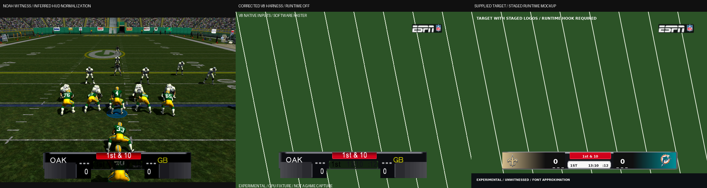

# r63 ESPN scorebug: native witness audit and runtime boundary

**STOP: the requested team-coloured v9 is not installed.** The brief says,
"If a change needs the runtime owner, stop and say so; do not enable it."
The existing static binder has no team-dependent material selection. Executing
it with all 32 team identities selects the same atlas, with no reads from
either team context. Adding a table of coloured textures does not add the
missing selector. That work belongs to the existing runtime owner, which this
task requires to stay off and untouched.

This delivery corrects the offline evidence, adds native font/draw and binding
tests, and explains several concrete v8 defects. It does **not** rename v8 to
v9, install a fixed matchup, enable the runtime, or claim a playable repair.
There are deliberately no `after_v9_*.png` files or v9 acceptance receipts.
**EXPERIMENTAL / UNWITNESSED applies to these CPU/raster reconstructions.**
Noah's supplied screenshot is the gameplay witness.

Worktree: `astra/r63-scorebug-espn`, base
`26b0d3d` (the executable/resource writers match the witness's `e997a8e`
stack). No emulator, GUI display, audio, network or push was used. All game
inputs were read only. No temporary or deliverable disc was created.

## Witness, corrected reconstruction and target



The middle panel is the **same v8 installation**, rendered with the corrected
harness. It is an after image of the evidence correction, not an after image
of a new game patch. Its strings and glyph quads come from native callbacks
and the retail FONT resources. The field, filtering, blending and depth test
are a software model. The missing corner mark is still a separately labelled
culling hypothesis; it is not silently removed from the principal render.

| Evidence | Link |
| --- | --- |
| Noah's original 1137x669 capture | [Witness](docs/scorebug_ingame/witness_2026-09-06_v8_ingame.png) |
| Witness mapped into the inferred native HUD viewport | [640x480 normalization](docs/scorebug_ingame/witness_v8_hud_normalized.png) |
| Previous v8 forecast, with synthetic strings and disabled scores | [Historical harness](docs/scorebug_ingame/after_v8_640x480.png) |
| Corrected v8, runtime absent, retail FONT quads | [4:3](docs/scorebug_ingame/reconstructed_v8_640x480.png) |
| Corrected v8 with the actual widescreen v3 camera hook | [Wide](docs/scorebug_ingame/reconstructed_v8_wide_640x480.png) |
| Same wide inputs, with the proposed back-face rejection | [CULL HYPOTHESIS](docs/scorebug_ingame/reconstructed_v8_wide_cull_hypothesis.png) |
| Full numeric inputs, callbacks, glyph vertices, material states and receipts | [Audit JSON](docs/scorebug_ingame/espn_native_audit.json) |

**PROVED provenance correction:** `target_NO_MIA.png` is not a broadcast
capture. Its own pixels say "TARGET WITH STAGED LOGOS / RUNTIME HOOK REQUIRED".
`ASTRA_SCOREBUG_INGAME_REPORT.md` identifies it as a generated synthetic-field
preview. It has a two-level centre and an upper-right mark, not the left-hand
mark/single-row layout described in this brief. The other supplied targets and
the SVG branch also contain staged designs. The stated single-bar layout is
the requested design; the supplied PNG establishes the requested rail bounds,
not evidence of an already functioning native bar. The target files are
preserved. No SVG branch merge or source-art substitution was performed.

## What the native paths actually prove

The old projection tool called `runtime.apply()` and constructed the runtime
test machine, even for its static image. It then disabled the two native score
records, forced the down/play-clock visibility sample, chose a frame by a
Python mode assumption, ignored material hide flags and vertex colours, and
painted independently supplied strings in a host font. Those are material
limitations, not an accurate static gameplay reconstruction.

The corrected tool constructs a static-only Unicorn fixture. It refuses either
runtime hook or a foreign callback before execution. It runs the installed,
hash-pinned v8 scene through relocation, registration, `FCCD0` setup, `FC200`
material visibility, `FCE70` with the settled score records **enabled**,
`22C00` palette composition, the native camera and `FC360` text drawing.
`47420 -> 46DF0 -> 46420 -> 46310` emits actual glyph vertices; interception is
at the immediate GPU boundary, not at a fabricated string renderer.

The ordinary presnap fixture explicitly supplies OAK away, GB home, 0-0,
quarter 1, 790 game-clock seconds, 12 play-clock seconds, and down 1 with a
914 cm line separation (native formatting rounds this to 10 yards). These are
sample game-state inputs, not recovered hidden state from the screenshot.
The game clocks themselves are unreadable in that screenshot.

FONT system/video data is read from the bounded font outer with the existing
`nfl_main_menu_font.py` parser and its SHA-256 pins. Host relocation of the
parser-proved field-local FONT pointers is explicit. The real font-slot
getter, metrics lookup, alignment, string walk and glyph submission run.
The private heap, startup animation selection, game predicates, and GPU
submission are fixture boundaries. Actual kernel/resource lifetimes and GPU
state are not executed.

### The lower row is caused by native score transforms

**PROVED:** the old harness wrote zero to score enable fields `A9597C` and
`A959B4`. This bypassed `FD2F0..FD416`, including the settled transforms of
the score-box parents. Merely setting the score phase to zero is different
from disabling the whole record. With both enabled, the quads on transforms
23/26 (`zscore_buga`, vertices 230..261) move below the frame, and the scores
move with their native text matrices.

| Geometry, 640x480 active-column comparison | Old disabled-score fixture | Corrected settled v8 |
| --- | ---: | ---: |
| Team-panel top | 383.01 | 409.20 |
| Team-panel bottom | 427.00 | 453.19 |
| Score transform anchor y | 414.00 | 422.20 |
| Actual score glyph y bounds | Not executed | 426.20..442.20 |
| Frame y bounds | 381.00..429.00 | 381.00..429.00 |

Thus a test checking only frame/clock/down bounds can pass while the visible
team panels extend 24 pixels below the intended frame. The new containment
predicate includes every visible, nondegenerate mesh and every submitted
glyph. It correctly **rejects v8**. It is not a passing v9 acceptance test.

### The text bindings already exist

**PROVED by native lookup and glyph submission:** none of the five ordinary
text records is unbound. Both clock variants exist; the unused variant
intentionally emits an empty string at the ten-minute threshold.

| Field | Record / callback | Bound scene transform | Sample output |
| --- | --- | --- | --- |
| Home abbreviation | `A95884` / `FC010` | `home_city`, index 3 | `gb` (font5 capital-shaped glyphs), possession yellow |
| Away abbreviation | `A958AC` / `FC030` | `away_city`, index 1 | `oak` (font5 capital-shaped glyphs), white |
| Quarter | `A958D4` / `FC090` | `Quarter`, index 5 | `1st` |
| Game clock under 10 minutes | `A958FC` / `FC100` | `Gameclock3`, index 7 | empty at 13:10 |
| Game clock at least 10 minutes | `A95924` / `FC150` | `Gameclock4`, index 9 | `13:10` |
| Home/away scores | `A9594C`, `A95984` / `FC050`, `FC070` | home/away box plus score leaf | `0`, `0` |
| Down and distance | `A959C8` / `FC7D0` | `drop_down`, index 11 | `1st & 10` |
| Play clock | `A95A38` / `FBE30` | `drop_clock`, index 15 | `:12` |

`FC090` reads quarter at `E602C4`. `FC100/FC150` use `FBAB0`, reading
`[E6028C]+10h`, rounding up and choosing the proper clock variant. `FBE30`
uses `FBB10` and `[E60294]+10h`. Tests execute the switch at 600/599 seconds,
zero, fractional seconds, and quarter changes. City callbacks read the native
contexts' `+13Ch` abbreviation pointers; the identity asset strings are at
`+10Ch`. Score callbacks read `E5FC28/E5FC68`.

**PROVED:** the six apparent `---` strings are painted atlas pixels, at
columns 48/53/58, row 30 of the shared panel region. No text callback emits
them. Score-parent movement flips/moves that texture region with the panels,
putting the marks above the scores in the witness. They are decorative
timeout-like marks, not unbound game-clock placeholders. V8 has no native
timeout text binding. A later static repair should omit them, as the brief
allows; live marks require the runtime counter/material selection.

### Contrast and the red tab

**PROVED inputs:** the clock-strip vertices 48..63, `cscore_buga`, still carry
retail D3DCOLOR **`99000000`**, black with alpha 153. Painting a white strip
in `score_buga` did not make those vertices white. The quarter callback's
colour is **`FF000000`**; both game-clock colours and the play clock are
**`FF111118`**. Their glyphs are submitted, rather than missing. The software
vertex-times-texture model produces the dark transparent centre seen in the
witness. Exact GPU combine/blend state remains a stated model boundary.

**PROVED:** the red tab is `dscore_buga`, vertices 64..79, transform 11,
sampling atlas rows 32..39. `A959C8` invokes the native down formatter. Its
six-unit native slide and the separate lower strip were deliberately authored
into v8. This is not an unrelated retail overlay covering a finished ESPN bar.

### The 2.0 fields are not font scale

**PROVED correction to `ASTRA_SCOREBUG_FIX_REPORT.md`:** `46920` initializes
text object `+30h/+34h/+38h` to `(2,2,1)`. `46420`, specifically
`46507..4653E`, adds these values to the shadow-pass position. `46310` adds
the actual FONT glyph quad to its text origin; it does not multiply the glyph
by these fields. Changing them to `(20,30,5)` leaves the complete captured
primary glyph vertices byte-for-byte equivalent in the plain scorebug style.
The new test executes that negative control. Main glyphs use font1 and city
glyphs use font5; main glyph height is approximately 16 pixels in this sample.
The report's earlier "2x glyph scale" explanation must not guide v9.

### Visible frame selection, wide placement and missing mark

**PROVED:** mode 0 selects `yscore_buga1` and `zz_ESPN_bug`; mode 1 selects
`yscore_buga` and `zz_ESPN_bug1`. The former harness rendered/checked the
other frame for mode 0. The actual mode-0 frame is
`[79.964,380.999,556.304,429.000]`, missing the reference's left rail by
4.036 pixels. The other frame remains about `[84.091,380.999,559.957,429]`.
Both copies need attention in a future static repair.

The wide mode-0 frame is `[117.470,380.999,519.382,429]`. The actual v3 hook
contracts x about the 320-unit centre by `27/32`; the intended display stretch
undoes this. Y is unchanged. Both direction modes and both slide endpoints
are tested. The 4:3 HUD policy is retained, with no world-marker undo applied
to the ordinary scorebug camera. A resource frame's four-pixel asymmetry is
not repaired by the widescreen policy.

**HYPOTHESIS, explicitly rendered separately:** the ESPN mark's two surviving
triangles have the opposite effective strip winding to the main frame/down
triangles after v8's vertex rewrite. Rejecting that winding removes the mark,
consistent with Noah's screenshot. The principal reconstruction shows the
mark because the actual GPU cull state was not captured. Winding is proved;
attributing the missing gameplay mark to back-face culling is not yet proved.
The mark is still authored near `(508,33)..(604,57)`, not inside the left end
of the requested bar.

**HYPOTHESIS for screenshot normalization:** mapping the full 1137x669 capture
to the native HUD rectangle `(0,16)..(640,464)` closely aligns the wide frame,
panels, scores, dashes and tab. It accounts for the apparent vertical offset
that a full-480-row resize leaves. No capture settings or guest framebuffer
dump establish that crop, so the JSON says `normalization_proved: false`.
Background, edge filtering, the faint top rail and some subpixel edges differ
between the synthetic software raster and the captured game. Those are not
claimed to be explained by proved GPU state. No emulator setting is blamed.

## Why team colours require the runtime owner

**PROVED for the audited static path:** `FC1A0` walks the eleven fixed name
pairs at `A95C60..A95CB8`, resolves each material and texture through native
lookup, and writes the descriptor at material `+30h`. In the v8 XBE all eleven
texture names are `score_buga`, including both ESPN copies. Executing this
unchanged binder for all 32 asset codes produces the same nonnull descriptor
in every material and zero reads from the two native team contexts. The
per-frame audited scorebug code updates visibility, transforms and text; it
does not select a team-colour material.

The existing `TEAM_LOGOS` metadata has the 32 palettes derived from the supplied
SVG `teams.json`. Those are host-side data. The runtime companion already has
a per-team texture table, setup selection and independent materials; its
report also records the unresolved entry freeze. Static resource compilation
does not make the native binder execute that selection. Globally baking NO/MIA
or OAK/GB into the shared atlas would be incorrect for other games. Loading
32 textures without selecting them would also be incorrect.

Decision: honour the explicit stop condition. Leave the static writer, source
art resolver, HUD-layout owner, runtime owner, allocator, presets and all
protected files unchanged. There is no new option and no protected wiring
change to request in `WIRING.md`. The already available static option still
installs v8. Finishing v9 needs a subsequent task that permits the team-binding
owner and resolves its runtime entry problem; then the static mesh, colours,
mark winding, two frame copies and glyph/cell containment can be repaired
together without presenting a neutral substitute as the requested result.

## Reproduction, receipts and verification

```sh
python3 -m tools.nfl2k5_scorebug_projection \
  --pack '/media/noah/Storage/for codex 1.0/extracted/ESPN NFL 2K5 (USA)/vc_53450030/0' \
  --xbe '/media/noah/Storage/for codex 1.0/extracted/ESPN NFL 2K5 (USA)/default.xbe' \
  --witness docs/scorebug_ingame/witness_2026-09-06_v8_ingame.png \
  --output docs/scorebug_ingame
```

This reads bounded resource slices, a FONT outer capped at 3 MB, and the
11.95 MB executable. It does not read a whole pack/disc into RAM or build a
disc. The retained v8 scene and atlas reproduce their existing pinned hashes:

| Resource | Span bytes | SHA-256 |
| --- | ---: | --- |
| `score_bug` | 4832 | `cdcf2aa898dd85332e3b872ca73eeae525ca85e9e543f4d07250bf820df16427` |
| `score_buga` | 2432 | `8771f332aa07a63db1c21d9803455cc4ed5dd7f04fb88d36d571b03f1c7b7cd0` |

The JSON includes exact XBE edit receipts, font/code pins and both resources'
before/after hashes. Both resources refit through the existing
`nfl_vc_lz_fill` writer, retain all 32 wrapper bytes including **`+14h = 16`**,
and decode byte-identically through native `4DC00` at the actual overlapping
source/destination placement. XBE and resource replay are exact no-ops. The
existing mixed/foreign-state, transaction and section-digest tests pass.
These are **retained v8 receipts**, not evidence of a new v9 installation.

Final standalone commands/results are recorded in
[espn_validation.json](docs/scorebug_ingame/espn_validation.json). The memory
and cave gate files include both forward and reverse complete owner unions;
their runtime-owner application is confined to those existing safety-test
fixtures, never the static projection or a disc. No gate was weakened.

All commands below used plain `python3 <path>`, measured with `/usr/bin/time -v`.

| Standalone path | Tests run | Result | Peak RSS, KiB |
| --- | ---: | --- | ---: |
| `tests/mod_editor/test_nfl2k5_scorebug_projection.py` | 13 | PASS | 205604 |
| `tests/mod_editor/test_nfl2k5_scorebug_ingame.py` | 11 | PASS | 138584 |
| `tests/mod_editor/test_nfl2k5_scorebug_source_art.py` | 13 | PASS, 3 skipped | 47840 |
| `tests/mod_editor/test_nfl2k5_scorebug_unified_adapter.py` | 5 | PASS | 30328 |
| `tests/nfl2k5_scorebug_layout_test.py` | 15 | PASS, 4 skipped | 146256 |
| `tests/mod_editor/test_xbe_patch_memory_writes.py` | 75 | PASS | 313796 |
| `tests/mod_editor/test_xbe_patch_cave_references.py` | 87 | PASS | 483376 |

Total: **212 passed, 7 skipped, 0 failed**. The legacy suites skip unavailable
research assets and the optional legacy CPU fixture; the corrected projection
suite's 13 native tests all execute. No full-disc copy was made. Maximum test
RSS is **472.05 MiB**, below the stricter 2 GB per-test limit.

The projection suite deliberately tests that v8 fails the two-pixel frame and
whole-bar containment requirements. It also tests native clock/quarter updates,
the shadow-offset negative control, 32-team binding invariance, black strip
vertex colours, mark winding, native decompression, and refusal of changed
callbacks/runtime hooks. There is no claim of a passing v9 cell-bounds test.

## Noah's witness list and remaining limits

No new disc is ready for Noah to play from this task. The supplied v8 witness
is a failure of the intended appearance. The following list belongs to the
future completed repair, after its runtime-owner prerequisite is authorized
and addressed:

1. Cold entry, repeated matchup entry and returning from menus must not hang.
   Confirm the exact build receipt and actual installed resource/XBE hashes.
2. OAK/GB, NO/MIA, BAL/PIT, LV/HOU, reversed home/away sides and created teams
   must show correct identities and colours with no stale material.
3. Both drive directions, both score phases and three-digit scores must stay
   inside one bar. Compare visible pixel bounds, not just the outer frame.
4. Check quarters 1..4 and overtime; game clock above/below 10:00, under a
   minute and 0:00; ordinary downs, Goal/Inches and possession changes.
5. Confirm the ESPN mark at the requested left cell, no decorative placeholders,
   readable white scores and clocks, and no flag/fumble text escaping the bar.
6. Check 4:3 and widescreen v3, kick meter, play-call/replay transitions and
   timeout/half resets. Omit timeout marks until their binding is implemented.

The unproved remainder is explicit: exact GPU culling/blending/filtering,
the capture crop, all gameplay visibility/events, and runtime team selection.
This task supplies reproducible evidence and a tested stop, not a runtime fix.

## Delivery

Git's shared metadata is read only. The authorized fallback uses isolated
metadata under `.scratch`, an explicit-path commit above `26b0d3d`, and
`.scratch/scorebug-espn.bundle`. The changed files remain in this worktree.
`ASTRA_BRIEF.md`, `.scratch`, retail executable/resource binaries, protected
files and other worktrees are excluded. No push was performed.

Scratch/disk usage and maximum resident memory for the final commands are in
the validation JSON. All task-owned temporary files are bounded research
outputs; zero temporary discs or pack copies need deletion.
