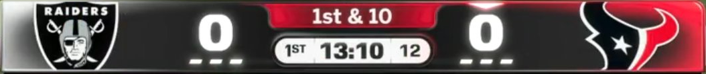

# r63 scorebug broadcast comparison

**EXPERIMENTAL / UNWITNESSED. The requested 1:1 result was not achieved.**
This delivery replaces the mockup-derived scene with a measured broadcast
layout, supplies static and optional runtime layers, and retains 26 comparison
iterations and native validation. Geometry meets the one-pixel boundary target
under the documented viewport mapping. Pixel edges, colours and text do not.
The requested custom glyph-atlas binding is also **not implemented**. These
are outstanding requirements, not claims deferred to a successful game test.

The existing `scorebug` option installs `espn-broadcast-exact-v1`. The existing
`scorebug_runtime` option installs `scorebug-runtime-v3-broadcast-exact` and
remains off in every preset. The reported game-entry freeze is unresolved.
No emulator application, GUI, audio, network, disc build or push was run.
Unicorn was used for the bounded native CPU proofs requested by the brief.

## Reference and final output

The sole target is [the supplied real LV/HOU broadcast](docs/scorebug_ingame/reference_LV_HOU_broadcast.jpeg).
Its SHA-256 is
`f88b98687827c753882d8c5186eb186095510228b039c6d7a2e9e9d88e725e14`.
The earlier `target_*.png` images are not acceptance targets.




These generated images are **software rasters of native submissions**, not
screenshots of gameplay. Reference pixels are never substituted into generated
scoreboard art or text. The reference column and normalized reference files
are explicitly labelled comparison inputs.

| Evidence | Artifact |
| --- | --- |
| Source rectangles, transform and uncertainty | [measurement.json](docs/scorebug_ingame/exact/measurement.json) |
| Every score, selected iteration, both aspects/modes | [scores.json](docs/scorebug_ingame/exact/scores.json) |
| Native positions, glyph quads, material names, code and byte receipts | [native_audit.json](docs/scorebug_ingame/exact/native_audit.json) |
| Source-dependent compiler identities | [compiler_pins.json](docs/scorebug_ingame/exact/compiler_pins.json) |
| All 32 compiled panel pairs and logo provenance | [panel sheet](docs/scorebug_ingame/exact/all_32_native_panels.png), [inventory](docs/scorebug_ingame/exact/panel_inventory.json) |
| Retail font limits | [font study](docs/scorebug_ingame/exact/font_study.json), [glyph sheet](docs/scorebug_ingame/exact/retail_font_study.png) |
| Six real-image preflights and XBE replay | [probe_matrix.json](docs/scorebug_ingame/exact/probe_matrix.json) |
| Standalone validation and development failures | [validation.json](docs/scorebug_ingame/exact/validation.json) |

## Measurement decision

The JPEG transition band gives outer rails **[434, 942, 1488, 1054]**, with
approximately two source pixels of edge uncertainty. Region bounds are:

| Region | Source rectangle |
| --- | --- |
| Left panel | [438, 946, 834, 1049] |
| Centre pill | [831, 947, 1089, 987] |
| Clock strip | [839, 992, 1083, 1045] |
| Right panel | [1088, 946, 1484, 1049] |

I chose to fit the full broadcast into the native active viewport:
`x = source_x / 3`, `y = 16 + source_y * 448 / 1080`.
The installed frame is therefore **[144.667, 406.756, 496.000, 453.215]**
in 640x480 HUD coordinates. The native root stays at (320,408), and the
projection includes the existing 16-pixel inset. A naive full-height 480 fit
puts the bottom at 468.444, below the native clipping boundary of 464.

This mapping is a documented framing decision, not a measurement of console
pixel aspect or TV overscan. The 0.01-pixel native agreement below is numerical
agreement with this mapping and must not be confused with the JPEG's much
larger measurement uncertainty. Widescreen v3 contracts X by 27/32 about 320;
Y is unchanged. The comparator applies the same contraction to its wide
reference, retaining both underlying 640x480 projections for review.

The literal photograph has a **light** play-clock field with dark digits and
thin separators, despite the brief calling it a dark cell. I followed the
photograph. It also has no distinct TEXANS wordmark above the logo. The runtime
panel includes the requested authored wordmark, which is an intentional
remaining discrepancy. RAIDERS is already present in the source shield.

## What changed

`mod_editor/core/nfl2k5_scorebug_exact.py` authors the new scene/atlas and panel
pixels. `nfl2k5_scorebug_ingame.py` retains its writer, preflight, rollback,
status and replay API; v8/v9 generators remain explicitly historical helpers.
Old or mixed patched inputs are refused rather than silently migrated.

The static layer uses the existing 64x64 P8 atlas and fixed scene spans. It
contains a neutral dark frame, thin rim, red pill, light clock strip, six
white decorative timeout dashes, white native scores and dark clock text.
Obsolete tabs and both network marks collapse to degenerate geometry inside
the frame. Native team abbreviations are transparent, including their native
possession colour. The existing kick-meter move, lineup hiding, root slots
and boot-logo reservation behaviour are retained.

Native ordinary text selects retail **FONT4**, and scores select **FONT8**.
Anchors are derived from the measured cells and checked through real native
FONT submissions. The play-clock formatter's `MOV EDX` operand at `0xFBE43`
now addresses the existing `%02d` suffix at `0xE6C43A`; the UTF-16 literal,
rounding, callback ABI and urgency logic remain intact. All new XBE fields
pin their retail bytes and participate in mixed/foreign refusal.

The runtime layer uses the existing owner's actual `zscore_buga` away and
`hscore_buga` home material bindings. It compiles 32 teams plus neutral,
two orientations, and four timeout counts: **264 native TXTRs**. Each is
128x32 P8 in a 5,280-byte uncompressed wrapper. Logo pixels come from the
pinned retail team textures. Gradients follow the supplied team colours;
LV silver and HOU red override their metadata primary colours to follow the
photograph. Home gradients reverse, but logo pixels and lettering do not.
Other wordmarks use authored, portable condensed pixel capitals. These are
not official team typography, and historical retail logos remain historical.

The four states of a panel now share one palette. Independently quantizing
states caused unrelated logo/gradient pixels to change when a timeout was
used; the new native image-difference test caught this, and now only the
selected side's dash band changes. UV endpoints address actual 128x32 texel
centres. The collection remains 1,393,920 appended bytes, with 1,394,688 bytes
of aligned pack growth. The existing archive writer owns every relocation.

**Runtime hook instructions, ABI, requests and behaviour were not rewritten.**
The runtime module's only edit is its required-resource version string. Its
existing allocation remains 1,408 RX bytes and 128 RW bytes. Score flashes,
down refresh, play-clock urgency, missing-texture handling, created-team
fallback and timeout sources remain the existing owner's implementation.
There is no new allocation or cave.

## Comparator, iteration and stopping point

`tools/nfl2k5_scorebug_exact.py` uses the corrected native projection harness.
Each trial serializes and refits the scene, decodes installed bytes, loads the
real atlas/panels, executes native setup/frame/text code and rasterizes the
captured positions, glyph UVs, vertex colours and texture descriptors.
The runtime renderer refuses a missing descriptor map rather than filling in
an arbitrary atlas. Its material receipts identify `sb37h3` and `sb20a3` in
the photographed HOU/LV fixture. No text strings are drawn by a substitute
preview font.

Per-region scores include RGB mean absolute error (0..255), a 16-bin RGB
histogram Wasserstein distance, symmetric pixel-edge distances, native
boundary errors and text quad versus reference ink boxes. Frame colour/edge
metrics use a two-pixel perimeter ring. Static neutral panels retain their
full-reference colour error but have `native_box=null`: they are not falsely
reported as independently observed team-panel boundaries.

Iterations 00..04 retain the initial metric, which included the entire frame
interior in the rim score. Iterations 05..25 use the corrected perimeter
metric. The initial results remain in `scores_initial.json`; do not compare
those scores numerically across metric versions. Iteration 18 repeats the
v9 control; iteration 19 includes the adjusted anchors, shared timeout
palette and corrected UVs. Iterations 20..25 retain rejected red-bias
neighbours. **Iteration 19 is selected**, with red bias -20.

The final red-channel coordinate descent tested steps 4, 2 and 1. It stopped
when no candidate improved the combined static/runtime regional mean by
0.005. The -22 neighbour improves that sum by less than 0.001, so the stopping
rule retains -20. This is a **local palette plateau**, not global convergence
of all scene, font, logo and blend parameters. It does not satisfy the brief's
one-pixel pixel-edge and small-colour-tolerance requirements.

| 4:3 region | Runtime boundary error, px | Static RGB MAE | Runtime RGB MAE | Runtime pixel-edge p95, px |
| --- | ---: | ---: | ---: | ---: |
| Frame rim | 0.0063 | 76.829 | 72.733 | 44.000 |
| Left panel | 0.0054 | 48.966 | 37.445 | 3.114 |
| Centre pill | 0.0056 | 43.990 | 43.990 | 7.211 |
| Clock strip | 0.0050 | 65.414 | 65.991 | 1.414 |
| Right panel | 0.0051 | 42.401 | 36.163 | 8.944 |

The large rim edge-distance tail is a real failure of the raster comparison,
including photograph/AA/gradient transitions within the narrow mask; it is
not replaced with the much smaller mesh-boundary metric. Static shared-region
boundary errors match the runtime values. Static panel boundaries are absent.
Both native placement modes render identically in each layer/aspect. Mean
regional RGB MAE is 55.520 static / 51.264 runtime in 4:3 and 54.855 / 50.496
in widescreen. The v9 control's static value is 73.883 under the same corrected
4:3 metric. All eight final acceptance records report `exact_match=false`.

Final 4:3 text-box errors are 2.874 px for scores, 5.333 for quarter, 3.667
for game clock, 3.333 for play clock and 10.667 for down/distance. Native quad
boxes include transparent padding; source ink boxes come from thresholded
JPEG regions. They are useful mismatch measurements, not font-outline proofs.

## PROVED and HYPOTHESIS

**PROVED by the bounded offline inputs and tests:**

- The measured scene boundaries, eight final layer/aspect/mode combinations,
  visible winding, and containment predicate. Static checks also exercise
  score rotations at 0, .25, .5, .75 and .999, slides, 100/999 scores,
  overtime, possession changes, clock format boundaries and alternate events.
- Both fixed spans keep their entire 32-byte wrappers. `score_bug` is 4,832
  bytes, `score_buga` 2,432 bytes, and both wrapper `+0x14` scratch fields
  remain **16**. The native in-place decompressor matches the compiler's
  decoded SHA-256 values. The atlas fits at 43 palette colours.
- Static XBE/resource replay, runtime collection identities, all six probe
  resource statuses, real-disc read-only preflights, and XBE replay. Foreign
  bytes, mixed resources, bad tails/indexes and injected transaction failures
  are rejected or rolled back by the existing writer tests.
- All 139 existing HUD wrappers and all 4,323 archive index entries retain
  their contracts; the suffix and unrelated packs retain their contents.
  Test fixtures seed the actual index/HUD/logo spans and use sparse zero holes
  for unused space, preserving logical writer/readback checks without a full
  pack or disc copy.
- Native collection loading completes under explicit host I/O completion:
  188 to 716 events, 44 to 308 registered TXTRs, and 678,144 to 2,097,408
  native heap bytes. The increment is 264 textures and 264 * 5,376 heap bytes.
  Allocation-failure, old-EOF/missing-resource and bounded wait tests pass.
- Both complete XBE gates compose owners in forward/reverse orders and the
  scale-out union. The play-clock operand is checked as a complete five-byte
  `MOV EDX` instruction and against the unchanged literal, not disassembled
  as if its four operand bytes were a new cave.

**HYPOTHESIS / UNWITNESSED:**

- Actual console/TV scaling, blend/depth/filter state and clipping. The
  rasterizer is an explicit software model, not an NV2A implementation.
- Game-entry stability, asynchronous GPU completion, retail heap pressure,
  full-game/replay/cutscene transitions and every on-screen runtime effect.
  Passing fixture callbacks does not identify or fix the reported freeze.
- Visual equality. Even perfect GPU agreement would not fix the demonstrated
  glyph widths, cap heights, wordmark/logo differences or missing details.

## Outstanding requirements

**Custom glyph atlas and binding:** the nine retail font resources were
measured. FONT4 is the smallest direct native down-string candidate at
59x12 ink pixels; the normalized reference is approximately 38.7x9.1.
FONT8's zero is 22x20 versus approximately 16.5x22.8 in the reference.
The ordinary text object's `+0x30/+0x34` fields are shadow offsets, not
scaling controls, and native score matrices are rebuilt each frame.
Repainting the shared `digital_font` TXTR would not bind these actual FONT
objects. Replacing global FONT4/FONT8 would also change unrelated UI.
I did not install either shortcut. A scoped native FONT resource/descriptor
binding is still required; this delivery does not contain or claim that
fallback. This is a substantive unfinished part of the brief.

The thin rim and its silver/red reflections, pill/clock radii, separators,
text weights, exact logo contours, tiny team lettering and possession
chevron still differ. Suppressing native team abbreviations also removes
their yellow possession cue; no matching replacement chevron is installed.
Three-digit scores remain within the overall frame but can crowd the centre
cells. Static dashes are decorative and never claim to track timeouts.

The freeze remains unresolved, and no runtime preset promotion is justified.
The necessary protected packaging/help/manifest changes are specified in
[WIRING.md](WIRING.md), not applied in this branch. A released build needs
that integration. These remaining items prevent a truthful claim that the
brief's full 1:1 goal is complete.

## Six-profile freeze witness matrix

The diagnostic recipe and pair identity remain those of the prior v8 probe:
**NE/TB plus neutral**, not the LV/HOU comparison pair.

| Profile | Hooks | Appended TXTRs | Pack growth | Intended isolation |
| --- | --- | ---: | ---: | --- |
| transport | No | 0 | 0 | Existing transport with changed HUD bytes |
| hooks | Yes | 0 | 0 | Missing-resource hook path |
| resources | No | 264 | 1,394,688 | Collection loading without hooks |
| neutral | Yes | 8 | 43,008 | Neutral bindings and timeout states |
| pair | Yes | 24 | 126,976 | NE/TB and fallback, both orientations |
| full | Yes | 264 | 1,394,688 | All team resources and existing hooks |

Every row preflights the real input XISO without writing it, reports applied
resource/static status for the proposed result, and has identical XBE replay.
Hook status is retail for transport/resources and applied for the other four.
Every row's gameplay result is **UNWITNESSED**, not pass. See the complete
receipt and proposed XBE hashes in `probe_matrix.json`.

Noah's witness list, after integration into disposable builds:

1. Keep an ordinary static-only control. In LV at HOU, record 4:3 and
   widescreen captures at the same score/quarter/clock, plus the screen's
   output mode and any TV scaling. Confirm placement before assessing shape.
2. Compare all six profiles on the same NE/TB entry route. Record entry
   success/freeze, last visible frame, elapsed time, build/probe/hash and
   whether a warm restart differs from a cold start. Do not call a successful
   one-profile entry a freeze fix.
3. For a profile that enters successfully, use a timeout on each team and
   verify 3/2/1/0 dashes independently, without other panel pixels changing.
   Check possession, score changes/rotation, under-five play-clock colour,
   down changes, 9:59/10:00, quarter changes and overtime.
4. Exercise both drive directions, kickoff/punt/field-goal screens, FLAG,
   FUMBLE, ball position, halftime, pause, replay, cutscene, return to menu
   and a second matchup. Confirm no exposed collapsed mark or lost panel.
5. Check home/away gradients and unmoved lettering for all 32 teams and
   created-team fallback. Check 100+ scores for centre-cell crowding.

## Validation, resource limits and delivery

All commands use standalone `python3 file.py` with
`QT_QPA_PLATFORM=offscreen`, timed using `/usr/bin/time -v`. The final results,
precise skips and earlier development failures are recorded in
`docs/scorebug_ingame/exact/validation.json`. The tables below are filled from
those final logs before committing.

| Standalone suite | Passed | Skipped | Wall seconds | Peak RSS, KiB |
| --- | ---: | ---: | ---: | ---: |
| `tests/nfl2k5_scorebug_layout_test.py` | 11 | 4 | 2.323 | 146,504 |
| `tests/mod_editor/test_nfl2k5_scorebug_exact.py` | 7 | 0 | 138.386 | 208,584 |
| `tests/mod_editor/test_nfl2k5_scorebug_ingame.py` | 11 | 0 | 8.697 | 137,756 |
| `tests/mod_editor/test_nfl2k5_scorebug_native.py` | 4 | 0 | 134.963 | 203,212 |
| `tests/mod_editor/test_nfl2k5_scorebug_projection.py` | 14 | 0 | 442.934 | 335,744 |
| `tests/mod_editor/test_nfl2k5_scorebug_resources.py` | 6 | 0 | 102.408 | 168,716 |
| `tests/mod_editor/test_nfl2k5_scorebug_runtime.py` | 12 | 0 | 117.332 | 243,960 |
| `tests/mod_editor/test_nfl2k5_scorebug_source_art.py` | 10 | 3 | 0.494 | 48,100 |
| `tests/mod_editor/test_nfl2k5_scorebug_unified_adapter.py` | 5 | 0 | 0.186 | 30,608 |
| `tests/mod_editor/test_xbe_patch_cave_references.py` | 95 | 0 | 385.686 | 502,756 |
| `tests/mod_editor/test_xbe_patch_memory_writes.py` | 79 | 0 | 295.651 | 314,268 |

**Total: 254 passed, 7 skipped, 0 failures across 11 standalone suites.**
The final receipt-flag assertion also passed separately after its naming change.
The seven skips are three absent legacy source-art comparison inputs, one
absent intermediate glTF, and three older opt-in bounded CPU fixtures.
The current projection/native/runtime CPU suites ran without skips.
Python compilation and `git diff --check` also passed.

No whole disc or archive pack was loaded into RAM. Archive access uses bounded
`PackView` reads. The probe preflight peaked at 173,400 KiB RSS. The largest
standalone suite peaked below 0.5 GiB, well under the 2 GiB test limit. Recorded
free space remained above **100,000,000,000 bytes**; this is decimal GB, not a
claim of 100 GiB. The final evidence directory is about 5 MiB and `.scratch`
is below 200 MiB, including the delivery bundle. No disposable disc remains.

The branch starts at `ddec83f`. Input sources include the supplied Fable
layout/atlas template, SVG lineage, actual retail logo/FONT spans, prior
scorebug ESPN/ingame/runtime/fix/v9 reports, allocator scale-out report and
RC85 baseline. No parallel compiler branch is required. All protected files
are untouched; the one `WIRING.md` addition supersedes the older scorebug v9
handoff without deleting unrelated handoffs.

Shared Git staging refused to create `index.lock` because its metadata is
read-only. The authorized fallback creates the commit using isolated metadata
and **114 explicit paths**, excluding `ASTRA_BRIEF.md` and `.scratch/` from
the commit. Delivery is `.scratch/r63-scorebug-exact.bundle`, with
commit/base/bundle identities in `.scratch/DELIVERY.json`. The verified bundle
contains only this work and requires the existing base commit. The original
worktree HEAD is unchanged. Nothing is pushed.

Reproduce the authored candidate from the pinned retail extraction:

```sh
python3 tools/nfl2k5_scorebug_exact.py \
  --pack '<retail extraction>/ESPN NFL 2K5 (USA)/vc_53450030/0' \
  --xbe '<retail extraction>/ESPN NFL 2K5 (USA)/default.xbe' \
  --output '<new evidence directory>'
```

`--accept-palette` explicitly updates the chosen red bias and compiler pins in
an authoring checkout. `--audit-only` verifies an existing completed selection
and refreshes the native audits, both aspect scores, font study and panel
inventory. The older projection CLI delegates to this comparator. It cannot
turn an offline image into a witnessed game result.
