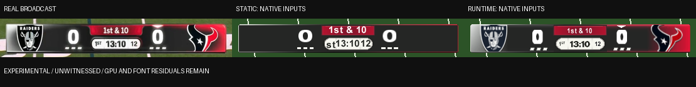

# r63-scorebug-exact2 delivery

**EXPERIMENTAL / UNWITNESSED. The integration and seven ordered residual passes are complete, followed by a joint local plateau check. A 1:1 gameplay match was not achieved. The game-entry freeze remains OPEN.**

The existing `scorebug` default is `espn-broadcast-exact-v1`. Supplying `scorebug_folder` retains the landed `espn-reference-v10` compiler, mesh, native fonts and byte identities. The diagnostic runtime is `scorebug-runtime-v4-scoped-fonts` and remains off in every preset. Its private fonts, team artwork, possession marker and compact scores require the runtime collection and hooks. The static default keeps neutral panels and retail fonts, including its remaining three-digit crowding.

Job A was committed early as `14a1ecb3c890d71d64ea79c79e63b3202f59713f` and delivered in `.scratch/integration.bundle` with `.scratch/INTEGRATION_DONE`. The shared Git metadata is read-only; all later commits use isolated metadata under `.scratch/delivery.git`, explicit file paths and the branch `astra/r63-scorebug-exact2`. `.scratch/final.bundle` contains every delivery commit since `b1674723c7f8a3b063ca61c15dabd78c5e6b5d48`; `.scratch/FINAL_DONE` records the final SHA. Neither the brief nor `.scratch` is committed. No push was performed.

## Reference and review artifacts

The sole target is [the supplied LV/HOU broadcast](docs/scorebug_ingame/reference_LV_HOU_broadcast.jpeg), 1920 x 1080, SHA-256 `f88b98687827c753882d8c5186eb186095510228b039c6d7a2e9e9d88e725e14`. Mockup images are not acceptance targets. Reference pixels are never substituted into generated art or glyphs.

Review the [full 932-iteration strip](docs/scorebug_ingame/exact/iteration_strip.png), [stage overview](docs/scorebug_ingame/exact/stage_overview.png), [all scores](docs/scorebug_ingame/exact/scores.json), [final local plateau evidence](docs/scorebug_ingame/exact/region_plateaus.json), [native submissions](docs/scorebug_ingame/exact/native_audit.json), [font binding proof](docs/scorebug_ingame/exact/font_binding.json), [runtime state proofs](docs/scorebug_ingame/exact/runtime_state_proofs.json), and [all 32 panel pairs](docs/scorebug_ingame/exact/all_32_native_panels.png). Every generated game-like image is a software raster of captured native submissions, not a screenshot of gameplay.

## Measurement and stopping decision

The photographic rails are [434, 942, 1488, 1054], with approximately two source pixels of edge uncertainty. The documented viewport mapping is `x = source_x / 3`, `y = 16 + source_y * 448 / 1080`. This produces [144.667, 406.756, 496.000, 453.215] in a 640 x 480 HUD and respects the native 16-pixel vertical inset. Widescreen v3 contracts X by 27/32 about 320. This is a framing decision, not a claim about console overscan or pixel aspect.

Metric v4 removes components touching a text ROI edge and isolated specks below three source pixels. The old quarter box included a five-pixel capsule-rim fragment. Its corrected ink box is 9.0 x 7.0519 HUD pixels; the original measurements remain in the retained history. Other reference text boxes are unchanged. Native quad boxes include transparent glyph padding and cannot prove font-outline equality. All five regions are re-scored for every retained candidate; frame edges are measured over a two-pixel perimeter ring.

Iteration **773** is installed. The final joint pass contains **56 settled coordinates**. Earlier passes retain wider searches and alternative rim, corner, separator, weight and lettering families. The final pass tests neighboring palette values, logo dimensions/positions, font scales, whole/subpixel anchor movements, weights, quarter capitals, separator choices and possession dimensions/position, then rechecks the compact font. No coordinate improves the final objective beyond its recorded threshold. Whole-pixel probes prevent native rounding from producing a false subpixel plateau.

The joint objective is the equal-weight mean of the five region RGB errors, with a strong penalty for losing the one-pixel text or possession fit. Compact-font width is optimized independently for three pixels of pill clearance. Some regions overlap: moving a logo can improve the rim score while worsening the panel score. `region_plateaus.json` retains these isolated gains and opposing regressions. This is a bounded local plateau of the documented objective and model families, not independent global minima for every region, and not pixel equality.

The table shows the final checkpoint for each stage; superseded quarter and cell attempts remain in `scores.json`.

| Pass | Selected iteration | Mean runtime RGB MAE | Recorded coordinates |
| --- | ---: | ---: | ---: |
| fonts | 88 | 42.7824 | 20 |
| rim | 136 | 32.3967 | 8 |
| quarter | 168 | 31.6079 | 12 |
| cells | 257 | 31.1596 | 22 |
| weights | 294 | 30.1325 | 16 |
| logos | 438 | 27.0755 | 40 |
| chevron | 469 | 26.9012 | 8 |
| compact | 495 | 26.9012 | 2 |
| plateau | 773 | 25.2797 | 168 |

The first-pass iteration 19 had mean runtime RGB MAE 51.2642. The final value is **25.2797**. Earlier iterations 00..04 used a different rim mask and are not directly comparable. Quarter metric corrections affect text-box scores, not regional RGB errors.

| 4:3 region | Native boundary error, px | Static RGB MAE | Runtime RGB MAE | Runtime edge p95, px |
| --- | ---: | ---: | ---: | ---: |
| centre pill | 0.0056 | 43.692 | 24.860 | 10.770 |
| clock strip | 0.0050 | 64.117 | 38.666 | 1.000 |
| frame rim | 0.0063 | 30.205 | 19.179 | 7.000 |
| left panel | 0.0054 | 48.486 | 22.370 | 2.000 |
| right panel | 0.0051 | 42.278 | 21.323 | 1.414 |

Acceptance remains boundary error <= 1 pixel, region RGB MAE <= 8, pixel-edge p95 <= 1 pixel, text-box error <= 1 pixel and full containment. All eight static/runtime, aspect and placement-mode records still report `exact_match=false`. The small native boundary errors are numerical agreement with the chosen mapping; they are not evidence of subpixel accuracy in the JPEG or GPU raster.

| Native text / callback | Private FONT | Native quad error, HUD px | Visible ink error, HUD px |
| --- | --- | ---: | ---: |
| 12 (0xfbe30) | ore_bug | 0.4533 | 0.3333 |
| 0 (0xfc050) | score_buga | 0.3321 | 0.6963 |
| 0 (0xfc070) | score_buga | 0.3345 | 0.6963 |
| 1st (0xfc090) | core_bug | 0.4648 | 1.0148 |
| 13:10 (0xfc150) | dscore_buga | 0.6250 | 1.0000 |
| 1st & 10 (0xfc7d0) | score_bug | 0.8919 | 0.8519 |

Visible-ink boxes are a separate threshold diagnostic at HUD resolution, with ROI-edge fragments excluded. The quarter label retains a 1.0148-pixel ink-boundary residual. This makes the difference between a fitted native quad and fitted visible text explicit; the original acceptance criteria were not weakened.

## What changed and what is proved

**PROVED by the pinned offline inputs and standalone tests:**

- Default and folder builds have distinct coherent scene identities. Status readers recognize complete shipped exact-v1 and v10 inputs; explicit writers refuse cross-version, mixed, foreign, v8 and v9 inputs before mutation. Custom folder inspection requires that folder. V10 source PNGs/compiler are unchanged. Original v10 assertions are retained in dedicated suites with explicit folder selection; two template test calls now explicitly select their folder.
- The v10 XBE remains `0d0eee5163c1d5edbc41a8a0a522f3c55d74e9c5699f078aab37bd9e01b8d23f`, scene span `8bf58e95bdc4ddbfe627ee705165f7a639d5ba033dc3d6c9732f622ef3e364f2`, and atlas span `a208b56329eec1dc285dfc8f04dcf66883b62d502c549ed70583d2fb7b0b1609`.
- Seven private native FONT resources clone pinned FONT4/FONT8 glyphs and bind only scorebug descriptors through the real registry. The original FONT resources and all nine global FONT slots remain unchanged. Native registration, field-relative relocation, glyph UVs, missing-resource fallback and foreign loader/name/callback refusal are tested. Per-glyph mask weighting preserves every numeral and clock punctuation. Quarter-only superscript S/T use the existing capital glyph masks.
- Thin silver/red reflections, corner/separator alternatives, text weights, tiny lettering and native logo contours were compared in order. The reference has no separate TEXANS wordmark; it is removed. RAIDERS remains part of the retail shield. Other teams retain portable authored small capitals and their pinned retail logos; historical logos are still historical.
- The possession marker uses an authored private FONT glyph and a seven-byte owned callback that writes one UTF-16 character into the caller's scratch buffer. The native possession predicate chooses its side and opacity. Team-name length cannot change its glyph count or alpha. Missing FONT lookup clears the marker colour, and native setup restores the actual retail city-label font selector.
- Each score independently selects its compact descriptor when the current or cached native score has three digits. Checking both cached character slots avoids stale bytes after a NUL. A discovered 333-to-99 early-flip overlap is fixed; 99-to-100, 999, return to two/one digits, NULL descriptors, all 900 three-digit widths, six flip phases, both aspects and both placement modes are tested. Three-digit clearance is at least three HUD pixels before widescreen contraction. These are engineering containment measurements; no three-digit reference photograph exists.
- The existing owner uses **1395 of 1408 RX bytes and 128 RW bytes**, with no new owner or allocation. Local branch shortening and a shared stdcall lookup wrapper keep all behavior inside that budget. Runtime state stays in RW memory; the one-glyph callback writes the native caller's buffer. The complete existing ABI, section digests and both XBE gate orders remain checked.
- Seven FONTs add 337,120 archive bytes and 337,792 native heap bytes. The full collection retains 264 TXTRs plus seven FONTs. Original 139 resource wrappers, archive index relocation, suffix content, exact receipts, replay, rollback and native asynchronous completion remain checked. Static scene/atlas spans preserve all 32 wrapper bytes, including +0x14, and native overlapping decompression matches the installed bytes.
- The exact-only play-clock operand at `0x000FBE43` points at the existing `%02d` suffix at `0xE6C43A`. The entire MOV instruction and unchanged UTF-16 literal are guarded; the original formatter and rounding remain native. The folder build retains its original colon and operands.

Evidence JSON is published by replacing complete snapshots, preserving the prior file if serialization fails. The projection fixture now groups adjacent pages with identical permissions, preserving the exact permission union and unmapped gaps. It applies runtime code only in memory, executes native setup/frame/text paths, and derives text from actual FONT descriptor metrics and glyph submissions. GPU boundaries, selected world predicates and animation phase inputs are explicit fixture replacements.

## Remaining hypotheses and gameplay witness

**HYPOTHESIS / unproved:** the software alpha, filtering, depth, culling and pixel-centre model matches NV2A output; the reconstructed contour/weight choices look the same after console video output; and the expanded collection can enter a real game. FONT4/FONT8 outline shapes and P8 logo resolution remain visible residuals even where cap sizes fit. JPEG/video filtering and reflective highlights are not reproduced exactly. The default static layer intentionally keeps neutral artwork and retail font sizing. These are current limitations, not promises of a successful 1:1 witness.

No game, emulator application, GUI display, audio or network was run. Bounded Unicorn CPU execution was used only for the requested offline proofs. The freeze has not been assigned a cause: completing the native loader fixture does not prove GPU completion or game entry. Every probe below has a fresh read-only real-disc preflight and identical XBE/resource replay; no profile has a gameplay witness for this compiler.

| Probe | Hooks | TXTRs | Private FONTs | Added native heap bytes | Game entry |
| --- | --- | ---: | ---: | ---: | --- |
| transport | no | 0 | 0 | 0 | UNWITNESSED |
| hooks | yes | 0 | 0 | 0 | UNWITNESSED |
| resources | no | 264 | 7 | 1,757,056 | UNWITNESSED |
| neutral | yes | 8 | 7 | 380,800 | UNWITNESSED |
| pair | yes | 24 | 7 | 466,816 | UNWITNESSED |
| full | yes | 264 | 7 | 1,757,056 | UNWITNESSED |

Noah's witness list:

1. Try the six profiles from the same clean source and record the first failing profile, exact entry point and reproducibility. Keep transport, hooks, resources, neutral, pair and full results separate. Test the pair profile with its documented TB/NE teams.
2. Capture LV at HOU at 0-0, 1st & 10, 13:10 and a 12-second play clock in both aspect ratios and placement modes. Compare the final scorebar with the sole supplied broadcast, including fonts, rim, clock separators and logo clipping.
3. Check possession on both sides, all timeout counts independently, score flashes, a new down, field-goal/punt/event labels, clock urgency below five seconds, the ten-minute formatter change, later quarters and overtime.
4. Exercise one-, two- and three-digit scores, both halves of the native flip, reset/new-game behavior, created-team neutral fallback and another matchup. Confirm the private fonts do not change menus, rosters or any other HUD.
5. Build a painted v10 folder and verify its original presentation and replay. Check the kick meter, lineup suppression, font fallback and a second game without restarting.

## Validation and protected-file handoff

The three opt-in legacy visibility cases also pass using their existing Create-a-Play source fixture. Final validation: **320 passed, 4 precise historical/evidence skips**, across 17 standalone suites. Peak test RSS was 516,308 KiB, below the two-GiB limit. [validation.json](docs/scorebug_ingame/exact/validation.json) contains the complete commands, skip reasons, timings, source hashes and development findings. The early integration separately passed 307 tests with seven skips; its evidence remains in [integration_validation.json](docs/scorebug_ingame/exact/integration_validation.json).

| Standalone command | Passed | Skipped | Peak RSS, KiB |
| --- | ---: | ---: | ---: |
| `python3 tests/mod_editor/test_nfl2k5_scorebug_exact.py -v` | 8 | 0 | 292,664 |
| `python3 tests/mod_editor/test_nfl2k5_scorebug_fonts.py -v` | 9 | 0 | 306,060 |
| `python3 tests/mod_editor/test_nfl2k5_scorebug_ingame.py -v` | 11 | 0 | 139,156 |
| `python3 tests/mod_editor/test_nfl2k5_scorebug_native.py -v` | 4 | 0 | 217,508 |
| `python3 tests/mod_editor/test_nfl2k5_scorebug_projection.py -v` | 14 | 0 | 306,112 |
| `python3 tests/mod_editor/test_nfl2k5_scorebug_resources.py -v` | 6 | 0 | 168,140 |
| `python3 tests/mod_editor/test_nfl2k5_scorebug_runtime.py -v` | 12 | 0 | 286,776 |
| `python3 tests/mod_editor/test_nfl2k5_scorebug_source_art.py -v` | 10 | 3 | 48,552 |
| `python3 tests/mod_editor/test_nfl2k5_scorebug_template.py -v` | 19 | 0 | 139,916 |
| `python3 tests/mod_editor/test_nfl2k5_scorebug_template_release.py -v` | 5 | 0 | 33,272 |
| `python3 tests/mod_editor/test_nfl2k5_scorebug_unified_adapter.py -v` | 5 | 0 | 30,208 |
| `python3 tests/mod_editor/test_nfl2k5_scorebug_v10_ingame.py -v` | 11 | 0 | 149,576 |
| `python3 tests/mod_editor/test_nfl2k5_scorebug_v10_projection.py -v` | 14 | 0 | 289,076 |
| `python3 tests/mod_editor/test_nfl2k5_scorebug_versions.py -v` | 4 | 0 | 159,832 |
| `python3 tests/mod_editor/test_xbe_patch_cave_references.py -v` | 95 | 0 | 516,308 |
| `python3 tests/mod_editor/test_xbe_patch_memory_writes.py -v` | 79 | 0 | 314,792 |
| `NFL2K5_SCOREBUG_EMULATION_TEST=1 python3 tests/nfl2k5_scorebug_layout_test.py -v` | 14 | 1 | 154,044 |

[WIRING.md](WIRING.md) specifies the two new product allowlist/import entries, both shared help strings, the existing folder override, dispatcher/status fields, presets, captions and manifest regeneration. Protected files and shared GUI files were not edited. The existing folder field remains `str = ""` and is passed as `folder or None` to the writer. Runtime remains diagnostic and disabled by default.

Only bounded source slices were read. Synthetic IO fixtures and logs use `.scratch`; temporary fixtures are deleted on exit. No disposable disc or pack copy remains. The delivery audit records protected-path checks, free space, scratch size and bundle verification separately in `.scratch/DELIVERY.json` and the completion markers.
