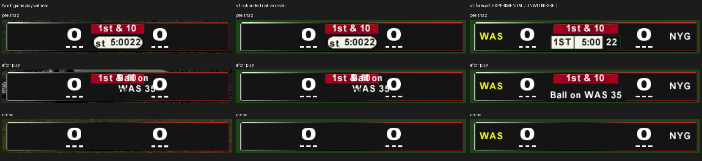

# r64 scorebug in-game fix

2026-09-07, base `c450b2d5a344c8d796e16f2eed8a66fb349c8bf8`.
**EXPERIMENTAL / UNWITNESSED.** Noah's three supplied captures witness the
previous bar. The new bar has CPU and resource evidence, but Noah has not played
it. The runtime game-entry freeze remains open.

The default static compiler is now `espn-broadcast-exact-v2`. It restores live
team abbreviations and the native yellow possession highlight, gives quarter,
game clock and play clock separate cells, and puts ball-on/events in their own
lower row. Existing retail visibility and score rotation continue to run.
An explicit artwork folder still selects the byte-identical v10 contract.

## Gameplay evidence and calibrated comparison



Columns are Noah's gameplay screenshot, reconstructed v1 native submissions,
and the v2 forecast. Rows are pre-snap, after a play, and demo kickoff. Only
the first column contains gameplay pixels. The other columns compile the
actual fixed-span scene/atlas and rasterize native text and mesh submissions.
The full images, original screenshots and numerical evidence are in
[`docs/scorebug_ingame/fix`](docs/scorebug_ingame/fix).

**PROVED:** the screenshot typography matches static retail `FONT4` small
text and `FONT8` rotating scores. It does not match the smaller private fonts
available only with the diagnostic runtime collection. The brief's description
of the installed fonts was therefore misleading for this witness. This is a
conclusion about the rendered bar, not an inspection of disc bd's executable.
The old authored compiler is retained as a hash-pinned negative control in
[`tests/fixtures/nfl2k5_scorebug_exact_v1.py`](tests/fixtures/nfl2k5_scorebug_exact_v1.py).
Its reconstructed scene and atlas match their previously committed hashes.

Actual capture dimensions and the empirical viewport transform are:

| Capture | PNG size | Mapping from 640x480 HUD coordinates |
| --- | --- | --- |
| `ksnip_20260907-140247.png`, pre-snap | 1128x665 | `(1.5*x + 85, 1.5*y - 25)` |
| `ksnip_20260907-140233.png`, after play | 1131x671 | `(1.5*x + 87, 1.5*y - 25)` |
| `ksnip_20260907-135348.png`, demo | 1130x667 | `(1.5*x + 86, 1.5*y - 26)` |

The entire captured window is not the HUD viewport. Using its width/height to
stretch the 640x480 raster gives the wrong scale and origin. The corrected
projection applies one affine mapping to actual submitted triangles, before
sampling the font textures. It does not resize a screenshot crop or fit each
glyph independently. Calibration is bounded to a 2048x2048 canvas.

The native v1 `1st & 10` glyph quads span 59x12 HUD units. The private-font
equivalent is 38.78x9.12, so using that preview for the static bar understates
the width by 20.22 and height by 2.88 HUD units, or 30.33 and 4.32 capture
pixels. Static score `0` has 22.001x20.001 quads; its private-font equivalent
is 16.501x22.801. Static scores are 5.5 units wider and 2.8 shorter. Those are
glyph-quad extents, not thresholded ink bounds. The actual captured score ink
is 32x29 pixels, reproduced exactly by the calibrated static raster.

| Independent ink observation | Witness bounds, exclusive right/bottom | Maximum v1 projection edge error |
| --- | --- | --- |
| Pre-snap away score | `[447,599,479,628]` | 0 px |
| Pre-snap home score | `[649,599,681,628]` | 0 px |
| Pre-snap down text | `[520,590,607,606]` | 0 px |
| Pre-snap lower row | `[514,624,618,642]` | 1 px |
| After-play away score | `[449,599,481,628]` | 0 px |
| After-play joined event/score cluster | `[522,590,683,632]` | 0 px |
| Demo away score | `[448,598,480,627]` | 0 px |
| Demo home score | `[650,598,682,627]` | 0 px |

The after-play defect joins event ink to the home score; it is explicitly
measured as a combined cluster. It is not counted as an independently isolated
home-score observation. The test uses the same connected-component ROIs for
the screenshot and independently generated raster. All eight measurements
are within one pixel. This establishes placement/extent agreement for these
observations, not complete pixel equality.

**PROVED:** native ordinary-text fields `+0x30/+0x34` are shadow offsets, not
glyph scale. The existing independent test remains. No speculative font-scale
initialization change was made. In v1 the quarter's glyphs begin at x=278 while
the light row begins at about 279.672; dark ink at the edge loses contrast.
The game-clock quad ends at x=338 and play-clock starts at x=339. That one-unit
gap produces the joined `5:0022` appearance.

**HYPOTHESIS:** the observed frame tone transfer is consistent with a video
range or filtering difference. The empirical LUT `round(1.082*v - 21.1)` maps
frame `(37,38,37)` to `(19,20,19)` and light-cell 247 to 246. Its location in
the NV2A/video/host capture chain is not isolated. The raster still labels
depth, blending and filtering as software models with `gpu_state_proved=false`.
The demo forecast uses fixture teams WAS/NYG and a native all-drops-closed
state; it does not identify the original demo matchup or prove its lifecycle.

## Static layout and native sequencing

The frame stays at the reference coordinates. The static red pill expands
from 86 to 104 HUD units so `4th & Inches` fits. The lower row expands from
81.33 to 112 units to fit the retail font. This deliberately changes the
reference's absolute center proportions; an exact photographic center width
is not claimed. The disabled private-font route retains the original pill
and clock-row widths. Readability with available static fonts takes priority
over pretending the private-font reference fit is available without its owner.

Static cell rails are quarter `[264,301]`, game clock `[301,347]`, play clock
`[347,376]` in the 640-column HUD. Quarter reads `1ST` through `4TH`; the native
overtime branch remains. The light oval becomes square light cells with
separators and a dark play-clock cell with white digits. Font advances up to
`4TH` (31), `15:00` (40), and `40` (18) fit with real side padding. The tests
cover all four combinations of 4:3/widescreen and placement modes 0/1,
quarters 1 through 5 and 13, game clocks 0/300/599/600/900 seconds and play
clocks 0/4/22/40. Quarter formatting also verifies `OT10` and its ABI; cell
containment is bounded through `OT9`.

Scores move outward by 24 away-side and 25.5 home-side HUD units, with timeout
dashes moved alongside them. Abbreviation anchors move to the outer neutral
panels and use native FONT4. Existing callbacks read the live team strings,
uppercase their own output, and select white or yellow through the existing
possession predicate. All 32 NFL abbreviation strings, both possession sides,
and 999 scores fit in both aspects. Static timeout marks remain decorative;
live timeout counts and per-game logos still belong to the runtime option.

**PROVED:** retail `FC9C0` can request down-and-distance AND ball-on in the
same frame, including the calls at `FCBAA/FCBCF` and `FCC28/FCC40`. It uses
separate elements, not compulsory alternation. The exact-v1 scene had collapsed
their backgrounds and placed both text anchors in the red pill. The updated
scene restores a 128x25 lower event row at HUD x=256..384, y=427..452. Ball-on
is centered and one line. Its foreground background covers ordinary clock
glyphs that retail continues to submit while the clock background is closed.
Native requested visibility, slide integration and material gates select it.

The old projection fixture incorrectly wrote `+0x58` (node binding availability)
as visibility and left hidden elements' current slides fully open. The fix
preserves availability and sets the actual request/current-slide fields.
The new six-state fixture executes retail `FC9C0` and 40 native frame updates,
covering pre-snap, after-play, live play, kickoff, flag and fumble. Unrelated
world queries are supplied at the boundary; direction placement is sampled
explicitly and independently tested. Repeated pre-snap/after-play/live
transitions keep the bound nodes available and down/event ink separate.

The scoped XBE edits are guarded before mutation:

- Team callback tail jumps at `FC028/FC048` use native uppercase `30F20`.
- Quarter cases occupy their original 48-byte `FC0A6..FC0D6` span, with the
  existing dispatch table retargeted. A common copy/uppercase tail changes
  only the caller's buffer. Shared ordinals and the overtime branch stay retail.
- The three immutable, scorebug-only UTF-16 format strings at `E6C484`,
  `E6C4A8`, `E6C4C4` replace newline with space. Their references are confined
  to the native ball/field-goal formatter `FBEB0`.
- Existing descriptor fields select font, alignment and white/yellow colors.
  No visibility callback, allocator request or code cave is added.

The memory gate checks the three immutable string edits separately from runtime
writes. The cave gate disassembles the exact quarter replacement and its targets;
it does not treat live code as free padding. Both preserve the existing owner
union and composition checks. Retail stores these strings in `.string_`, with
unchanged flags `0x26` (executable but not writable). They remain immutable
literals; the formatter writes its caller's buffer. No runtime data is stored
in this section or in `.text`.

## Runtime compatibility, resources and replay

Runtime stays diagnostic and false in Basic, Advanced and Experimental presets.
Its loader/setup, missing-name handling, native binding, allocation, hook sites,
labels and branch offsets are unchanged. A test reconstructs the previous
emitted code with SHA-256
`d3331c84b984f6e4b198135891e964a6a038105fc8f995a5895a76d89149ffc4`
and proves that the only machine-code difference is the four-byte normal
play-clock color immediate, now white for the dark cell. There is no claimed
freeze fix. Two build-time descriptor defaults return to zero when the runtime
owner replaces static names with its one-sided chevrons. Exact owner/hook
recognition makes both application orders and replay byte-identical; a partial
color change is refused as foreign. Private quarter FONT copies accept the new
capital letters with their existing fitted metrics. Global retail FONT donors
and v10 folder outputs are unchanged.

New identities and exact receipts are in
[`receipts.json`](docs/scorebug_ingame/fix/receipts.json). Static resource spans
remain 4,832 and 2,432 bytes; filled lengths are 4,792 and 2,389. Both retain
their entire 32-byte wrapper, including `+0x14 = 16`, and pass the actual native
overlapping decompressor. Their hashes are:

| Output | SHA-256 |
| --- | --- |
| Static SCNE span | `6c3cad4eee9dc3aab4d4cc2ffba60dfdfc579c40fa6d60b18d013deab0529eea` |
| Static atlas span | `a4055637d479233c9e929f73fa3ee60da5826e28f47b0f562ed39771a50d90f3` |
| Decoded static SCNE | `86ff7728d7f2a0a3bf9be7efa6641459710b55ee57978cfc5c38636ef3bf6a35` |
| Decoded runtime SCNE | `d5422122b90d2c67c478696a35cdd76392c9704b5c6597c08532ea5b5138fe8e` |
| Runtime HUD after | `16ceb2bc26538007cd12d6a046a9b4e7bf5dc1267958ad5be7c087189d1d55e5` |
| Runtime appendix | `846864649a3b2309c476edb55fc9b14a912e062548d1a2abf474a8e3acf44063` |

The real retail disc was opened read-only for preflight. Planned writes are
the XBE at 2,396,160 (11,948,032 bytes), SCNE at 1,741,675,264 (4,832 bytes),
and atlas at 1,741,540,432 (2,432 bytes). Receipts include before/after hashes,
XBE edits, unchanged static runtime-hook bytes, replay and wrapper checks.
No acceptance disc or pack copy was created. Old exact-v1 installations are
foreign to v2; rebuild from a clean source rather than layering this onto bd.

## Validation

**351 passed, 11 skipped, 0 failures/errors across 362 tests in 21 standalone suites.**
Both XBE gates passed their full original/reverse owner unions, including
scale-out. Largest test process: 503,940 KiB (492.13 MiB); witness tool:
372,280 KiB. No process approached the 2 GB limit.

Each command below was run standalone with `python3 <path> -v`. Only the
legacy layout command also sets `NFL2K5_SCOREBUG_EMULATION_TEST=1` to enable
its three bounded native CPU checks.

| Test path | Tests | Passed | Skipped |
| --- | ---: | ---: | ---: |
| `tests/nfl2k5_scorebug_layout_test.py` | 15 | 14 | 1 |
| `tests/nfl2k5_scorebug_mod_project_test.py` | 10 | 3 | 7 |
| `tests/mod_editor/test_nfl2k5_scorebug_author.py` | 12 | 12 | 0 |
| `tests/mod_editor/test_nfl2k5_scorebug_exact.py` | 8 | 8 | 0 |
| `tests/mod_editor/test_nfl2k5_scorebug_fonts.py` | 9 | 9 | 0 |
| `tests/mod_editor/test_nfl2k5_scorebug_freeze.py` | 7 | 7 | 0 |
| `tests/mod_editor/test_nfl2k5_scorebug_ingame.py` | 11 | 11 | 0 |
| `tests/mod_editor/test_nfl2k5_scorebug_ingame_fix.py` | 9 | 9 | 0 |
| `tests/mod_editor/test_nfl2k5_scorebug_native.py` | 4 | 4 | 0 |
| `tests/mod_editor/test_nfl2k5_scorebug_projection.py` | 14 | 14 | 0 |
| `tests/mod_editor/test_nfl2k5_scorebug_resources.py` | 6 | 6 | 0 |
| `tests/mod_editor/test_nfl2k5_scorebug_runtime.py` | 12 | 12 | 0 |
| `tests/mod_editor/test_nfl2k5_scorebug_source_art.py` | 13 | 10 | 3 |
| `tests/mod_editor/test_nfl2k5_scorebug_template.py` | 19 | 19 | 0 |
| `tests/mod_editor/test_nfl2k5_scorebug_template_release.py` | 5 | 5 | 0 |
| `tests/mod_editor/test_nfl2k5_scorebug_unified_adapter.py` | 5 | 5 | 0 |
| `tests/mod_editor/test_nfl2k5_scorebug_v10_ingame.py` | 11 | 11 | 0 |
| `tests/mod_editor/test_nfl2k5_scorebug_v10_projection.py` | 14 | 14 | 0 |
| `tests/mod_editor/test_nfl2k5_scorebug_versions.py` | 4 | 4 | 0 |
| `tests/mod_editor/test_xbe_patch_cave_references.py` | 95 | 95 | 0 |
| `tests/mod_editor/test_xbe_patch_memory_writes.py` | 79 | 79 | 0 |

Three source-art skips require absent old typed-importer/retail-scene
comparison exports. One legacy layout skip requires an absent intermediate
glTF export. Seven typed-project skips require the absent historical JSON
fixture. Current fixed-span, native-font, template and version proofs all ran.

Exact commands, outcomes, log hashes, source/artifact hashes, resource limits
and the protected-path audit are in
[`validation.json`](docs/scorebug_ingame/fix/validation.json). All edited Python
files compile and `git diff --check` passes. No protected file changed.

The final disk check recorded 107.470 GB free on `/`, above the 100 GB
floor. No disposable disc or archive copy exists in this worktree.

The focused nine-test suite adds actual native cell/identity/event tests,
capitalization ABI and shared-string checks, both owner orders, replay and
foreign-state refusal, runtime event placement, a failing v1 negative control,
and the independent screenshot calibration. The existing photographic
comparator still reports the wider static strip's reference deviation rather
than treating it as a reference match.

During development the new capture transform exposed a texture-variable name
collision; it was fixed before the final runs. Calibration initially attempted
to isolate the home score where the defect physically joins it to event text;
the measurement now explicitly names that cluster. The legacy atlas sampler
was moved below the relocated widest score so it still measures texture texels.
Seven legacy typed-project cases previously raised missing-file errors because
the ignored `reports/assets/nfl2k5_scorebug_mod_project_example.json` is absent;
they now give a precise evidence skip, while the three synthetic cases run.
No missing external evidence was fabricated and no gate failure was suppressed.
The first revised memory-gate run also exposed an incorrect assumption that
retail's string section was non-executable. The gate now pins its actual name,
flags and unchanged section record, and still requires it to be non-writable.

## Reproduce and build recipe

Generate every comparison/placement image plus native receipts and read-only
disc preflight with one offline command:

```bash
python3 tools/nfl2k5_scorebug_witness.py \
  --extraction '/media/noah/Storage/for codex 1.0/extracted/ESPN NFL 2K5 (USA)' \
  --output docs/scorebug_ingame/fix \
  --disc '/media/noah/Storage/for codex 1.0/ESPN NFL 2K5 (USA).xiso.iso'
```

The following future acceptance recipe uses the existing copied-image writer,
keeps runtime off and removes the image on every normal or exceptional exit.
It was not executed here. Its free-space precondition preserves the stricter
100 GB floor after the copy, rather than relying on the older 40 GB minimum.

```python
from pathlib import Path
import json, shutil, tempfile
from tools.nfl2k5_scorebug_reference import apply_copy
from mod_editor.core import nfl2k5_scorebug_ingame as scorebug

source = Path('/media/noah/Storage/for codex 1.0/ESPN NFL 2K5 (USA).xiso.iso')
floor = 100_000_000_000
if shutil.disk_usage('/').free < floor + source.stat().st_size + 64 * 1024**2:
    raise RuntimeError('Not enough free space to preserve the 100 GB floor')
with tempfile.TemporaryDirectory(prefix='r64-scorebug-', dir='/tmp') as directory:
    target = Path(directory).resolve() / 'static-v2.xiso.iso'
    receipt = apply_copy(source, target, runtime=False)
    assert scorebug.image_status(target) == 'applied'
    assert scorebug.apply_in_place(target)['state_before'] == 'applied'
    assert shutil.disk_usage('/').free >= floor
    Path('.scratch/static-v2-acceptance.json').write_text(
        json.dumps(receipt, indent=2) + '\n', encoding='utf-8')
    # Any separately scheduled gameplay witness must finish within this lifetime.
assert not target.exists()
```

For Noah's next played build, use a clean retail source, enable **Experimental
ESPN scorebar**, leave **Scorebug effects (diagnostic only)** off, and leave the
artwork-folder field blank. Use a disposable destination managed by
`TemporaryDirectory`; close the game/image before that directory is cleaned.
No new wiring is needed for these existing selectors. Help and the protected
manifest handoff are specified in the appended r64 section of
[`WIRING.md`](WIRING.md).

## Noah's remaining witness list

1. Repeat WAS at NYG pre-snap and after-play captures on the rebuilt static
   source. Confirm `1ST`, separated `5:00` and `22`, dark play-clock cell,
   visible WAS/NYG and the correct yellow possession side.
2. Play through snap, tackle, next huddle and another snap. Confirm the ball-on
   row replaces the clocks, stays below down text, clears both scores and
   returns to the normal clock cells without a lingering dark panel.
3. Repeat both placement modes in 4:3 and widescreen, then change possession
   and score. Check score rotation, `4th & Inches`, a 15-minute clock, quarter
   change and overtime. Check flags, fumbles, field-goal/midfield labels and
   demo kickoff for event timing and depth.
4. Separately continue the existing **hooks versus neutral** two-profile
   game-entry witness from `ASTRA_SCOREBUG_FREEZE_REPORT.md`. Preserve all six
   probes. Do not enable full runtime logos in a preset based on these CPU
   checks; loader lifetime, GPU consumption and the reported freeze remain
   unproved in gameplay.

Other known limits: static fonts and widened center differ from the photograph;
GPU tone/filter/depth behavior remains modeled; arbitrary created-team names
beyond the tested NFL abbreviations are not bounded by this fit. No network,
emulator, GUI display or audio was used. Source reads were bounded to XBE,
owned HUD/resource spans and PNGs. All temporary files stay below the scratch
budget, and root free space remained above 100 GB.

## Delivery

The explicit-path `git add` was refused because the shared worktree metadata
cannot create `index.lock` on its read-only filesystem. Delivery therefore uses
the brief's isolated-commit bundle fallback at
`.scratch/r64-scorebug-ingame-fix.bundle`. Files remain in this worktree and the
shared branch is not advanced. `.scratch/DELIVERY.json` records the commit,
parent, exact paths, bundle hash and verification. Neither `ASTRA_BRIEF.md` nor
`.scratch/` is part of the commit. No push is performed.
