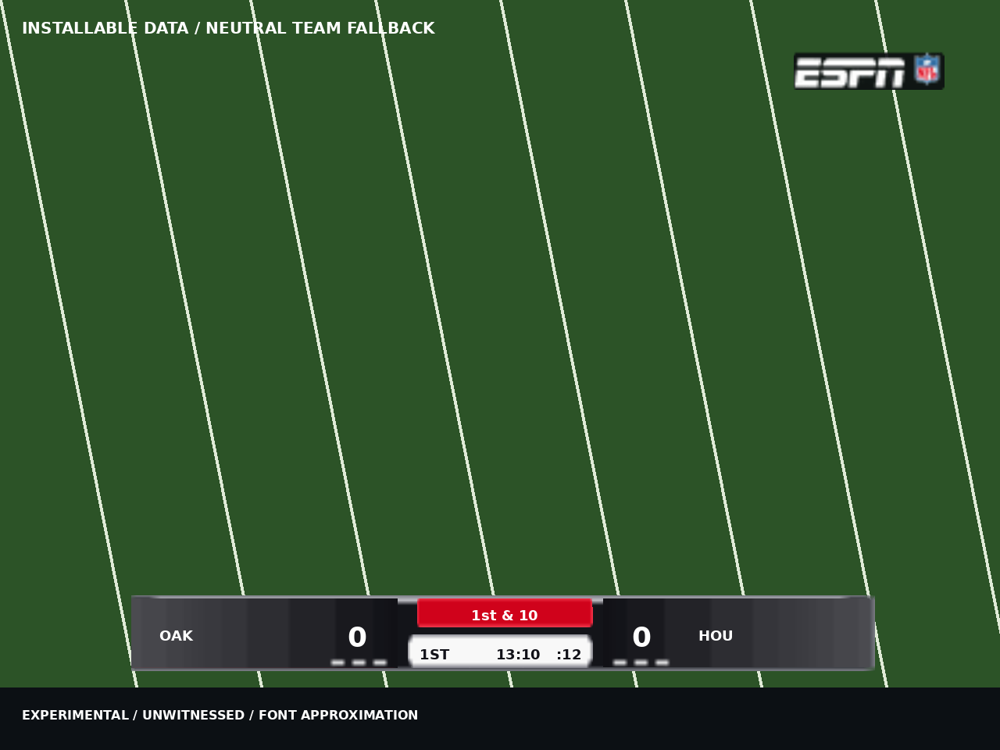
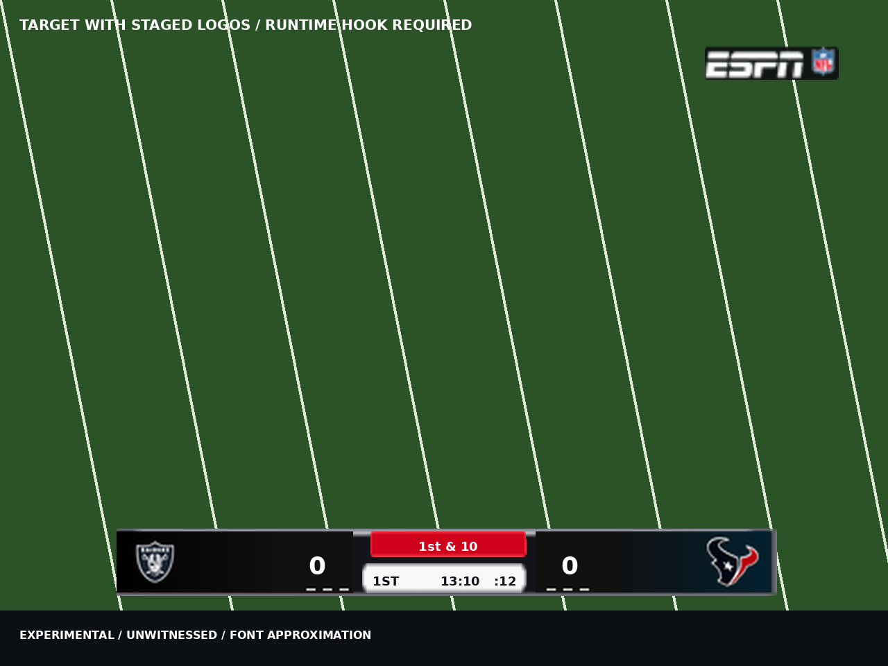

# ESPN reference scorebug, r61b

EXPERIMENTAL / UNWITNESSED. No game, emulator, GUI, audio or network was used.
The installable resource patch and a local test disc are built. Runtime team
binding, a refresh on every new down, score color flashes, timeout dimming and
under-five play-clock color still require code. Their data and implementation
contract are below. The shared XBE gates have an inherited depth-lock/row
composition failure; the scorebug-specific gates pass. This is not a release sign-off.

## Built and reviewable



The installed bar occupies x80..560, y381..429 on the 640x480 HUD. It has a
480x48 frame, opposed team panels, white scores, a red upper center pill and
white lower clock strip. The literal ESPN wordmark and retail NFL shield occupy
x508..604, y33..57. Both drive-direction copies of the mark are placed there.
The watermark is part of the same scorebug and follows its visibility gate.
The ticker starts at y440. The existing kick-meter margin and lineup-strip
changes are retained through their own writer.

The generic install has neutral gradient panels and live retail abbreviations.
The three dashes on each side are decorative, all lit. They do not count
remaining timeouts. Text is positioned through the scene's native anchors;
the game retains its font and score rotation. Preview glyphs approximate that
font and do not prove in-game font size, clipping or antialiasing.



This second image substitutes staged, real team artwork over the exact panel
bounds. It is a target requiring the runtime hook, not the output of a played
game or the generic installer. Additional proofs:
[light palettes](docs/scorebug_ingame/target_NO_MIA.png),
[dark palettes](docs/scorebug_ingame/target_BAL_PIT.png),
[widest text](docs/scorebug_ingame/target_widest.png),
[all 32 staged panels](docs/scorebug_ingame/team_panels.png),
[native slide samples](docs/scorebug_ingame/slide_samples.png).

The field is synthetic. The preview reads SCNE command strips, vertex UVs and
the actual quantized P8 output, rather than drawing an unrelated ideal bar.
Native score rotation, depth testing and material visibility are not simulated.

The user's SVG is translated by role into the game's tiny texture allocation:
frame, gradients, center pill, clock strip, logo panels and watermark. It is
not resized as one bitmap, since scores and clocks must remain game text.
The master has abbreviation placeholders and original geometric ESPN-style
lettering. I used the disc's real wordmark instead of representing either as
an official logo. The two-row center follows the reference photo's white strip.

## Reproduce without loose retail assets

From this checkout:

```sh
python3 tools/nfl2k5_scorebug_layout.py preview /tmp/scorebug.png \
  --source '/media/noah/Storage/for codex 1.0/ESPN NFL 2K5 (USA).xiso.iso'
python3 tools/nfl2k5_scorebug_layout.py preview /tmp/scorebug-target.png \
  --source '/media/noah/Storage/for codex 1.0/ESPN NFL 2K5 (USA).xiso.iso' \
  --matchup LV HOU
python3 tools/nfl2k5_scorebug_layout.py stage \
  '/media/noah/Storage/for codex 1.0/ESPN NFL 2K5 (USA).xiso.iso' /tmp/scorebug-stage
python3 tools/nfl2k5_scorebug_layout.py apply \
  '/media/noah/Storage/for codex 1.0/ESPN NFL 2K5 (USA).xiso.iso' /tmp/scorebug-test.xiso.iso
python3 tools/nfl2k5_scorebug_layout.py status /tmp/scorebug-test.xiso.iso
```

`apply` creates a separate copy and writes a sibling `.scorebug.json` receipt.
Existing outputs require `--overwrite`; same-file and symlink destinations
refuse. The staged directory contains 64 unmirrored-logo panel images and RGBA
buffers, per-source receipts, and a fixed-span scene with separate team material
slots. Staging does not install those resources. `--legacy-v6` explicitly
selects the preserved old research CLI; product `status` and `apply_in_place`
use v7. Older modified scorebugs are foreign and must be rebuilt from retail.

Local ready-to-play copy, not committed:
`.scratch/scorebug/ESPN-reference-v7.xiso.iso`.
SHA-256 `f05c2e4aadba8e2c548823eb3e65ac44497b8be323225c73277ebc0008e2a6be`.
The source is unchanged:
`7b4b493b9492ecfb353ae97c7243210c8dd4fe1601eb34549eea67ad6ee68bc9`.
Full image comparison found **7,612 changed bytes and zero changes outside the
planned XBE and two resource spans**. File length is unchanged. A second apply
returned `applied` and changed no bytes.

## Resource proof

All numbers below are pack-0-relative. XDVDFS resolves the pack's position in
each input; no rip-specific absolute pack location is assumed.

| Resource | Outer/chunk | Offset | Span | Use |
| --- | --- | ---: | ---: | --- |
| `score_bug` | 346/78 | 110486272 | 4832 | Edited scene; 16512 decoded bytes |
| `score_buga` | 346/53 | 110351440 | 2432 | Edited 64x64 P8 atlas |
| `espn1` | 346/31 | 110140624 | 2352 | Read-only literal ESPN source, 128x128 DXT1 |
| `nflShield1` | 346/32 | 110142976 | 8512 | Read-only NFL shield source, 256x256 DXT1 |
| `shield_espn` | 346/26 | 110125136 | 5952 | Untouched shared replay/presentation texture |

The atlas is packed as frame rows 0..15, neutral gradient/dashes 16..31, red
pill 32..39, white strip 40..47 and watermark 48..63. The white coverage of the
literal `espn1` wordmark is isolated from its red background and rasterized into
46x12 pixels. The NFL shield fits 13x15 pixels. This is recognizable native
brand art at a severe resolution limit, not a recolored retail ESPN pill.

The mark materials' XBE texture-name pointers at `0xA95CAC` and `0xA95CB4`
change from `0xE6C768` (`shield_espn`) to the existing `0xE6C6E8`
(`score_buga`). PROVED: `FUN_000FC1A0` walks the eleven material/name pairs,
calls the TXTR lookup and writes each material's texture pointer at `+0x30`.
The new rectangle UVs are confined to the watermark region. Other consumers
of `shield_espn`, including replays, retain all their original bytes.

The SCNE retains all 286 vertices, 29 transforms, 11 submeshes and command
blocks. Only positions, quantization scale/offset, UVs and text transforms
change in the generic scene. Score anchors are x±91/y10; down anchor x-3/y27
plus the native 0..6 slide; quarter x-42/y2, right-aligned game clock x26/y2,
centered play clock x44/y2. Team abbreviations retain left alignment. Text
on the white strip is dark; scores, cities and down text are white. Native
possession highlighting remains. A three-digit score needs an in-game check.

PROVED: both output wrappers, including `+0x14`, are byte-identical to retail.
The scene fills 4797/4800 body bytes. The atlas fills 2384/2400 and retains
its 16-byte scratch word. A 256-color candidate failed the loader budget;
the 128-color candidate passed independent decode and overlap analysis.
`nfl_vc_lz_fill` performs the fill and existing `nfl_tset_png_import` performs
palette quantization. No general resource allocator or section growth is used.

Exact pins, per-resource receipts, source IDs, native animation parameters and
full-disc verification are in [evidence.json](docs/scorebug_ingame/evidence.json)
and the shipped metadata module `nfl2k5_scorebug_resources.py`.

## Team texture identities and future binding contract

PROVED: the disc has per-team franchise-office logo textures named
`XX_teamlogo_00_h0`, 256x256 P8, in the `frXX.iff` archives. Each source span,
decoded digest, outer CRC and name is pinned and tested. The logo source is
retail-era art: relocated teams use their 2004 identity, and Washington uses
the disc's historical mark. Modern primary/secondary colors come from the
supplied `teams.json`. No network assets were fetched.

**Asset codes are not roster IDs.** For example Raiders are asset `20`, roster
22, outer 44/chunk 0; Texans are asset `37`, roster 29, outer 60/chunk 0;
Steelers are asset `22`, roster 28. All 32 mappings appear in the metadata and
contact sheet. The original `logos.iff` outer 6 is a CACR cache directory, not
a TXTR atlas. The existence of a texture on disc does not prove it remains
resident during field play.

PROVED binding primitive: `0xFC1DC` sets EDX to `0x52545854` (TXTR),
`0xFC1E1` clears ECX (lookup context), `0xFC1E3` calls `0x449E0` with a
pushed UTF-16 name, and `0xFC1E8` writes EAX to `[ESI+0x30]`. Native Team
Select independently writes material `+0x30` through `0x31EA90` (ECX texture,
EAX material, EDX diffuse color); it clears material `+8` bit 0 for a non-null
texture and sets it for a null texture. These sites establish the operation
needed by the bug, but do not prove an arbitrary office texture is loaded.

The staged data makes the future change concrete:

1. `stage_binding_scene` retains the same 4832-byte wrapper and fills 4789 body
   bytes. `zscore_buga` becomes away-only; the old home vertices collapse.
   `hscore_buga` becomes the home panel, with vertex palette indices set to
   root matrix 0. Both panels sample full texture UVs and have white vertex
   color. Command blocks and material names do not grow. It is deliberately
   not recognized as the installed scene by generic `status()`.
2. Each team has independent 128x32 RGBA8 away/home buffers. The right logo
   is never reflected. There are 64 buffers of 16384 bytes, exactly **1 MiB**
   before descriptors. Source IDs and SHA-256 accompany every buffer. A future
   loader must convert these through the proven Xbox swizzle/descriptor path,
   register texture objects and keep them alive for the field scene. Raw RGBA
   bytes are not a D3D texture pointer.
3. Against `nfl2k5_xbe_space.py`, request named allocations rather than fixed
   guessed addresses: executable code `scorebug_events` (initial budget 4096,
   alignment 16), read-only preloaded `scorebug_panel_pixels` (1 MiB plus
   descriptor/name table, alignment 128), and writable `scorebug_state`
   (256 bytes, alignment 16). The writable block contains magic/version,
   scene generation, home/away identity, two texture pointers, cached score,
   down/distance, timeout counts, play-clock value and event timers. No runtime
   data may be placed in code. The allocator is not present in this branch;
   no API signature or allocation address is invented here.
4. A precise init interception candidate is the five-byte call at `0xFCE56`,
   retail `e845f3ffff`. The trampoline must first call retail `0xFC1A0`, then
   acquire this scene's two materials, install textures, set
   `[0xA95B00]=0` (hangtime element 2 enabled field) and clear the home material
   hide bit. It must preserve EFLAGS, general registers and FPU/SSE state,
   return to `0xFCE5B`, and keep all native failure/null paths. This site is
   a candidate, **not reserved or patched**. The oracle must reserve it after
   the allocator is integrated; `unknown` must still refuse.
5. Current identities should come from the native home/away context getters:
   `0x61C50` returns `0xB30864`, `0x61C60` returns `0xB30A58`, matching the
   city callbacks `0xFC010`/`0xFC030`. Team Select uses context `+0x10C` as
   its asset-code string when formatting resource names. Validate that field
   against the 32-code table in bounded execution before using it in the
   field hook. Do not use possession pointers `0xE60280/84` as home/away.
6. A missing identity, missing texture or changed scene generation must keep
   or restore the neutral generic scene/materials. Never leave the last
   game's logo bound. Field entry, a second matchup without process restart,
   both placement modes, replays and scene teardown must be exercised before
   enabling runtime binding. Texture construction/registration and lifetime
   are unresolved native ABI work; a cache lookup alone is insufficient.

## Animation catalogue and event specification

| Behavior | Evidence and shipped behavior | Remaining code |
| --- | --- | --- |
| Element slide | PROVED six `0x70` records at `0xA959C8`; direction `+0x18`, duration `+0x28`, min/max `+0x2C/+0x30`, requested visibility `+0x38`, current position `+0x3C`, enabled `+0x58`. `0xFCE70` ramps/clamps and adds direction times current position to node matrices. Down now moves 0..6 units in 0.2 s; other directions are zero. | New-down refresh is not a native visibility transition every time. Compare down/distance/possession generation, trigger one 0.2 s refresh, and avoid resetting it every frame. |
| Timed visibility | PROVED timed flag `+0x4C`, elapsed `+0x50`, hold duration `+0x54`; the driver updates the visibility request while the timer runs. Root-shift `+0x34` is zero. | Reuse only after proving interaction with `0xFC9C0`, which rewrites requested visibility. |
| Score change | PROVED `0xFD2F0..0xFD416` compares rendered score text, advances phase at 1.6/s, switches old/new text around phase 0.5 and rotates the score node. Retained unchanged, including both scores. | A color flash is additional behavior. Compare scores, flash white/accent for 0.18 s, then restore each text D3DCOLOR; phase duration is about 0.625 s. Reset on new scene and do not flash merely for initial population. |
| Timeout dashes | Six static dashes are in the atlas and staged panels. No timeout-count callback/material is proved in this scene. | Prove timeout getter and reset semantics. Use three separate quads per side or refresh the relevant texture region only when counts change. Dim consumed dashes, and restore at the correct half/overtime reset. Never infer a timeout from a stopped clock. |
| Play-clock urgency | PROVED `0xFBE30` calls getter `0xFBB10`; it reads `[0xE60294]+0x10` and formats `:%02d`. Normal text is dark on white. | After the native update, if the play clock is active and `0 <= seconds < 5`, set record `0xA95A48` to red `0xFFD0021B`; otherwise restore `0xFF111118`. Test 5, 4.9, 4, 0 and disabled-clock states. |
| Yellow/red elements | PROVED callback `0xFBE90` formats `FLAG`, and `0xFBEA0` formats `FUMBLE`, from strings `0xE6C464/470`. The old description of yellow as play-clock urgency was wrong. | Do not repurpose their events as a clock signal. Their old off-screen behavior remains in the generic layout. |

There is no proved general timed color/scale track in the SCNE. Runtime matrix
reset `0xFBBC0` erases serialized matrix scaling every frame. Score rotation is
an explicit native driver operation, not an SVG animation. Future event hooks
must live after the native writer for the fields they override, with bounded
ABI tests and both XBE gates; the exact per-frame hook site is not reserved.

## Integrity and verification

Resource `status(payload, resource)` recognizes only whole retail or pinned
v7 spans. `apply` is pure and idempotent and refuses foreign wrapper, body or
padding bytes. XBE status checks every owned field as one coherent state and
pins unchanged material/score/clock driver bodies. Mixed states refuse before
any image write. Existing independently owned HUD and boot-logo states compose
through their own validators. Position constants use the existing reserved
`0x10A40/44` allocation; there is no new code cave or runtime variable.

The image transaction prepares every replacement first, rechecks source spans,
writes and reads back, and restores touched spans on an ordinary I/O failure.
This is not power-loss atomicity. The copy CLI publishes its closed temporary
file with `os.replace`. Receipts include exact offsets, lengths, before/after
digests, all XBE fields and the retained wrapper proof. Studio preview uses its
private cache with a closed temporary file. Old developer PNGs no longer decide
the installable v7 appearance. Release wiring still needs the new modules.

Exact checks run with plain Python:

| Command | Result |
| --- | --- |
| `python3 tests/mod_editor/test_nfl2k5_scorebug_ingame.py` | 11 passed |
| `python3 tests/nfl2k5_scorebug_layout_test.py` | 15 run, 4 precise skips, remaining passed |
| `python3 tests/mod_editor/test_nfl2k5_scorebug_source_art.py` | 13 run, 3 legacy-evidence skips, remaining passed |
| `python3 tests/mod_editor/test_nfl2k5_scorebug_unified_adapter.py` | 5 passed; fixed its missing standalone import path |
| `python3 tests/mod_editor/test_xbe_patch_memory_writes.py ScorebugReferenceWrites` | 1 passed |
| `python3 tests/mod_editor/test_xbe_patch_cave_references.py ScorebugReferenceReservations` | 1 passed |
| Both full shared gate files | FAIL in inherited `setUpClass`, before scorebug application: depth locks reject depth rows' bench call sites. Memory file: 5 tests passed plus setup error; cave file: 1 passed plus setup error. |
| Untouched HEAD versions of both gate `setUpClass` methods | Same `DepthLockError: unknown bench promotion call sites`, reproduced without our changes |
| Full image comparison and second apply | Same size; 7612 changed bytes, zero outside planned spans; `applied` then idempotent |
| `git diff --check` | Passed |

The full shared gates have not been weakened or skipped to hide that inherited
failure. Both now compose this feature after the existing owners, and each has
a separate scorebug check that executes despite the inherited setup failure.
The conflicting depth modules are outside this task's ownership; the exact
repair handoff is in WIRING.md. No claim that the whole stack is green is made.

## Noah's witness list

Use the v7 test disc for the neutral installed behavior. The staged-logo target
requires a later executable with the binding hook and must not be judged as
already implemented by this disc.

1. Raiders at Texans, then reverse home/away. Both drive directions, first and
   third quarter, possession changes, kickoff return, scrimmage snap and live
   play. Confirm bottom center stays fixed and the top-right mark persists.
2. Trigger a replay, penalty, fumble, quarter end, halftime and a full-screen
   presentation. Confirm hide/return behavior and untouched replay ESPN art.
   Check kick meter, player lineup and ticker clearance in 4:3 and 16:9 HUDs.
3. Score a TD, field goal and safety for each side. Watch native score rotation,
   old/new digits, 9-to-10 and 99-to-100 width. A color flash is not installed.
4. Go through 1st/2nd/3rd/4th down, Goal, Inches, a long distance, turnover on
   downs and overtime. Observe pill entry/exit and legibility; repeat while
   the scorebug remains visible. A refresh on every down is not promised.
5. Use a timeout from each count 3/2/1/0, then cross a half and overtime reset.
   Dashes currently stay lit. Check play clock 6/5/4/1/0 and untimed practice;
   urgency red is not yet installed. These observations define future hooks.
6. Saints/Dolphins and Ravens/Steelers for bright and dark text contrast;
   Chiefs/Bills for 4th & Inches and long clocks; Washington/Tampa Bay for
   long team labels; Rams/Chargers for the retail-era identity policy.
7. After runtime binding lands, verify all 32 source IDs against the contact
   sheet, swap sides, exit to menus and start a different matchup without
   rebooting. Test a custom/all-star team to verify neutral fallback. Confirm
   the right logo faces normally and no previous matchup's logo survives.
