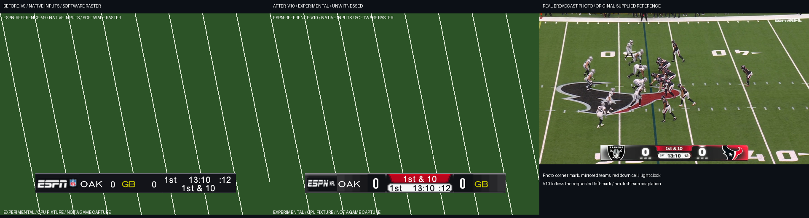
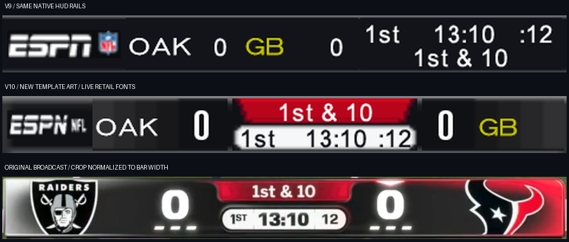

# Static ESPN scorebar v10 and repaintable template

2026-09-07. Base: `f263cd04365f9874541c756958a40b998d405e6d`, branch
`astra/r63-scorebug-v10`. **EXPERIMENTAL / UNWITNESSED.**

The existing static `scorebug` option now installs `espn-reference-v10` from
newly authored modular artwork. The folder compiler, fixed-span installer,
native proof, standalone tests and release PNG checks are implemented.
The protected BuildPlan, GUI folder field, release allowlist and runtime
closure changes are specified at the top of [WIRING.md](WIRING.md) for Claude.
Custom folders already work through the CLI and Python backend. The shared
GUI has not been edited, and this is not a gameplay witness or release build.

## Reference decision and comparison

The brief names `target_NO_MIA.png`, `target_BAL_PIT.png`, `target_LV_HOU.png`
and `target_widest.png` as broadcast captures. Their pixels explicitly label
them as staged mockups. I preserved those files and the v9 evidence unchanged,
and used the original photograph `scorebug_reference_2026-09-05.jpeg` from
the read-only research hub. Its byte-identical evidence copy is
[real_broadcast_reference.jpeg](docs/scorebug_ingame/real_broadcast_reference.jpeg),
SHA-256 `f88b98687827c753882d8c5186eb186095510228b039c6d7a2e9e9d88e725e14`.
The native audit records all four historical target hashes and their provenance.



The following comparison normalizes the cropped bars to the same width.
The photograph's crop is `[432,939,1490,1056]`; the native rows use the
requested `[84,381,560,429]` rails. Resizing is for visual comparison only.



The new layout follows the photograph's dark mirrored team blocks, larger
white scores, red central down cell, light recessed clock cell and narrow
frame. The brief's explicit left-mark requirement moves the photograph's
upper-right watermark into the left cell. Neutral blocks and live native
abbreviations replace the photograph's selected team logos. At 64x64 atlas
resolution with shared live fonts, this is a broadcast-inspired adaptation,
not a pixel-perfect copy. The supplied community SVG lineage is preserved
under the template and supplies the geometric ESPN mark design.

## What was built

[docs/scorebug_template/README.md](docs/scorebug_template/README.md) is Noah's
painting guide. The folder has 179 files, including 86 PNGs and 88 SVGs:
eight active layers at 1x and 2x, master HUD guides, atlas previews, all 32
team block variants, optional timeout marks, a new glyph sheet and metrics,
the supplied team/state tables and source vectors. These are new source
pixels, not exported `espn1`, `nflShield1` or `score_buga` artwork.

`mod_editor/core/nfl2k5_scorebug_template.py` compiles that folder. The eight
selected PNGs are authoritative. Every canvas is checked before pixel
decoding, each source is capped at 512 KiB, and the union may contain at most
256 exact RGBA colours, counting alpha. Selecting `source_scale: 2` performs
nearest-neighbour reduction. A sorted exact palette makes the output
deterministic; there is no lossy colour-reduction fallback. Too much detail
for the compressed slot produces a plain instruction to simplify the art.

`layout.json` pins the HUD rails, all eight atlas/HUD rectangles, text anchors,
colours, wrapper contract and runtime handoff. Frame, mark, team blocks,
independent score backings, clock and down art can be repainted. Fixed cell
count, scene topology, cell placement and live text anchors cannot change
through this compiler. Only `source_scale` is an authoring setting; colour,
font and timeout metadata describes the installed contract. Editing that
metadata does not rewrite executable fields. Optional timeout/glyph sheets,
SVGs and atlas previews are not active PNG-layer inputs.

The native mesh keeps the existing transform hierarchy, vertex and command
counts, score rotation and visibility logic. It repacks UVs, moves the score
and text cells, and reverses the team source V coordinate to account for the
native settled Y reflection. The red down cell now has contained geometry.
The existing kick-meter move and lineup-strip suppression remain in effect.
Auxiliary event text remains live, with its background geometry collapsed.

The default static installer and preview read only the two required scene
and texture spans. They do not read the disc's logo art. Historical v8/v9
art helpers remain for the independent negative control and older runtime
artifacts; they do not supply v10 pixels. The legacy approximate GUI preview
now uses the new clock text contrast. The native proof images below are the
authoritative offline layout evidence.

Custom installation uses a single compiled source snapshot per image
transaction. It checks the scene, atlas and executable together before any
write, rejects mixed versions or a different previously installed template,
keeps an in-memory rollback journal, checks readback, and returns source and
installed-byte receipts. Reapplying the same template is byte-identical.
Executable reads are capped at 16 MiB. Resource and disc access remains
bounded; it never reads an entire pack or disc into memory.

```sh
python3 -m mod_editor.core.nfl2k5_scorebug_template validate \
  --folder /path/to/my-scorebar --receipt /path/to/template-check.json

python3 -m mod_editor.core.nfl2k5_scorebug_template apply \
  --folder /path/to/my-scorebar --image /path/to/existing-output-copy.iso \
  --receipt /path/to/scorebar-install.json
```

The second command edits an existing disposable output copy; it does not
make a disc copy. Leave the folder blank in the Python backend to select the
shipped v10 default. Rebuild from a supported clean base to change versions
or template pixels on an already patched image.

## Font and runtime decisions

A new condensed digit/letter atlas is authored as geometric pixel rows in
`glyphs/`, with 1x/2x PNG/SVG sources and metrics. It is staged, not installed
live. The native scoreboard binds shared FONT objects. Repainting its P8
frame or replacing the separate `digital_font` texture cannot install these
glyphs. A separate FONT resource and isolated binding need runtime/resource
owner work; replacing a shared FONT would affect other screens. I used the
brief's permitted live-font fallback within this static two-resource scope.

Live clocks, quarter, down and event labels use **font1**; abbreviations use
**font5**; scores use the larger **font2**, whose visible digits are 25 pixels
high. Existing data words at `0xA95950` and `0xA95988` change font slot 0 to 1.
No global FONT resource, glyph metric or cached score string is changed.
Scores/down are white; the quarter, clock and play clock are `FF111118` on
the light cell. Native possession yellow remains live. These fonts differ
from the photograph, especially the narrow score digits.

The 32 supplied team palettes have new independently repaintable block art.
`stage_team_variant(team, side=...)` compiles a complete 64x64 variant while
preserving the independent score backing and every other cell. All 64
team/side variants fit losslessly with the fixed wrapper. This stages art;
it does not select the current matchup. The static native binding audit
checks 32 identities and proves that all materials still use the common
atlas, without team-context reads.

The runtime owner must resolve the actual identities, create independent
away/home texture bindings, and coordinate material visibility. Away parent
23 and home parent 26 currently share `zscore_buga`; the staged split uses
`hscore_buga` for home and must coordinate element 2. The old diagnostic
runtime's 128x32 panels are incompatible with this 64x64 packing until its
collection and binding scene migrate together. No runtime allocator bytes,
new cave, owner or hook are introduced here. The earlier runtime entry
freeze is not fixed by this artwork task.

Optional timeout dashes are new art only. A live 0..3 count needs runtime
state reads, transitions and reset handling. `live_timeouts: true` refuses
in the static compiler. The dark neutral default, staged teams, staged font
and absent live timeout counters are deliberate, documented scope limits.

## PROVED

- Exact scene/atlas refit, native overlapping decompression, fixed spans,
  unchanged complete 32-byte wrappers and wrapper `+0x14 = 16` before/after.
  Both host and native decoded hashes agree. XBE and both resources replay
  without byte changes.
- Native scene relocation, parent transforms, score rotation, text setup,
  live formatter outputs and actual FONT glyph submissions in bounded CPU
  fixtures. Both direction modes render identical pixels at each aspect.
- All four v10 projection cases pass the unchanged v9 containment predicate
  and the stricter actual-frame predicate with 0.02-pixel tolerance. The
  independently hash-pinned v8 negative control fails the same predicate.
  Native winding keeps the mark with the frame under the tested cull policy.
- The projection suite covers both modes, 4:3/widescreen v3, score phases,
  visibility samples, one/two/three-digit scores, long down strings, auxiliary
  events and real glyph bounds. Widescreen v3 contracts X by 27/32 around 320.
- Custom painting changes only the selected atlas region. Tests cover wrong
  size, per-file and combined palette overflow, alpha, invalid layout,
  source-size and XBE bounds, genuine compressed-size overflow, same-folder
  replay, foreign-template refusal before mutation, readback rollback and
  one source compilation per transaction. Global FONTs remain unchanged.
- Both complete XBE gates pass against the existing owner union in both
  orders and both allocator variants: **79 memory-write tests and 91 cave
  reference tests**. This static owner was already composed by the union;
  the new FONT slot fields use its ordinary existing data edits.
- The new exact-path release catalog permits all 86 reviewed template PNGs
  and refuses edited, renamed, unlisted or uncatalogued PNGs. A temporary
  staged product-source closure finds the default template and validates it
  without repository paths or legacy game exports.

| Resource | Fixed span | Filled bytes | Installed span SHA-256 |
| --- | ---: | ---: | --- |
| `score_bug` | 4832 | 4790 | `8bf58e95bdc4ddbfe627ee705165f7a639d5ba033dc3d6c9732f622ef3e364f2` |
| `score_buga` | 2432 | 2388 | `a208b56329eec1dc285dfc8f04dcf66883b62d502c549ed70583d2fb7b0b1609` |

Decoded scene SHA-256:
`77dcbe4639c8cd35468aee28cd36cfc023b0bcf226572477a367d56d0ff00c24`.
Decoded atlas SHA-256:
`c073fabcaa9eccb00d0614cba5fdda2843cb68b4e5ee7fd5da1a7a303ac9d35c`.
Packed RGBA SHA-256:
`b01e06ca3723080cb60b80bb279a954479c1422c4c0e0533cfcd3dc2ef8ba298`.
The selected layer union has 17 RGBA values; overlapping score backings leave
16 in the final atlas. No quantization removes a selected pixel's colour.

[v10_native_audit.json](docs/scorebug_ingame/v10_native_audit.json) contains
native positions, glyphs, fonts, team binding cases, wrappers and receipts.
[v10_image_plan.json](docs/scorebug_ingame/v10_image_plan.json) records a real
XISO preflight through its actual XDVDFS extents. The source was opened
read-only; the three planned writes were not performed. The plan reads an
11,948,032-byte XBE plus the two tiny fixed resource spans. Full installation,
rollback and replay run on deleted temporary sparse fixtures, not a full
acceptance disc. The patched retail-only XBE plan hash is
`0d0eee5163c1d5edbc41a8a0a522f3c55d74e9c5699f078aab37bd9e01b8d23f`.

## Tests and reproduction

Each suite below ran as a standalone file with plain `python3`, wrapped in
`/usr/bin/time -v` for peak RSS. Paths are relative to the repository root.
Full command/result metadata is in
[v10_validation.json](docs/scorebug_ingame/v10_validation.json).
Across these 13 suites: **283 passed, 7 skipped, 1 missing-evidence error**
out of 291 tests. Both required XBE gates have no failures or skips.

| Command after `python3` | Result | Peak RSS, KiB |
| --- | --- | ---: |
| `tests/mod_editor/test_nfl2k5_scorebug_template.py` | 19 passed | 139704 |
| `tests/mod_editor/test_nfl2k5_scorebug_template_release.py` | 5 passed | 33208 |
| `tests/mod_editor/test_nfl2k5_scorebug_ingame.py` | 11 passed | 149520 |
| `tests/mod_editor/test_nfl2k5_scorebug_projection.py` | 14 passed | 346304 |
| `tests/nfl2k5_scorebug_layout_test.py` | 11 passed, 4 skipped | 146096 |
| `tests/mod_editor/test_nfl2k5_scorebug_source_art.py` | 10 passed, 3 skipped | 48320 |
| `tests/mod_editor/test_nfl2k5_scorebug_unified_adapter.py` | 5 passed | 30464 |
| `tests/mod_editor/test_nfl2k5_scorebug_runtime.py` | 12 passed | 273920 |
| `tests/mod_editor/test_nfl2k5_scorebug_resources.py` | 6 passed | 167276 |
| `tests/mod_editor/test_nfl2k5_scorebug_native.py` | 4 passed | 209340 |
| `tests/mod_editor/test_xbe_patch_memory_writes.py` | 79 passed | 314024 |
| `tests/mod_editor/test_xbe_patch_cave_references.py` | 91 passed | 483672 |
| `tests/mod_editor/test_phase1_packaging.py` | 16 passed, 1 error: missing pre-existing evidence | 24064 |

The seven historical skips explicitly name absent legacy export/evidence
inputs. The broader packaging test's error is the absent
`reports/assets/menu_state_trace.json`, read by
`test_reviewed_metadata_files_match_exact_contract_and_have_no_payload`.
That protected release-tag test and existing metadata contracts are
unchanged. The 16 other packaging checks pass; this is not a claim that the
full release gate or a distributable release has been produced.

The capability handoff passes the pinned registry schema after merging into
a sorted scratch copy (109 rows). Its evidence files and exact backend and
validation module commands pass the registry's file helpers. Full-registry
file validation stops at the pre-existing missing
`docs/research/apf_audio.md` in the first unrelated capability. No placeholder
evidence was created and the canonical registry was not edited.

The first full cave-gate run exposed an inherited assertion that excluded
only the legacy kickoff owner, while the current protected manifest records
both legacy and relocated hook declarations. An attempted relocated-only
exclusion also failed. The final test requires exactly both known owners
and a complete relocated hook reservation, retaining the original complete
instruction, installed-hook and relocated-code assertions. The targeted
test passed, then all 91 full-gate cases passed. No manifest or production
kickoff code was changed. The layout regression's old v9 anchor expectations
were updated to the independently proved v10 anchors before its passing run.

```sh
python3 -m tools.nfl2k5_scorebug_projection \
  --pack '/media/noah/Storage/for codex 1.0/extracted/ESPN NFL 2K5 (USA)/vc_53450030/0' \
  --xbe '/media/noah/Storage/for codex 1.0/extracted/ESPN NFL 2K5 (USA)/default.xbe' \
  --photo '/home/noah/Desktop/2K5-8 Editors/scorebug_reference_2026-09-05.jpeg' \
  --output docs/scorebug_ingame
```

This command completed successfully. It writes four native render cases and
their cull variants, the two comparisons and the JSON audit. The public CLI
now follows v10 and never overwrites historical v9 files. Normal and mode-1
images are available at [4:3](docs/scorebug_ingame/after_v10_640x480.png),
[4:3 mode 1](docs/scorebug_ingame/after_v10_mode1_640x480.png),
[widescreen v3](docs/scorebug_ingame/after_v10_wide_640x480.png) and
[widescreen mode 1](docs/scorebug_ingame/after_v10_wide_mode1_640x480.png).

## HYPOTHESIS and Noah's witness list

The bounded CPU evidence should predict gameplay placement, but the final
raster is a software model. No actual GPU state, driver filtering, display
overscan, game-entry lifetime or full match was witnessed. The renders do
not prove every simultaneous auxiliary text combination is collision-free,
and they do not prove a diagnostic runtime freeze is gone. Subtle edge bleed
and the physical appearance of the large font2 scores still need a display.

1. Keep the diagnostic scorebug runtime off. Build from a clean supported
   base, enter a cold exhibition and repeat entry/exit several times. Confirm
   no freeze and record the build receipt and template source hashes.
2. Check 4:3 and widescreen v3, both direction modes, different stadiums,
   reversed home/away teams, current and created-team identities. Confirm
   neutral backgrounds, correct live abbreviations, possession yellow and
   the requested left mark.
3. Score repeatedly through one- and two-digit totals; inspect the entire
   native score rotation and, with an appropriate test state, three digits.
   Check for clipping, reflected highlights, vertical jumps and digit overlap.
4. Observe quarter transitions, overtime, clock `15:00`, late-clock values,
   play-clock countdown, `4th & 99`, goal-to-go and inches. Check contrast,
   right alignment and the real selected game's formatter strings.
5. Trigger flags, fumbles, ball-on/hang-time labels, penalties, replay and
   play-call transitions. Check native visibility and overlapping event
   labels, the raised kick meter and suppressed lineup strip.
6. Spend timeouts and start a new half/game. There should be no static fake
   timeout count; live timeout marks remain a separate runtime deliverable.
7. Paint one cell in a copied template, install it through the documented
   CLI (or the integrated folder field), and compare that cell in play.
   Check a 2x export too. Reapply the same folder and verify identical bytes;
   invalid palettes/canvases and a changed already-installed folder must
   refuse without altering the output.

## Protected integration and delivery

WIRING specifies every required BuildPlan/preset/normalization change,
the existing Hi-res-style folder field, caption and Retail/Patch help,
NEEDS_IMAGE, source preflight, image writer forwarding, all four dispatcher
status dictionaries, exact release additions, runtime-closure import and
capability object. It explains why no new `_apply_all` kwarg, owner tuple,
allocation or final XBE pass is needed. Claude alone updates the protected
allowlist, GUI/build files and generated cave manifest.

The release checker now pins the exact new PNG catalog, SHA-256
`8c5369eab12910a99562da909c1a0aea59de2a5137f6169daa1ad1a2d49137f9`.
Its 86 exceptions are path/size/hash/dimension-specific. The 183 exact
allowlist additions in WIRING cover the 179 template files plus the compiler,
authoring tool, PNG catalog and capability handoff. Proof photographs,
screenshots, native resource bytes and the research harness are not release
payload additions. Refreshing default PNGs requires an intentional catalog
and checker pin update; arbitrary user art belongs in a separate input folder.

No protected file was edited. No emulator, GUI display, audio, network or
push was used. No full disc or pack copy was created. The root filesystem
had at least 101,558,341,632 bytes free at the initial check and over
107 billion bytes at final validation. The largest measured process was
483,672 KiB, below the stricter 2 GiB per-test limit. Temporary sparse
fixtures were deleted on every exit path. Scratch remains below 200 MiB;
supplied SVG lineage inputs are retained, and task preview scratch images
are removed.

`git add --` with the 212 explicit reviewed paths was rejected because the
shared worktree index is read-only (`index.lock: Read-only file system`).
Delivery therefore uses the authorized fallback: an isolated local commit
with this base as its parent and `.scratch/r63-scorebug-v10.bundle`. The
existing shared Git metadata is not modified. `ASTRA_BRIEF.md` and `.scratch/`
are excluded from the commit. Nothing is pushed. The bundle's commit ID and
verification receipt are recorded beside it in scratch and in the handoff.
