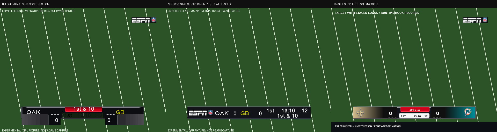
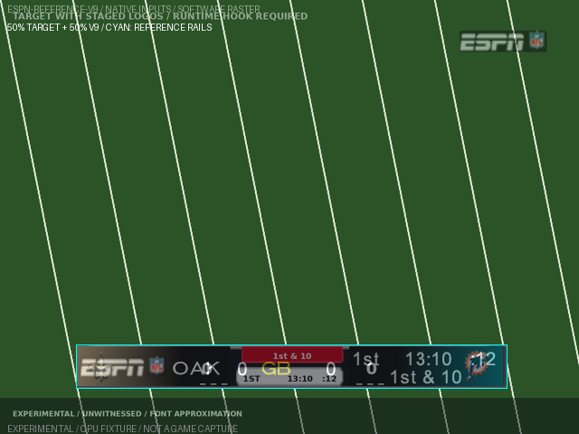

# Static ESPN scorebug v9

**Built: the existing static ESPN scorebar option now installs
`espn-reference-v9`. EXPERIMENTAL / UNWITNESSED.** Team colours and live timeout
selection remain deferred. No runtime hook, allocator request or preset was
added or enabled. Noah has not played this revision.

Base: `331e04d33fcf8a57788821f9618eb3927383fbeb`, branch
`astra/r63-scorebug-v9`. Only this worktree was edited. Retail inputs were
read only. No game/console emulator, GUI display, audio, network or push was
used. Bounded Unicorn instruction fixtures are the native CPU evidence below.
There was no full-disc build or retained disc/pack copy.

## Before, after and supplied target



The before panel reconstructs the pinned v8 scene, atlas and executable fields
with both score records enabled. The after panel uses v9 through the same
native relocation, setup, visibility, score rotation, camera, formatter and
retail FONT submission paths. Background, filtering, blending, depth and
rasterization are explicitly software models, not a captured game frame.

The supplied `target_NO_MIA.png` is a staged mockup, as its own label and the
previous report establish. Its measured 640x480 rails are **[84,381,560,429]**.
It supplies the neutral frame colour and 96x24 ESPN/NFL art size. The current
brief controls the placement: the mark moves to the left, team blocks are
neutral, and down/distance is white inside the bar. No NO/MIA matchup or team
palette is baked into a generic disc. The original target and Noah's v8
witness remain byte-identical.

**Layout decision:** keep the reference-size mark and native font sizes. The
left cell contains the mark; two adjacent 98-pixel team cells contain the
abbreviations and scores. The right cell uses two text baselines, with quarter,
game clock and play clock above down/distance. This fits long native down
strings and three-digit scores into one 476x48 outer bar. It has no separate
pill, second frame or lower detached row.



This is a 50/50 overlay, with the measured rails in cyan. Interior content
intentionally follows the new brief; it is not a claim of pixel equality with
the old staged layout.

| Evidence | File |
| --- | --- |
| Before, pinned v8 reconstruction | [4:3](docs/scorebug_ingame/before_v9_v8_640x480.png), [wide](docs/scorebug_ingame/before_v9_v8_wide_640x480.png) |
| Static v9, mode 0 | [4:3](docs/scorebug_ingame/after_v9_640x480.png), [wide](docs/scorebug_ingame/after_v9_wide_640x480.png) |
| Static v9, mode 1 | [4:3](docs/scorebug_ingame/after_v9_mode1_640x480.png), [wide](docs/scorebug_ingame/after_v9_wide_mode1_640x480.png) |
| Explicit culling model | [4:3](docs/scorebug_ingame/after_v9_640x480_cull.png), [wide](docs/scorebug_ingame/after_v9_wide_640x480_cull.png) |
| Native inputs, every mesh/glyph, materials, code/font pins and byte receipts | [Native audit](docs/scorebug_ingame/v9_native_audit.json) |
| Exact commands, results, memory, disk and delivery checks | [Validation](docs/scorebug_ingame/v9_validation.json) |

## PROVED: static repair

1. **Score parents repaired.** The native settled rotation reflects panel Y
   about parents 23 and 26. V8 inherited parent Y=5.9 although the panel centre
   was Y=19. V9 places both parent pivots at their actual cell centres, including
   Y=19, and preserves the native score leaves and shadow offsets. No score
   enable is zeroed and no instruction in `FD2F0..FD416` is patched.
2. **Both frame copies agree.** `yscore_buga` and `yscore_buga1` use identical
   two-triangle rectangles inside their existing command streams. Surplus
   frame vertices are degenerate; command bytes, vertex counts and allocation
   sizes are unchanged. The mode-0 four-pixel left miss is removed. Both
   direction modes produce byte-identical rendered pixels in both aspect
   states, including their corresponding ESPN mark copies.
3. **Readable colours.** `cscore_buga` vertices 48..63 change from retail
   `99000000` to `FFFFFFFF`. Sixteen existing text-colour words become white,
   covering scores, both clock variants, quarter, down, play clock and the
   auxiliary event text. The two retail possession-yellow abbreviation words
   stay `FFC0C000`. Native possession switching verifies which abbreviation
   receives yellow; all other captured text is white.
4. **Neutral team blocks.** The actual decoded P8 panel/strip pixels are
   exactly RGBA `(19,20,25,255)`, the reference frame fill `#131419`. Both teams
   share this block and have live native abbreviations. Painting atlas row 30
   columns 48/53/58 dark removes the decorative `---` pixels; the decoded
   panel region contains no such marks.
5. **Down and distance stays bound.** The `dscore_buga` tab triangles collapse
   to a point, and the native slide direction becomes zero. The text still
   comes from record `A959C8` and formatter `FC7D0`. It draws in white on the
   right, inside the bar. Native visibility remains in control. Auxiliary
   flag/fumble/hang-time/ball-position meshes also collapse; their text anchors
   are inside the frame. The two-line `Ball at\nMidfield` binding uses the
   upper baseline so its second line also fits.
6. **ESPN mark at reference size.** The installed mesh occupies approximately
   `(88,393)..(184,417)`, a 96x24 left-cell rectangle. Its art is the existing
   disc-derived ESPN/NFL region from the pinned `espn1` and `nflShield1`
   resources used by the source-art path, with no font imitation or new art
   source. Both visible mark triangles have negative effective strip area,
   the same winding as both frame triangles. The explicit positive-winding
   culling model preserves the mark pixels. The old relative culling mismatch
   is gone; actual hardware cull state remains unwitnessed.
7. **4:3 anchor retained.** Scene root stays `(320,408)` before the native
   16-pixel viewport Y offset. Wide v3 contracts X by `27/32` about 320 and
   leaves Y unchanged. The actual wide hook runs in the fixture; no scorebug
   world-marker compensation or new widescreen option is installed.

| Native 640x480 bounds | V8 | V9 |
| --- | --- | --- |
| Mode-0 frame X | 79.964..556.304 | 84.001..559.996 |
| Frame Y, either mode | 380.999..429.000 | 380.999..429.000 |
| Team-panel Y, settled | 409.199..453.190 | 382.999..426.990 |
| Score glyph Y, settled zero | 426.200..442.201 | 400.000..416.000 |
| Wide mode-0 frame X | 117.470..519.382 | 120.876..522.496 |

**Containment passes v9 and rejects v8.** The existing predicate still covers
all visible nondegenerate mesh bounds and every submitted glyph. Wide checks
use the same reference rails after the actual 27/32 contraction. In addition
to its two-pixel reference tolerance, v9 passes a stricter check against the
actual visible frame with only 0.02 pixels of numeric tolerance. The tests
cover both modes, both aspect states, both visibility endpoints, and score
phases 0, .25, .5, .75 and .999 with old/new score strings including three
digits. They also execute Inches, overtime, the ten-minute clock switch,
under-minute and zero clocks, under-five play clock, possession switching and
the four auxiliary text bindings. These are bounded samples, not an assertion
about every possible live-game state or arbitrary custom-team string.

The v8 negative control retains its exact scene and atlas span hashes
`cdcf2aa8...16427` and `8771f332...b7cd0`. It still fails for the visible frame,
score panels, score glyphs and upper-right mark. The historical disabled-score
fixture also remains available as a negative control; it is never the v9
acceptance path.

## PROVED: transport, replay and ownership

| V9 resource | Span bytes | SHA-256 |
| --- | ---: | --- |
| `score_bug` | 4832 | `419be64dfa7207dd05f0b8686886d9cea5b08fb6babad69ea7328084356a84ef` |
| `score_buga` | 2432 | `3967940dee5d82a6aff3164456d51b7e9809eab72fbe35b507055edd8e2a5204` |

Both resources refit through **`nfl_vc_lz_fill`**, retain all 32 wrapper bytes,
and retain retail **wrapper +0x14 = 16**. The scene and atlas use 4787 and 2387
filled payload bytes, respectively. The atlas compiler refuses two 256-colour
candidates that exceed retail overlap scratch and succeeds at 128 colours;
it does not inflate the wrapper scratch word. The native `4DC00` decompressor
runs at the real overlapping source/destination placement and produces the
same decoded hashes as the host parser. All details are in the audit JSON.

Resource and executable replay return identical bytes. Receipts now carry
`espn-reference-v9`; the image receipt also records the future team-material
hook contract. The static writer preflights all resources and the executable
before writing, refuses mixed/foreign bytes, checks its writes and retains its
rollback journal. The sparse transaction fixture exercises late-resource
refusal and exact reapply without copying a disc. Old v8 resources/executable
fields are foreign to v9: rebuild from the supported clean base.

The XBE uses the existing reserved root constants and ordinary existing data
fields, plus the already owned static instruction edits. There are **zero new
RX/RW/RO allocations** and no allocator page/manifest ownership changes. Both
XBE gate files already install the static owner through the complete union in
`tests/nfl2k5_allocator_stack.py`, including forward/reverse and scale-out
variants. Their assertions are unchanged.

The runtime hook module, presets and every protected file are unchanged. To
avoid changing the separately pinned runtime collection as a side effect of
static v9, its shared compiler explicitly calls the retained v8 atlas
generator and its staging scene retains v8 geometry. Its existing scene,
outer, appendix and collection pins pass the resource suite. The runtime
owner still composes with the static executable fields, as before; this does
not promote it or fix its reported entry freeze.

## Runtime work and HYPOTHESIS

**Team colours/live timeouts still require the runtime owner.** The static
binder `FC1A0` continues to select the same atlas across all 32 team identities,
with no team-context reads. The static material is `zscore_buga` on score
parents 23/26 (native names `away_score1` / `home_score1`). The existing
staging contract reserves independent selection
through `zscore_buga` for away and `hscore_buga` for home, with element 2's
material visibility needing coordination. This is documented in
`TEAM_MATERIAL_HOOK` and the receipt. Neither the static material nor a table
of team textures can select teams or remaining-timeout state by itself.

**HYPOTHESIS / unwitnessed:** exact GPU blending, filtering, depth/cull state,
resource lifetimes at cold entry, visibility transitions and combinations of
live event text. Auxiliary glyph containment is proved in explicit fixtures;
that does not prove their timing or absence of text overlap during actual
transitions. The previous runtime entry freeze remains an independent known
gap. No v9 gameplay success, team colour selection or live timeout behavior is
claimed here.

The native fixture itself gained two evidence corrections needed for the new
coverage: `E5FC28` aliases the home score/direction owner, and the away context
also needs a direction object when possession changes. Cached score frames
are attributed to their actual score records even when they do not call the
formatter. An initial extended-suite run caught the missing away fixture
object; the targeted possession regression passed after it was supplied. No
game executable instruction was changed to make that test pass.

## Reproduction and verification

```sh
python3 -m tools.nfl2k5_scorebug_projection \
  --pack '/media/noah/Storage/for codex 1.0/extracted/ESPN NFL 2K5 (USA)/vc_53450030/0' \
  --xbe '/media/noah/Storage/for codex 1.0/extracted/ESPN NFL 2K5 (USA)/default.xbe' \
  --witness docs/scorebug_ingame/witness_2026-09-06_v8_ingame.png \
  --output docs/scorebug_ingame
```

Each test file below runs standalone as `python3 <path>`, measured with
`/usr/bin/time -v`. The native harness reads bounded resource slices, a FONT
outer capped at 3 MB and the roughly 12 MB executable. No process loads a
whole disc or pack into memory.

| Standalone test path | Tests | Result | Peak RSS, KiB |
| --- | ---: | --- | ---: |
| `tests/mod_editor/test_nfl2k5_scorebug_ingame.py` | 11 | PASS | 137448 |
| `tests/mod_editor/test_nfl2k5_scorebug_projection.py` | 14 | PASS | 355272 |
| `tests/mod_editor/test_nfl2k5_scorebug_source_art.py` | 13 | PASS, 3 skipped | 48124 |
| `tests/mod_editor/test_nfl2k5_scorebug_unified_adapter.py` | 5 | PASS | 29980 |
| `tests/nfl2k5_scorebug_layout_test.py` | 15 | PASS, 4 skipped | 146288 |
| `tests/mod_editor/test_nfl2k5_scorebug_runtime.py` | 12 | PASS | 269908 |
| `tests/mod_editor/test_nfl2k5_scorebug_resources.py` | 6 | PASS | 166700 |
| `tests/mod_editor/test_xbe_patch_memory_writes.py` | 79 | PASS | 315620 |
| `tests/mod_editor/test_xbe_patch_cave_references.py` | 91 | PASS | 484088 |

Final acceptance: **239 passed, 7 skipped, 0 failed**. The projection generator also passes its containment, winding, native-decode and pixel-equality checks.

The seven historical-evidence skips are for missing legacy art/audit/glTF
fixtures and the optional old CPU fixture. The v9 projection, writer, native
runtime compatibility and both executable gates execute without skips.
A failed development run (one missing synthetic away-direction object) and
its passing targeted rerun are recorded separately in validation; only the
final complete standalone runs contribute to the acceptance total.

Disk checks started at 104 GiB available and finish at **101.76 GiB free**, above the stricter 100 GiB floor. No real-disc build was started. There are no task-owned disc or pack copies to retain or delete. The sparse transaction fixture was automatically deleted, and scratch preview images were removed before delivery. Scratch before the small Git bundle occupies 0.29 MiB, below 200 MiB. The largest final process used **484088 KiB (472.74 MiB)**, below the stricter 2 GiB per-test limit and the 25 GB per-process limit. Timing logs and byte measurements are retained in the validation JSON.

## Noah's witness list

Use a fresh build with the existing static **Experimental ESPN scorebar**
option and `scorebug_runtime=False`. Check the receipt says
`espn-reference-v9` and compare installed resource hashes above.

1. Cold game entry, repeated matchup entry and menu returns must complete.
   Test OAK/GB, NO/MIA, BAL/PIT, LV/HOU, reversed home/away and a created team.
   Both blocks should be neutral dark, with correct abbreviations and yellow
   possession. No team colours or timeout marks are expected in static v9.
2. Compare both drive directions at 4:3 and widescreen v3. One frame should
   occupy the same safe-area rails, with the ESPN mark in its left cell.
   Check that the scores and panels never form a lower detached row.
3. Score changes, both halves of the score flip, two-/three-digit scores and
   long abbreviations must remain readable and inside their cells.
4. Check quarters 1..4 and overtime; 10:00/9:59, under one minute and 0:00;
   play clock below five; ordinary downs, Goal and Inches; possession changes.
5. Check flag, fumble, hang-time and ball-position messages for readable text,
   containment and collisions with other right-cell text during transitions.
6. Check kick meter, play-call/replay transitions, timeout/halftime resets and
   return to ordinary play. Confirm the old red tab and decorative dashes are
   absent and that the mark survives the actual GPU cull state.

## Delivery and protected handoff

The static option already routes to v9; no dispatcher, BuildPlan, preset,
allowlist, new import or capability wiring is needed to select it. The exact
shared GUI help-text replacement and Claude's exclusive source-pin/cave-
manifest refresh are documented at the top of [WIRING.md](WIRING.md). Those
protected/shared files were not edited here.

Shared Git metadata is read only. The brief's authorized fallback uses
isolated metadata under `.scratch/scorebug-v9-git`, an explicit-path commit
above the recorded base on `astra/r63-scorebug-v9`, and
**`.scratch/r63-scorebug-v9.bundle`**. Changed files remain in this worktree.
The bundle excludes `ASTRA_BRIEF.md`, `.scratch/`, retail binaries and all
protected files. No push was performed.
