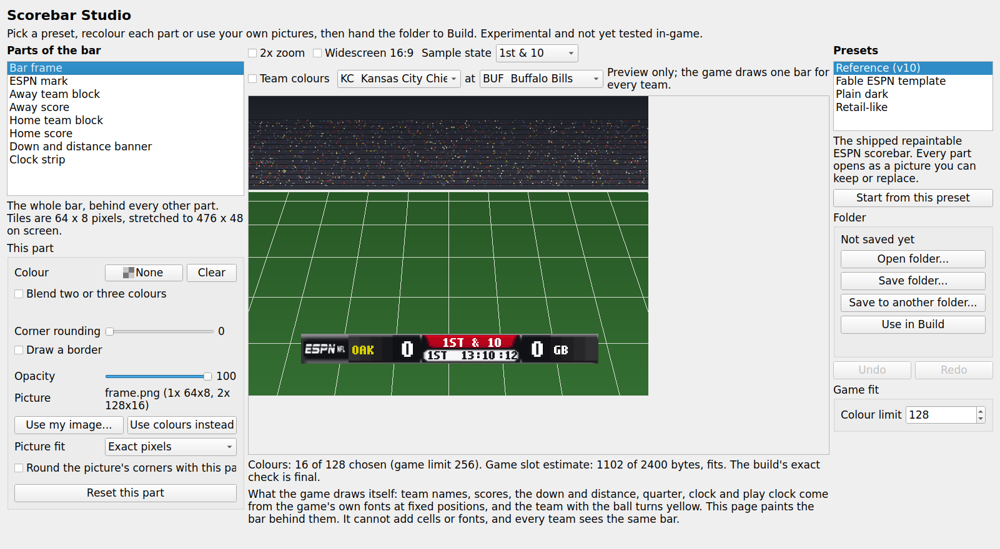
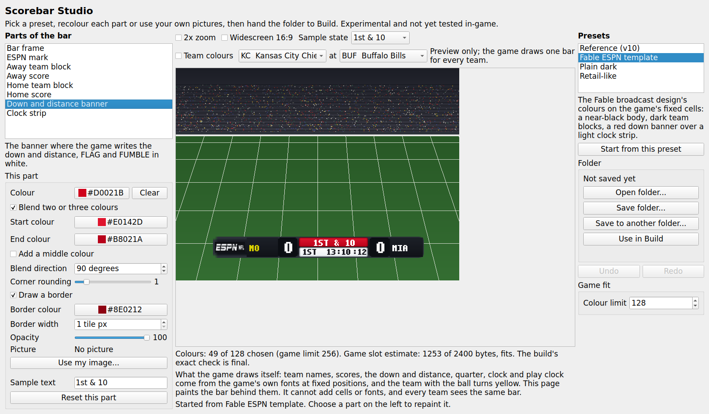
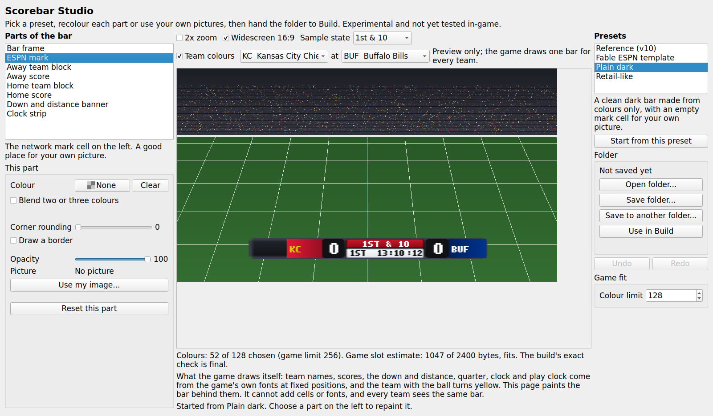
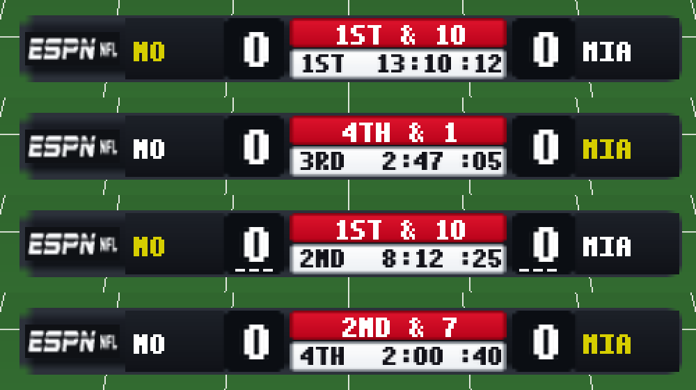

# Scorebar Studio: an easy scorebug editor page (2026-09-07)

Branch `fable/r63-scorebug-studio`, base `b2948b8`. **EXPERIMENTAL / UNWITNESSED.**

Noah asked for the scorebug work to become "a super easy to use scorebug
editor/creator tool in the editor", and earlier: "I can design the assets
myself. I just need a modular template that I can make beautiful." This branch
adds a **Scorebar** page to 2K5 Mod Studio that does exactly that on top of the
existing v10 template compiler. Nothing protected was edited; the shell wiring
is the first section of `WIRING.md`.

## What it does

* **Presets.** Reference (v10), Fable ESPN template, Plain dark, Retail-like.
  The registry is `data/nfl2k5_scorebug_studio_presets.json`; a folder preset
  (an exact ESPN bar, for example) is one JSON row, no code.
* **Eight parts with plain names.** Bar frame, ESPN mark, Away team block, Away
  score, Home team block, Home score, Down and distance banner, Clock strip. Each
  has a colour, an optional two- or three-colour blend with a direction, corner
  rounding, a border, opacity, an optional picture (Fit inside, Fill and crop,
  Stretch to fit, Exact pixels, with optional corner clipping) and sample text.
* **Live preview** of the bar on a drawn field (no disc art) with stand-in text
  at the game's measured live text positions, 4:3 or widescreen 16:9 (27/32
  contraction about the centre, then the 16:9 stretch), 2x zoom, four sample
  states (1st & 10, 4th & 1, Timeouts, Two-minute) and a team colours preview
  that says "Preview only; the game draws one bar for every team."
* **Undo and redo** on every step (slider drags merge into one), a dirty flag,
  accessible names on every control, keyboard operable, offscreen-safe.
* **Open folder** reads a Studio folder with all its settings, or any valid
  template folder as eight exact-pixel picture parts. **Save folder** writes
  `layout.json` (the preset's contract), `1x/`, `2x/`, `images/` and
  `scorebar_studio.json`, then runs `compile_folder` and reports colours and an
  estimate of the game's 2,400-byte scorebar slot. **Use in Build** saves and
  emits `folder_chosen(str)` for the Build tab's scorebar folder field.
* **Lossless round trip.** The shipped reference opens and saves back with all
  sixteen PNGs byte-identical; a layer that is exactly a template PNG with no
  other settings is copied, never re-encoded.
* **Colour budget.** Blends across all parts are reduced together to the chosen
  colour limit (default 128, hard limit 256) without touching exact-pixel parts.
  The slot estimate uses the optimal VC-LZ encoder with the pinned retail stream
  parameters (tag 1, 11 offset bits, 2,400-byte body) and a fixed header
  allowance; against the real retail span it agrees with `encode_span` for all
  four presets and for a noisy atlas that cannot fit.
* **Warnings** name a dark clock strip (the game writes near-black there) and
  very light text cells (the game writes white there).

## Screenshots









The user guide is `docs/mod_editor/scorebug_studio.md`.

## Files

| File | Role |
| --- | --- |
| `mod_editor/core/nfl2k5_scorebug_author.py` | document model, renderer, preview, presets, CLI (`presets`, `export`, `preview`, `validate`) |
| `mod_editor/gui/scorebug_studio_panel_qt.py` | the page: `ScorebugStudioPanel`, signal `folder_chosen(str)` |
| `data/nfl2k5_scorebug_studio_presets.json` | preset registry, schema `nfl2k5_scorebug_studio_presets/v1` |
| `docs/mod_editor/scorebug_studio.md` and `docs/mod_editor/scorebug_studio/` | two-minute guide with rendered previews and page screenshots |
| `docs/mod_editor/nfl2k5_scorebug_studio_capability.json` | registry object `nfl2k5.scorebug_presentation.studio` |
| `tests/mod_editor/test_nfl2k5_scorebug_author.py` | model tests |
| `tests/mod_editor/test_scorebug_studio_panel_qt.py` | offscreen page tests |
| `WIRING.md` (first section) | the protected edits for Claude |

Document schema `nfl2k5_scorebug_author/v1`: a `scorebar_studio.json` next to
`layout.json` with eight layer objects (`fill`, `gradient`, `radius`, `border`,
`opacity`, `image`, `sample_text`), `source_scale`, `colour_limit` and the
preview state. Pictures are stored in `images/` and pinned by SHA-256.

## Limits, honestly

* **One bar.** The static scorebar binds one texture on all eleven materials.
  Team colours on the page are preview only; runtime team art is the separate
  diagnostic `scorebug_runtime` feature, off in every preset.
* **No live fonts, cells or hooks.** The template repaints eight fixed cells.
  Team names, scores, down and distance, quarter, clock, play clock, possession
  yellow, FLAG and FUMBLE are the game's own text at the game's own anchors.
  The stand-in preview text is the staged broadcast glyph sheet and reads in
  capitals; the game's fonts decide the real look.
* **Tiny tiles.** The frame is 64 x 8 pixels stretched to 476 x 48, so a one
  tile pixel border is about 7 x 6 pixels on screen; the blocks are 32 x 16. An
  imported picture is fitted in on-screen proportions and then reduced to the
  tile, so fine detail cannot survive; the preview shows what the game gets.
* **Retail-like is an approximation** from colours measured on the native
  projection and the in-game witness frame. No retail pixels are copied and the
  original bar's mark cell (its network mark sits elsewhere on screen) stays empty.
* **Fable ESPN template** carries the Fable design's palette and shapes on the
  fixed v1 cells with the reference mark; the Fable folder's own geometry does
  not fit the v1 contract, so it is not a pixel import.
* **Slot estimate.** The figure on the page is an estimate; Build's exact
  fixed-span check remains the authority. The v10 reference reads 1,102 of 2,400
  on the page and 1,069 in the exact encoder (the header allowance is
  deliberately generous).
* **Timeouts state** shows where runtime timeout marks would sit; the static
  bar does not draw them.
* **Not wired yet.** Until Claude applies the WIRING section the page is not in
  the sidebar and the signal is not connected. The folder still works through
  the Build tab's existing Choose folder button and the command line.

## Test results

Run with `QT_QPA_PLATFORM=offscreen` and `PYTHONPATH` at the worktree root:

```
tests.mod_editor.test_nfl2k5_scorebug_author      12 tests  OK  (11 offline, 1 retail-gated: ran here, the USA pack is present)
tests.mod_editor.test_scorebug_studio_panel_qt    11 tests  OK
tests.mod_editor.test_nfl2k5_scorebug_template    19 tests  OK  (10 offline, 9 retail-gated; unchanged, still green)
Ran 42 tests in 22.6 s   OK
```

What they prove: the reference round trip is byte-identical (sixteen PNGs, same
compiled atlas, same layer hashes); every preset exports, compiles under its
colour limit, fits the slot estimate and reopens equal; picture fitting pads,
crops, stretches and crops-by-rect as named, at 1x and 2x; rendering and saving
are deterministic; the colour limit reduces blends jointly without touching
exact pictures; warnings name the right parts; bad documents and folders refuse
with plain messages; preview sizes and the widescreen contraction are right; the
CLI lists, exports, previews and validates; the product path imports no Qt,
numpy or emulator. On the page: eight parts, four presets, a live pixmap, every
control has an accessible name and no em dashes, a colour change marks dirty and
undo/redo restore it, slider drags merge, the sample state writes the centre
text as one undoable step, widescreen and zoom and team colours change only the
preview, Use my image fits and Use colours instead recovers, save then reopen
equals, Use in Build saves first when dirty and emits the folder, errors show in
the result label instead of dialogs, the colour limit is undoable and flows into
the saved folder.

Also run: `validate_registry.validate_data` on a sorted copy of the registry
with the new object (valid, 110 capabilities); `test_shipped_tools_posix_only`
and `test_directory_publishes_are_portable` (OK). `test_generated_artifacts_are_lf`
fails on this branch exactly as it does at base `b2948b8`: it lists eight
unpinned `write_text` calls in `nfl2k5_scorebug_template.py:230`,
`tools/nfl2k5_scorebug_template_art.py` and `tools/nfl2k5_kickoff_returns.py`,
none of them mine. The Studio model writes its JSON as bytes, so it is not
listed.

## Noah's witness list

Nothing here has been watched in-game. After Claude wires the page:

1. Open Scorebar, start from Plain dark, put your own picture on the ESPN mark,
   recolour the banner, save a folder, press Use in Build, tick Experimental ESPN
   scorebar, build a disc copy and look at the bar in a Play Now game at 4:3.
2. The same disc in widescreen: the bar should sit inside the same rails,
   contracted, with your mark on the left.
3. Reference (v10) saved unchanged from the page and built: the bar must be
   pixel-identical to the shipped v10 install (the receipt's layer hashes match).
4. A busy blend on every part with the colour limit at 256: Build's exact check
   should refuse or accept in line with the page's estimate; report any case
   where the page says fits and the build refuses.
5. The clock strip painted dark on purpose: confirm the near-black clock text is
   unreadable in-game, as the page warns.

## Three things to try first

1. **Scorebar, Plain dark, Use my image on the ESPN mark, Save folder, Use in
   Build.** The whole point of the page in under a minute.
2. **Open folder on `docs/scorebug_template`, save it to a new folder, compare
   the PNGs.** Byte for byte the same; then press Use colours instead on the
   Down and distance banner and watch the live preview.
3. **Fable ESPN template, Team colours on, Widescreen 16:9, Sample state
   Two-minute.** Then read the line under the preview: colours, slot estimate,
   and any warning about the clock strip.
