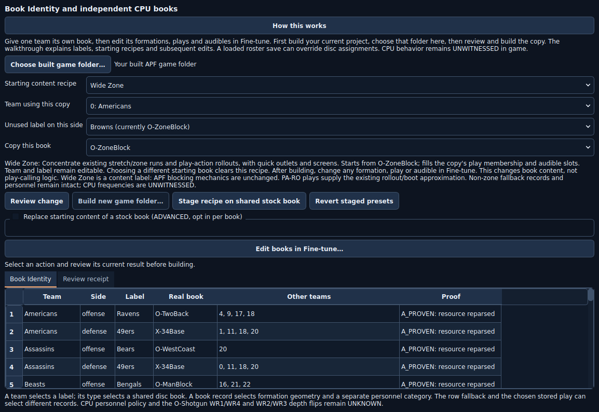
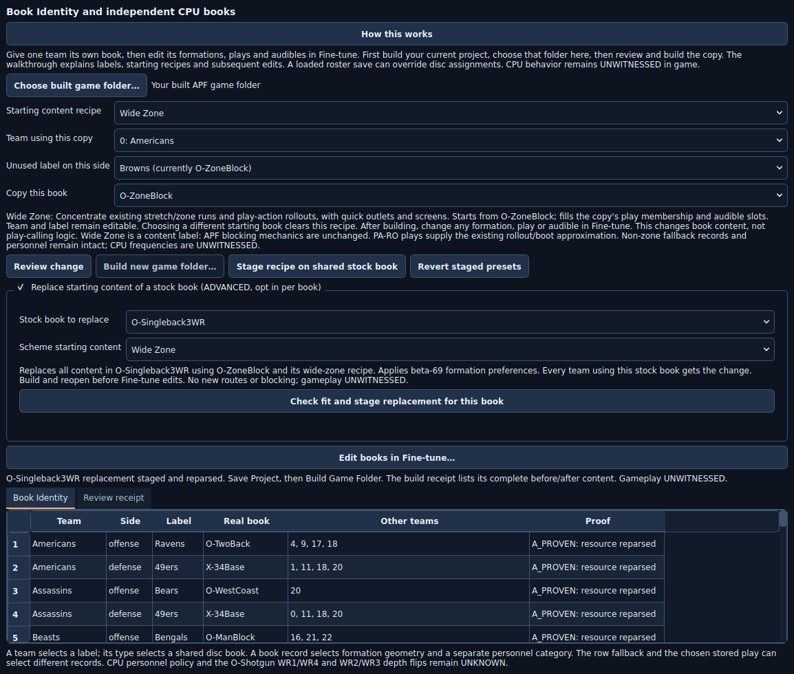

# Book Identity: starting plays and independent CPU books

Aszemple wrote, “These other tabs, I'm not sure how to utilize yet”. Start here
in **Playbooks → Book Identity → How this works**. The screenshots below are
offscreen renders of Studio controls, made by `tools/apf_gui_replay_offscreen.py`.
They show offline authoring, not a running game. Every in-game outcome remains
**UNWITNESSED**.

## What a book identity means

A team's assignment points to a **label**, and the label names a **book resource**
containing formations, plays and audibles. Two labels can name the same resource.
Changing that shared book changes the starting content for all its users.

The table shows the team, offense/defense, label, resolved book name and other
teams sharing it. **“A_PROVEN resource reparsed”** means Studio resolved the
label by name, found its resource in the archive and read the book back.
It proves the offline assignment and resource agree. It does not prove which
book Xenia loads during a match or what the CPU calls. A loaded roster save,
USER A/B working book or global merge can change the active content.

## Give a CPU team an independent book

1. Finish and **Save Project** for your current artwork and roster edits.
   Choose **Build Game Folder** to create a complete separate game folder.
2. In Book Identity, choose **Choose built game folder…**, then that output.
3. Choose **Team using this copy**, an **Unused label on this side**, and
   **Copy this book**. Offense and defense are separate assignments; repeat
   for the other side if wanted. USER-o is an offensive donor, USER-d a
   defensive donor. A global book is a special-play supplement, not a blank
   all-situation book.
4. Choose a **Starting content recipe**, or leave **Copy the book as it is**.
   A recipe selects its donor automatically. Changing the donor clears it.
5. Choose **Review change**. Read the named source, new copy and assignments
   in **Review receipt**. Choose **Build new game folder…** after it passes.
6. Choose **Edit the new independent book in Fine-tune…**. Select the copy by
   name, edit its formations, plays and audibles, and save a **book-edit recipe**
   from that dialog. Build another new folder from the Fine-tune workspace.

Cloning inserts archive entries, so complete the old Studio project first.
Open the newly built folder for subsequent work. Its book choices resolve by
name even when entry numbers have shifted. A standalone book-edit recipe and
a full Studio `.apf2k8mod` project are different files; keep both when using both
workflows. CPU Play Calling also offers reviewed own-book plans for disc teams.

## Three starting recipes and eight calling schemes

The existing Book Identity recipes select actual donor plays and audible slots:

| Starting recipe | Donor | Use |
| --- | --- | --- |
| Wide Zone | O-ZoneBlock | Zone-run starting selection with passing complements |
| Spread-to-Run | O-Shotgun | Spread starting selection with run complements |
| Pro Power | O-ManBlock | Power starting selection with passing complements |

They use existing plays and do not manufacture blocking, routes or an RPO.
Read the recipe's on-screen intent and limitations before building.

**CPU Play Calling** has eight beta-69 schemes: Air Coryell, Erhardt-Perkins,
West Coast, West Coast Spread, Spread-to-Run, Wide Zone, Power/Gap and Pro Spread.
These adjust formation preferences and team tendency in the team's existing
book; they do not replace its plays. Review missing personnel, stage once,
preview situations, and export the play-call spreadsheet. Reapplying a calling
scheme adds its rating deltas again. Lower raw formation ratings generally
increase preference; neither rating 0 nor 7 means “never”. Optional situation
row weights do not replace the ordinary CPU lottery. See the bundled
[scheme guide](apf_b69_schemes.md).

**Fine-tune** changes individual formations, play memberships and audible slots.
Use it after choosing starting content. **Never call (ordinary CPU lottery)**
is a separate CPU Play Calling control. Special formations remain protected.

## Replace one of the eight stock books

This ADVANCED option is **off by default**. It affects everyone sharing the
selected stock book. For one team's independent content, use the copy workflow.

1. Open the source game in the main Studio. Save the project first.
2. In Book Identity, check **Replace starting content of a stock book**.
3. Pick the exact **Stock book to replace**, then **Scheme starting content**.
   The eight targets are O-ManBlock, O-TwoBack, O-SinglebackAce,
   O-Singleback3WR, O-WestCoast, O-ZoneBlock, O-Shotgun and USER-o.
   The actual names are **O-ZoneBlock** and **USER-o**, rather than “O-ZoneBack”
   or “USER-0”.
4. Choose **Check fit and stage replacement for this book**. Studio replaces
   the target's whole starting content with the donor below, applies the
   existing membership recipe where listed, and sets beta-69 formation
   preferences. It retains the donor's special-play content and tail.
5. Read the before/after formation and play lists, donor, hashes and allocation
   sizes in **Review receipt**. The checkbox turns off after staging. Repeat
   explicitly for any other book; previously staged book choices remain.
6. **Save Project**, then **Build Game Folder**. The build receipt includes
   the replacement and its reparse checks. Reopen the built folder before
   additional Fine-tune work, or before copying the replaced stock book to an
   independent CPU book. Revert staged presets or Undo restores project intent.

| Scheme starting content | Donor | Membership recipe |
| --- | --- | --- |
| Air Coryell | O-TwoBack | Complete donor |
| Erhardt-Perkins | USER-o | Complete donor |
| West Coast | O-WestCoast | Complete donor |
| West Coast Spread | O-Shotgun | Complete donor |
| Spread-to-Run | O-Shotgun | Spread-to-Run |
| Wide Zone | O-ZoneBlock | Wide Zone |
| Power/Gap | O-ManBlock | Pro Power |
| Pro Spread | O-Singleback3WR | Complete donor |

These are authored starting choices using existing scheme data, not exact
historical coaching playbooks. The receipt names all selected content. This
replacement does not set a team's run percentage; use CPU Play Calling for that.
Choose its matching scheme if desired after reopening the replacement build.
Donors come from the selected source game. Start from your clean original when
you want stock donor content; an already edited donor supplies its edited plays.

**If it refuses:** the selected book's fixed compressed allocation may be too
small, a donor may be missing, or the book may already have Fine-tune edits.
The message names the cause and next step. Select another target or use the
independent-copy workflow; build or revert conflicting edits first. Studio
does not silently drop plays or publish an oversized book to make it fit.

## Build and launch in Xenia

1. Keep the source read-only. Build to a new folder, and retain the project and
   build receipt. Confirm the expected book names and assignments in that output.
2. Configure Xenia in Studio, then use **Launch in Xenia** for the final built
   folder. Fully close the previous Xenia process first. Confirm the launched
   game folder and BASE or TU 1.1 version.
3. Start a fresh matchup and record any loaded roster/USER book override.
   Test the edited team and an unchanged comparison team. Log formations,
   personnel and plays in the same situations. An offline preview is a model,
   not a played-game witness.

Book content changes need no experimental executable patch. If separately
testing a personnel-curve or pass-fetch experiment, review and install its
matching BASE/TU patch in CPU Play Calling, then launch through Studio.
Studio delivers managed patches to the actual launch storage's `patches`
directory and forwards the enabled setting. In Xenia's log check **Storage
root:** and **Patcher: Applying patch for:** the intended patch; a patch-file
count alone proves only discovery. The pass-fetch experiment applies only to
specific pass subtypes and does not force a TE on ordinary third-down calls.

**Witness still needed:** independent CPU assignments, removal persistence,
ordinary 5-2 calls, TE personnel and all actual game loading/rendering.
