# Retail match-coverage census

All 37 books, 9,251 plays and 3,332 defensive plays decoded. 59 play records have explicit exchanges across 105 formation menus. Reciprocal plays: 53; plays with unpaired rules: 6; unclassified plays: 0; defensive 0x1A nodes: 0.

PROVED refers to bytes and static consumers. These are offscreen Studio diagrams, with all linked formations shown. Cyan handoff arrows are annotations. They are not gameplay captures. All slots and indices are zero-based.

| Book | Formation | Play | Defenders and rule | Art |
| --- | --- | --- | --- | --- |
| ARZ | Nickel (f25) | Combo Inside Zone (p26) | CB2 (slot 9) starts in man. When the receiver moves left past the defender and the midpoint between that defender and the game's reference player, it signals OLB (slot 4) and takes a zone at X +15, depth 18 yards. OLB starts with a zone landmark at X +8, depth 10 yards, then changes from zone to man. The receiver position is predicted 0.2 seconds ahead; live pickup remains native.  CB (slot 10) starts in man. When the receiver moves right past the defender and the midpoint between that defender and the game's reference player, it signals CB3 (slot 6) and takes a zone at X -15, depth 18 yards. CB3 starts with a zone landmark at X -8, depth 10 yards, then changes from zone to man. The receiver position is predicted 0.2 seconds ahead; live pickup remains native. | [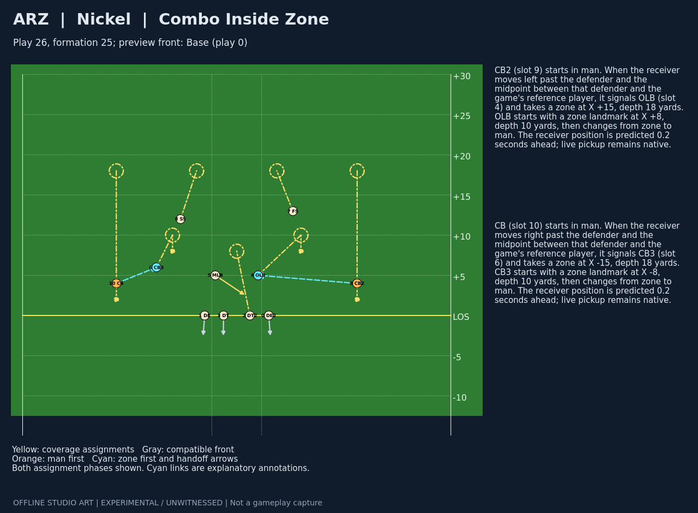](ARZ-p026-f25.png) |
| ATL | Nickel (f23) | Combo Inside Zone (p28) | CB2 (slot 9) starts in man. When the receiver moves left past the defender and the midpoint between that defender and the game's reference player, it signals OLB (slot 4) and takes a zone at X +15, depth 18 yards. OLB starts with a zone landmark at X +8, depth 10 yards, then changes from zone to man. The receiver position is predicted 0.2 seconds ahead; live pickup remains native.  CB (slot 10) starts in man. When the receiver moves right past the defender and the midpoint between that defender and the game's reference player, it signals CB3 (slot 6) and takes a zone at X -15, depth 18 yards. CB3 starts with a zone landmark at X -8, depth 10 yards, then changes from zone to man. The receiver position is predicted 0.2 seconds ahead; live pickup remains native. |  |
| ATL | Dime (f24) | Combo Inside Zone (p28) | CB2 (slot 9) starts in man. When the receiver moves left past the defender and the midpoint between that defender and the game's reference player, it signals CB4 (slot 4) and takes a zone at X +15, depth 18 yards. CB4 starts with a zone landmark at X +8, depth 10 yards, then changes from zone to man. The receiver position is predicted 0.2 seconds ahead; live pickup remains native.  CB (slot 10) starts in man. When the receiver moves right past the defender and the midpoint between that defender and the game's reference player, it signals CB3 (slot 6) and takes a zone at X -15, depth 18 yards. CB3 starts with a zone landmark at X -8, depth 10 yards, then changes from zone to man. The receiver position is predicted 0.2 seconds ahead; live pickup remains native. |  |
| BAL | 3-4 (f25) | Zone Double Steal (p14) | CB2 (slot 9) starts in man. When the receiver goes beyond the defender and reaches 15 yards downfield, it signals FS (slot 7) and takes a zone at X +15, depth 12 yards. FS starts with a zone landmark at X +15, depth 15 yards, then changes from zone to man. The receiver position is predicted 0.2 seconds ahead; live pickup remains native.  CB (slot 10) starts in man. When the receiver goes beyond the defender and reaches 15 yards downfield, it signals SS (slot 8) and takes a zone at X -15, depth 12 yards. SS starts with a zone landmark at X -15, depth 15 yards, then changes from zone to man. The receiver position is predicted 0.2 seconds ahead; live pickup remains native. | [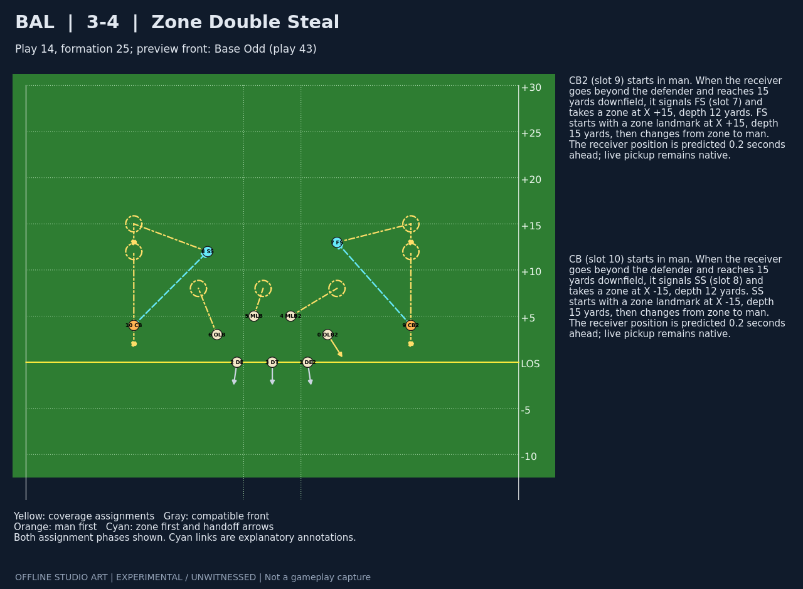](BAL-p014-f25.png) |
| BAL | 3-4 (f25) | Combo Strong Zone (p23) | CB2 (slot 9) starts in man. When the receiver moves left past the defender and the midpoint between that defender and the game's reference player, it signals OLB2 (slot 0) and takes a zone at X +14, depth 18 yards. OLB2 starts with a zone landmark at X +8, depth 10 yards, then changes from zone to man. The receiver position is predicted 0.2 seconds ahead; live pickup remains native. | [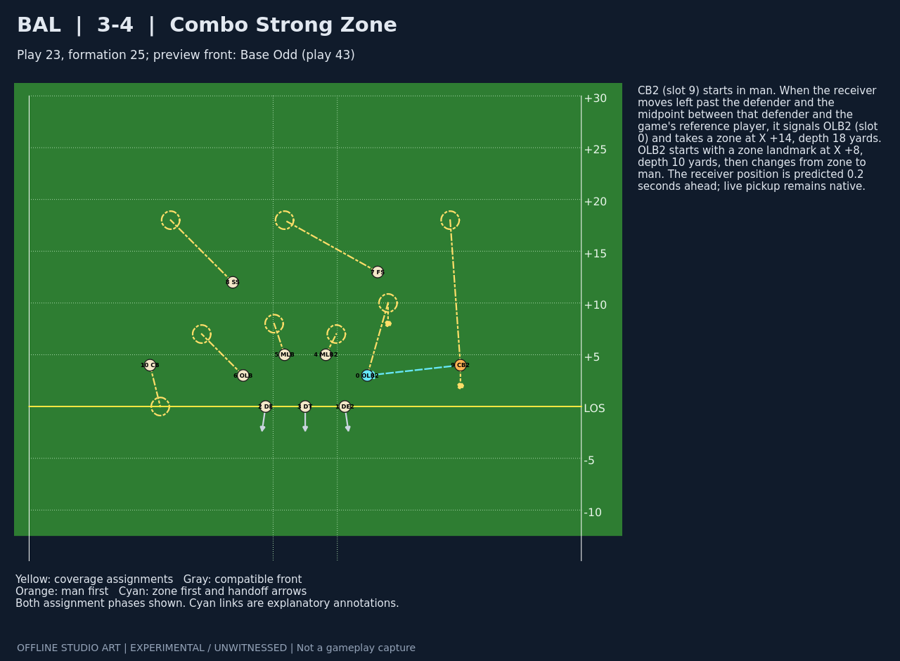](BAL-p023-f25.png) |
| BUF | Nickel (f28) | Combo Inside Zone (p23) | CB2 (slot 9) starts in man. When the receiver moves left past the defender and the midpoint between that defender and the game's reference player, it signals OLB (slot 4) and takes a zone at X +15, depth 18 yards. OLB starts with a zone landmark at X +8, depth 10 yards, then changes from zone to man. The receiver position is predicted 0.2 seconds ahead; live pickup remains native.  CB (slot 10) starts in man. When the receiver moves right past the defender and the midpoint between that defender and the game's reference player, it signals CB3 (slot 6) and takes a zone at X -15, depth 18 yards. CB3 starts with a zone landmark at X -8, depth 10 yards, then changes from zone to man. The receiver position is predicted 0.2 seconds ahead; live pickup remains native. |  |
| BUF | Dime (f29) | Combo Inside Zone (p23) | CB2 (slot 9) starts in man. When the receiver moves left past the defender and the midpoint between that defender and the game's reference player, it signals CB4 (slot 4) and takes a zone at X +15, depth 18 yards. CB4 starts with a zone landmark at X +8, depth 10 yards, then changes from zone to man. The receiver position is predicted 0.2 seconds ahead; live pickup remains native.  CB (slot 10) starts in man. When the receiver moves right past the defender and the midpoint between that defender and the game's reference player, it signals CB3 (slot 6) and takes a zone at X -15, depth 18 yards. CB3 starts with a zone landmark at X -8, depth 10 yards, then changes from zone to man. The receiver position is predicted 0.2 seconds ahead; live pickup remains native. |  |
| BUF | 4-3 (f27) | Open Cover 5 (p25) | CB2 (slot 9) starts in man. When the receiver goes beyond the defender and reaches 15 yards downfield, it signals FS (slot 7) and takes a zone at X +15, depth 12 yards. FS starts with a zone landmark at X +15, depth 15 yards, then changes from zone to man. The receiver position is predicted 0.2 seconds ahead; live pickup remains native. | [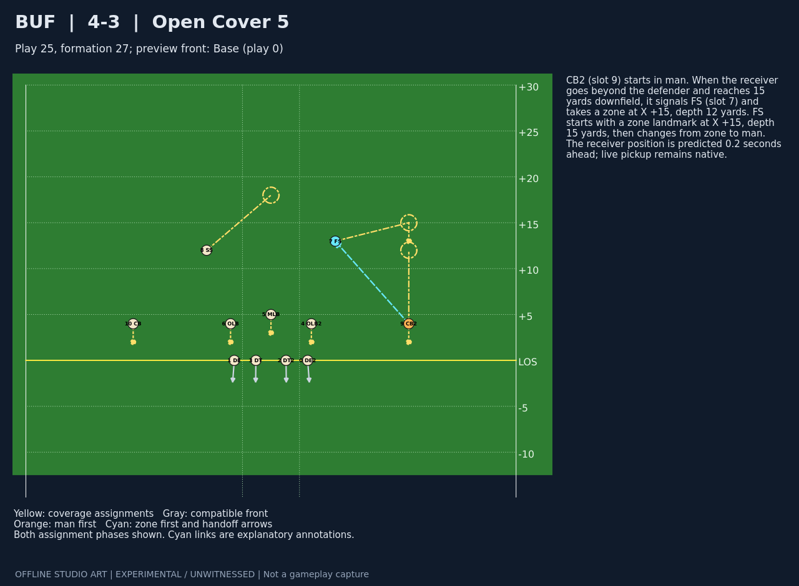](BUF-p025-f27.png) |
| CAR | Nickel (f29) | Combo Inside Zone (p14) | CB2 (slot 9) starts in man. When the receiver moves left past the defender and the midpoint between that defender and the game's reference player, it signals OLB (slot 4) and takes a zone at X +15, depth 18 yards. OLB starts with a zone landmark at X +8, depth 10 yards, then changes from zone to man. The receiver position is predicted 0.2 seconds ahead; live pickup remains native.  CB (slot 10) starts in man. When the receiver moves right past the defender and the midpoint between that defender and the game's reference player, it signals CB3 (slot 6) and takes a zone at X -15, depth 18 yards. CB3 starts with a zone landmark at X -8, depth 10 yards, then changes from zone to man. The receiver position is predicted 0.2 seconds ahead; live pickup remains native. |  |
| CAR | Dime (f30) | Combo Inside Zone (p14) | CB2 (slot 9) starts in man. When the receiver moves left past the defender and the midpoint between that defender and the game's reference player, it signals CB4 (slot 4) and takes a zone at X +15, depth 18 yards. CB4 starts with a zone landmark at X +8, depth 10 yards, then changes from zone to man. The receiver position is predicted 0.2 seconds ahead; live pickup remains native.  CB (slot 10) starts in man. When the receiver moves right past the defender and the midpoint between that defender and the game's reference player, it signals CB3 (slot 6) and takes a zone at X -15, depth 18 yards. CB3 starts with a zone landmark at X -8, depth 10 yards, then changes from zone to man. The receiver position is predicted 0.2 seconds ahead; live pickup remains native. |  |
| CHI | 4-3 (f24) | Combo Inside Zone (p14) | CB2 (slot 9) starts in man. When the receiver moves left past the defender and the midpoint between that defender and the game's reference player, it signals OLB2 (slot 4) and takes a zone at X +15, depth 18 yards. OLB2 starts with a zone landmark at X +8, depth 10 yards, then changes from zone to man. The receiver position is predicted 0.2 seconds ahead; live pickup remains native.  CB (slot 10) starts in man. When the receiver moves right past the defender and the midpoint between that defender and the game's reference player, it signals OLB (slot 6) and takes a zone at X -15, depth 18 yards. OLB starts with a zone landmark at X -8, depth 10 yards, then changes from zone to man. The receiver position is predicted 0.2 seconds ahead; live pickup remains native. |  |
| CHI | 4-3 (f24) | Combo Strong Zone (p27) | OLB2 (slot 4) has a zone-to-man continuation, waiting for its own slot signal; its later man node names CB2 (slot 9) as partner. The stored partner slots are not reciprocal. Live effect is unproved.  CB2 (slot 9) has a man-to-zone rule when the receiver moves left past the defender and the midpoint between that defender and the game's reference player. It signals DE2 (slot 0), then takes a zone at X +14, depth 18 yards. The stored partner slots are not reciprocal. Live effect is unproved. |  |
| CHI | Nickel (f25) | Combo Strong Zone (p27) | OLB (slot 4) has a zone-to-man continuation, waiting for its own slot signal; its later man node names CB2 (slot 9) as partner. The stored partner slots are not reciprocal. Live effect is unproved.  CB2 (slot 9) has a man-to-zone rule when the receiver moves left past the defender and the midpoint between that defender and the game's reference player. It signals DE2 (slot 0), then takes a zone at X +14, depth 18 yards. The stored partner slots are not reciprocal. Live effect is unproved. |  |
| CHI | Dime (f26) | Combo Strong Zone (p27) | CB4 (slot 4) has a zone-to-man continuation, waiting for its own slot signal; its later man node names CB2 (slot 9) as partner. The stored partner slots are not reciprocal. Live effect is unproved.  CB2 (slot 9) has a man-to-zone rule when the receiver moves left past the defender and the midpoint between that defender and the game's reference player. It signals DE2 (slot 0), then takes a zone at X +14, depth 18 yards. The stored partner slots are not reciprocal. Live effect is unproved. | [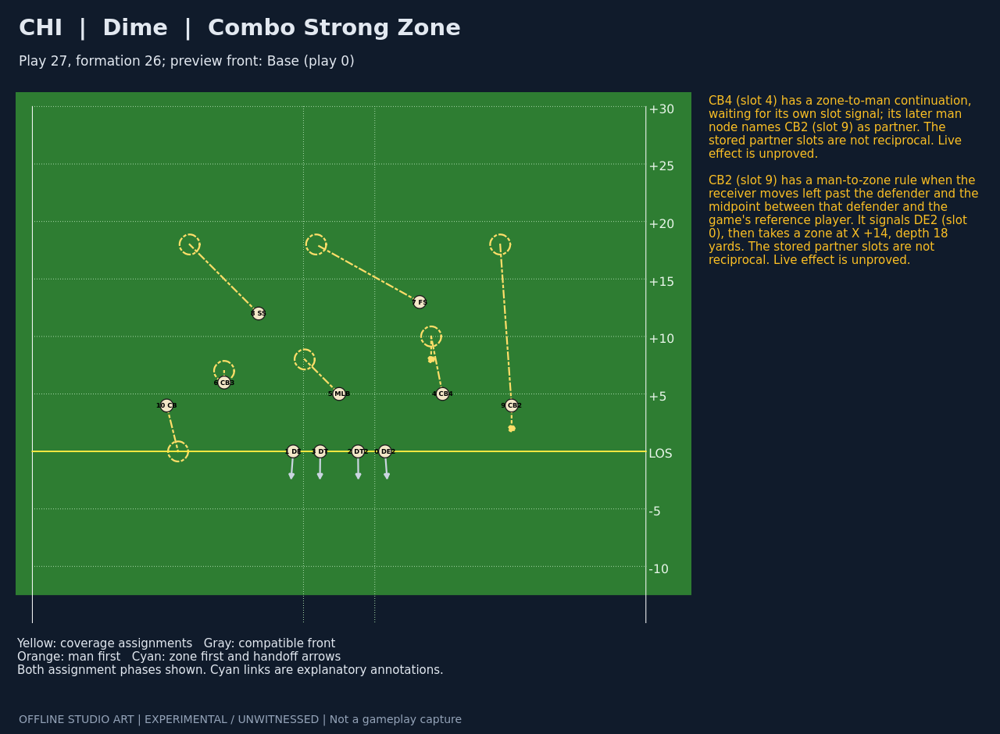](CHI-p027-f26.png) |
| CIN | 4-3 (f27) | Combo Strong Zone (p3) | OLB2 (slot 4) has a zone-to-man continuation, waiting for its own slot signal; its later man node names CB2 (slot 9) as partner. The stored partner slots are not reciprocal. Live effect is unproved.  CB2 (slot 9) has a man-to-zone rule when the receiver moves left past the defender and the midpoint between that defender and the game's reference player. It signals DE2 (slot 0), then takes a zone at X +14, depth 18 yards. The stored partner slots are not reciprocal. Live effect is unproved. | [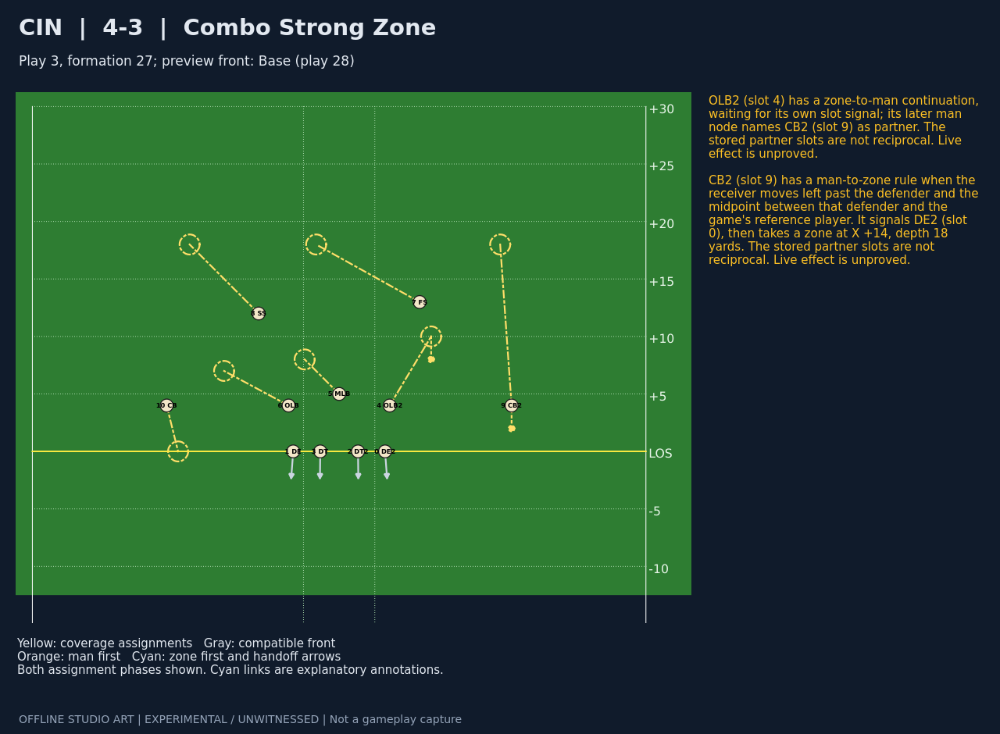](CIN-p003-f27.png) |
| CIN | 4-3 (f27) | Weak Combo Strong Zone (p26) | CB2 (slot 9) starts in man. When the receiver goes beyond the defender and reaches 15 yards downfield, it signals FS (slot 7) and takes a zone at X +15, depth 9 yards. FS starts with a zone landmark at X +9, depth 12 yards, then changes from zone to man. The receiver position is predicted 0.2 seconds ahead; live pickup remains native. | [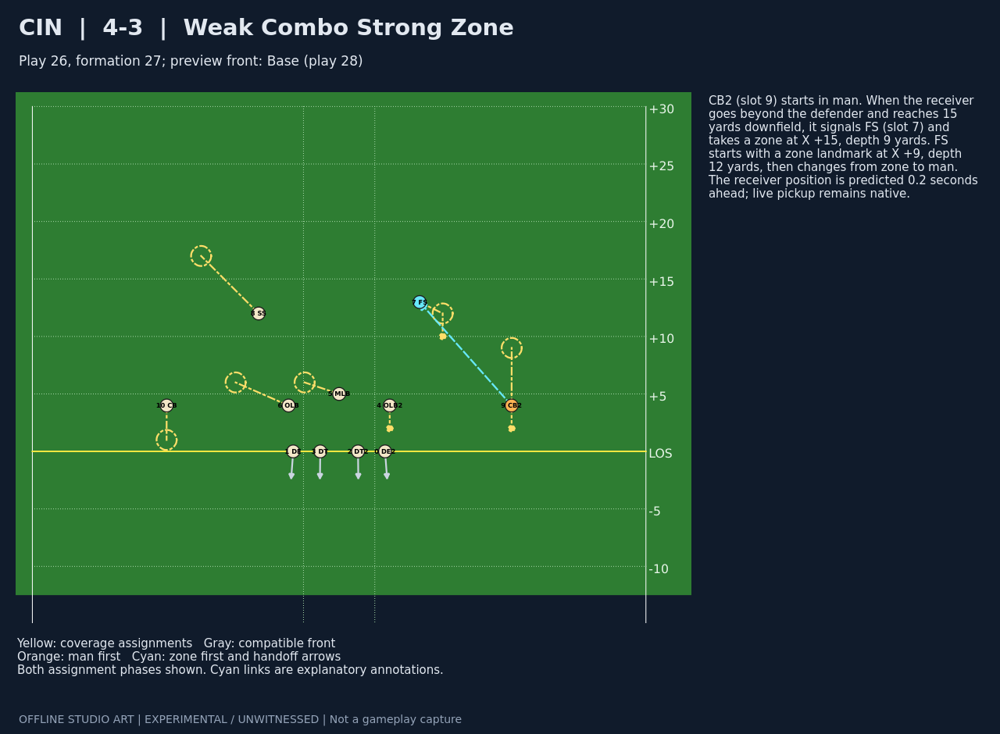](CIN-p026-f27.png) |
| CIN | Nickel (f28) | Weak Combo Strong Zone (p26) | CB2 (slot 9) starts in man. When the receiver goes beyond the defender and reaches 15 yards downfield, it signals FS (slot 7) and takes a zone at X +15, depth 9 yards. FS starts with a zone landmark at X +9, depth 12 yards, then changes from zone to man. The receiver position is predicted 0.2 seconds ahead; live pickup remains native. | [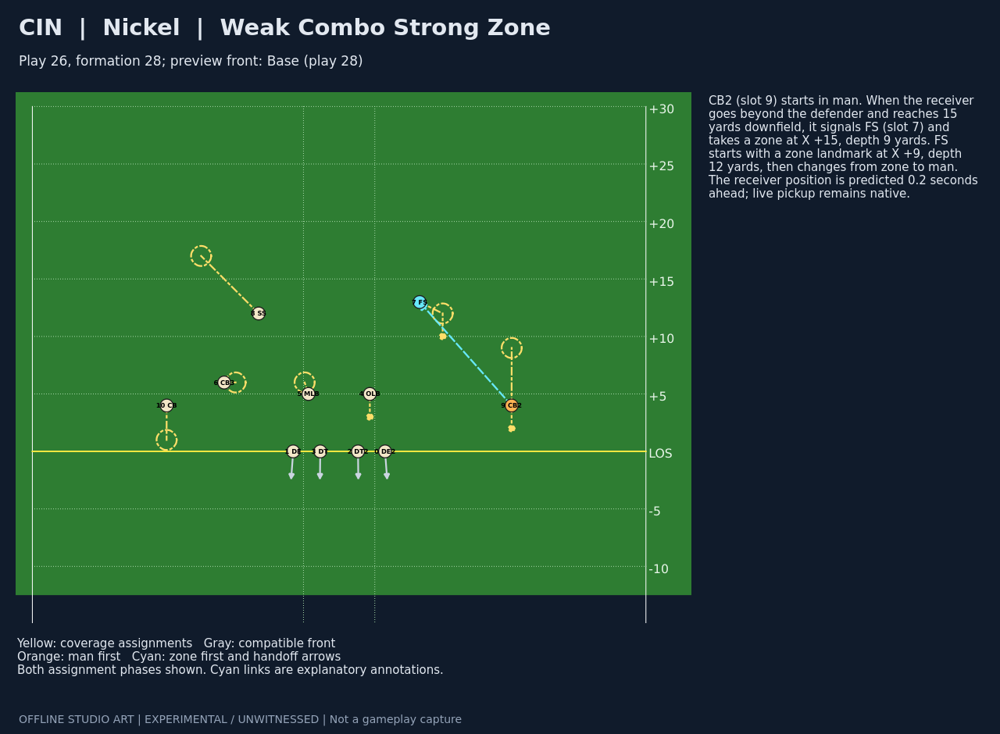](CIN-p026-f28.png) |
| CIN | Dime (f29) | Weak Combo Strong Zone (p26) | CB2 (slot 9) starts in man. When the receiver goes beyond the defender and reaches 15 yards downfield, it signals FS (slot 7) and takes a zone at X +15, depth 9 yards. FS starts with a zone landmark at X +9, depth 12 yards, then changes from zone to man. The receiver position is predicted 0.2 seconds ahead; live pickup remains native. | [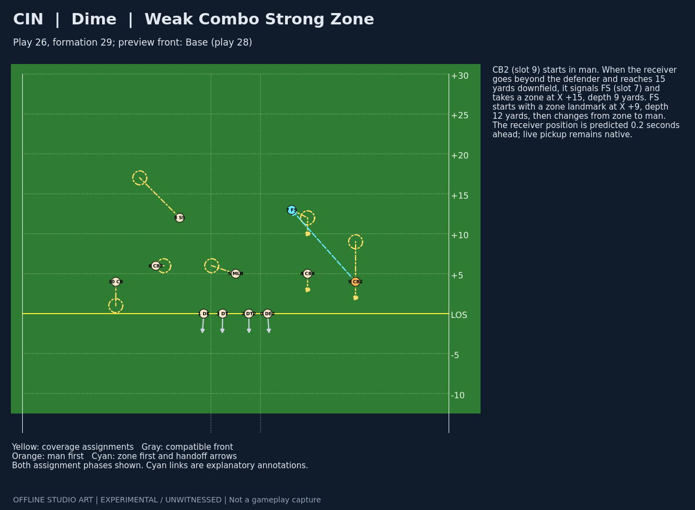](CIN-p026-f29.png) |
| CLE | All | No explicit exchange | Ordinary man and zone are excluded. | |
| DAL | 4-3 (f23) | Combo Inside Zone (p16) | CB2 (slot 9) starts in man. When the receiver moves left past the defender and the midpoint between that defender and the game's reference player, it signals OLB2 (slot 4) and takes a zone at X +15, depth 18 yards. OLB2 starts with a zone landmark at X +8, depth 10 yards, then changes from zone to man. The receiver position is predicted 0.2 seconds ahead; live pickup remains native.  CB (slot 10) starts in man. When the receiver moves right past the defender and the midpoint between that defender and the game's reference player, it signals OLB (slot 6) and takes a zone at X -15, depth 18 yards. OLB starts with a zone landmark at X -8, depth 10 yards, then changes from zone to man. The receiver position is predicted 0.2 seconds ahead; live pickup remains native. | [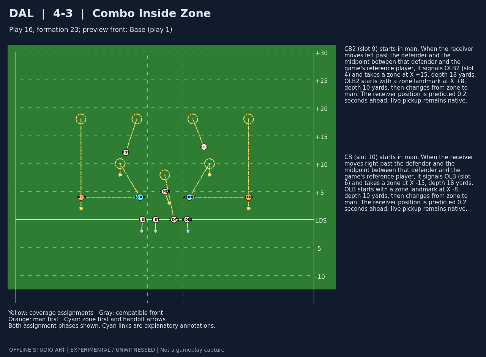](DAL-p016-f23.png) |
| DAL | Nickel (f25) | Combo Inside Zone (p16) | CB2 (slot 9) starts in man. When the receiver moves left past the defender and the midpoint between that defender and the game's reference player, it signals OLB (slot 4) and takes a zone at X +15, depth 18 yards. OLB starts with a zone landmark at X +8, depth 10 yards, then changes from zone to man. The receiver position is predicted 0.2 seconds ahead; live pickup remains native.  CB (slot 10) starts in man. When the receiver moves right past the defender and the midpoint between that defender and the game's reference player, it signals CB3 (slot 6) and takes a zone at X -15, depth 18 yards. CB3 starts with a zone landmark at X -8, depth 10 yards, then changes from zone to man. The receiver position is predicted 0.2 seconds ahead; live pickup remains native. |  |
| DAL | Dime (f26) | Combo Inside Zone (p16) | CB2 (slot 9) starts in man. When the receiver moves left past the defender and the midpoint between that defender and the game's reference player, it signals CB4 (slot 4) and takes a zone at X +15, depth 18 yards. CB4 starts with a zone landmark at X +8, depth 10 yards, then changes from zone to man. The receiver position is predicted 0.2 seconds ahead; live pickup remains native.  CB (slot 10) starts in man. When the receiver moves right past the defender and the midpoint between that defender and the game's reference player, it signals CB3 (slot 6) and takes a zone at X -15, depth 18 yards. CB3 starts with a zone landmark at X -8, depth 10 yards, then changes from zone to man. The receiver position is predicted 0.2 seconds ahead; live pickup remains native. |  |
| DEN | Nickel (f25) | Combo Inside Zone (p27) | CB2 (slot 9) starts in man. When the receiver moves left past the defender and the midpoint between that defender and the game's reference player, it signals OLB (slot 4) and takes a zone at X +15, depth 18 yards. OLB starts with a zone landmark at X +8, depth 10 yards, then changes from zone to man. The receiver position is predicted 0.2 seconds ahead; live pickup remains native.  CB (slot 10) starts in man. When the receiver moves right past the defender and the midpoint between that defender and the game's reference player, it signals CB3 (slot 6) and takes a zone at X -15, depth 18 yards. CB3 starts with a zone landmark at X -8, depth 10 yards, then changes from zone to man. The receiver position is predicted 0.2 seconds ahead; live pickup remains native. |  |
| DEN | Dime (f26) | Combo Inside Zone (p27) | CB2 (slot 9) starts in man. When the receiver moves left past the defender and the midpoint between that defender and the game's reference player, it signals CB4 (slot 4) and takes a zone at X +15, depth 18 yards. CB4 starts with a zone landmark at X +8, depth 10 yards, then changes from zone to man. The receiver position is predicted 0.2 seconds ahead; live pickup remains native.  CB (slot 10) starts in man. When the receiver moves right past the defender and the midpoint between that defender and the game's reference player, it signals CB3 (slot 6) and takes a zone at X -15, depth 18 yards. CB3 starts with a zone landmark at X -8, depth 10 yards, then changes from zone to man. The receiver position is predicted 0.2 seconds ahead; live pickup remains native. |  |
| DET | 4-3 (f24) | Combo Inside Zone (p11) | CB2 (slot 9) starts in man. When the receiver moves left past the defender and the midpoint between that defender and the game's reference player, it signals OLB2 (slot 4) and takes a zone at X +15, depth 18 yards. OLB2 starts with a zone landmark at X +8, depth 10 yards, then changes from zone to man. The receiver position is predicted 0.2 seconds ahead; live pickup remains native.  CB (slot 10) starts in man. When the receiver moves right past the defender and the midpoint between that defender and the game's reference player, it signals OLB (slot 6) and takes a zone at X -15, depth 18 yards. OLB starts with a zone landmark at X -8, depth 10 yards, then changes from zone to man. The receiver position is predicted 0.2 seconds ahead; live pickup remains native. |  |
| DET | Nickel (f25) | Combo Inside Zone (p11) | CB2 (slot 9) starts in man. When the receiver moves left past the defender and the midpoint between that defender and the game's reference player, it signals OLB (slot 4) and takes a zone at X +15, depth 18 yards. OLB starts with a zone landmark at X +8, depth 10 yards, then changes from zone to man. The receiver position is predicted 0.2 seconds ahead; live pickup remains native.  CB (slot 10) starts in man. When the receiver moves right past the defender and the midpoint between that defender and the game's reference player, it signals CB3 (slot 6) and takes a zone at X -15, depth 18 yards. CB3 starts with a zone landmark at X -8, depth 10 yards, then changes from zone to man. The receiver position is predicted 0.2 seconds ahead; live pickup remains native. |  |
| DET | Dime (f26) | Combo Inside Zone (p11) | CB2 (slot 9) starts in man. When the receiver moves left past the defender and the midpoint between that defender and the game's reference player, it signals CB4 (slot 4) and takes a zone at X +15, depth 18 yards. CB4 starts with a zone landmark at X +8, depth 10 yards, then changes from zone to man. The receiver position is predicted 0.2 seconds ahead; live pickup remains native.  CB (slot 10) starts in man. When the receiver moves right past the defender and the midpoint between that defender and the game's reference player, it signals CB3 (slot 6) and takes a zone at X -15, depth 18 yards. CB3 starts with a zone landmark at X -8, depth 10 yards, then changes from zone to man. The receiver position is predicted 0.2 seconds ahead; live pickup remains native. |  |
| Editor | All | No explicit exchange | Ordinary man and zone are excluded. | |
| GB | Nickel (f32) | Combo Inside Zone (p28) | CB2 (slot 9) starts in man. When the receiver moves left past the defender and the midpoint between that defender and the game's reference player, it signals OLB (slot 4) and takes a zone at X +15, depth 18 yards. OLB starts with a zone landmark at X +8, depth 10 yards, then changes from zone to man. The receiver position is predicted 0.2 seconds ahead; live pickup remains native.  CB (slot 10) starts in man. When the receiver moves right past the defender and the midpoint between that defender and the game's reference player, it signals CB3 (slot 6) and takes a zone at X -15, depth 18 yards. CB3 starts with a zone landmark at X -8, depth 10 yards, then changes from zone to man. The receiver position is predicted 0.2 seconds ahead; live pickup remains native. |  |
| GB | Dime (f33) | Combo Inside Zone (p28) | CB2 (slot 9) starts in man. When the receiver moves left past the defender and the midpoint between that defender and the game's reference player, it signals CB4 (slot 4) and takes a zone at X +15, depth 18 yards. CB4 starts with a zone landmark at X +8, depth 10 yards, then changes from zone to man. The receiver position is predicted 0.2 seconds ahead; live pickup remains native.  CB (slot 10) starts in man. When the receiver moves right past the defender and the midpoint between that defender and the game's reference player, it signals CB3 (slot 6) and takes a zone at X -15, depth 18 yards. CB3 starts with a zone landmark at X -8, depth 10 yards, then changes from zone to man. The receiver position is predicted 0.2 seconds ahead; live pickup remains native. |  |
| GB | Nickel (f32) | Strong Bracket 1 (p55) | CB (slot 10) starts in man. When the receiver goes beyond the defender and reaches 15 yards downfield, it signals SS (slot 8) and takes a zone at X -15, depth 12 yards. SS starts with a zone landmark at X -15, depth 15 yards, then changes from zone to man. The receiver position is predicted 0.2 seconds ahead; live pickup remains native. |  |
| GB | Dime (f33) | Strong Bracket 1 (p55) | CB (slot 10) starts in man. When the receiver goes beyond the defender and reaches 15 yards downfield, it signals SS (slot 8) and takes a zone at X -15, depth 12 yards. SS starts with a zone landmark at X -15, depth 15 yards, then changes from zone to man. The receiver position is predicted 0.2 seconds ahead; live pickup remains native. |  |
| GB | Nickel (f32) | Weak Bracket 1 (p56) | CB2 (slot 9) starts in man. When the receiver goes beyond the defender and reaches 15 yards downfield, it signals FS (slot 7) and takes a zone at X +15, depth 12 yards. FS starts with a zone landmark at X +15, depth 15 yards, then changes from zone to man. The receiver position is predicted 0.2 seconds ahead; live pickup remains native. |  |
| GB | Dime (f33) | Weak Bracket 1 (p56) | CB2 (slot 9) starts in man. When the receiver goes beyond the defender and reaches 15 yards downfield, it signals FS (slot 7) and takes a zone at X +15, depth 12 yards. FS starts with a zone landmark at X +15, depth 15 yards, then changes from zone to man. The receiver position is predicted 0.2 seconds ahead; live pickup remains native. |  |
| GEN | 3-4 (f24) | Combo Strong Zone (p34) | CB2 (slot 9) starts in man. When the receiver moves left past the defender and the midpoint between that defender and the game's reference player, it signals OLB2 (slot 0) and takes a zone at X +14, depth 18 yards. OLB2 starts with a zone landmark at X +8, depth 10 yards, then changes from zone to man. The receiver position is predicted 0.2 seconds ahead; live pickup remains native. |  |
| GEN | 3-4 (f24) | Combo Inside Zone (p39) | CB2 (slot 9) starts in man. When the receiver moves left past the defender and the midpoint between that defender and the game's reference player, it signals OLB2 (slot 0) and takes a zone at X +15, depth 15 yards. OLB2 starts with a zone landmark at X +10, depth 10 yards, then changes from zone to man. The receiver position is predicted 0.2 seconds ahead; live pickup remains native.  CB (slot 10) starts in man. When the receiver moves right past the defender and the midpoint between that defender and the game's reference player, it signals OLB (slot 6) and takes a zone at X -15, depth 15 yards. OLB starts with a zone landmark at X -10, depth 10 yards, then changes from zone to man. The receiver position is predicted 0.2 seconds ahead; live pickup remains native. | [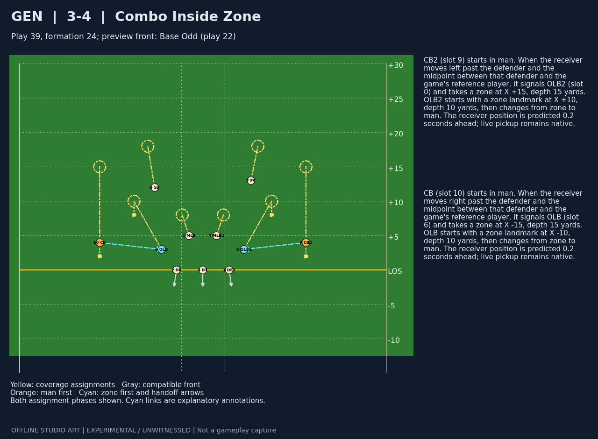](GEN-p039-f24.png) |
| HOU | 3-4 (f23) | Combo Inside Zone (p12) | CB2 (slot 9) starts in man. When the receiver moves left past the defender and the midpoint between that defender and the game's reference player, it signals OLB2 (slot 0) and takes a zone at X +15, depth 15 yards. OLB2 starts with a zone landmark at X +10, depth 10 yards, then changes from zone to man. The receiver position is predicted 0.2 seconds ahead; live pickup remains native.  CB (slot 10) starts in man. When the receiver moves right past the defender and the midpoint between that defender and the game's reference player, it signals OLB (slot 6) and takes a zone at X -15, depth 15 yards. OLB starts with a zone landmark at X -10, depth 10 yards, then changes from zone to man. The receiver position is predicted 0.2 seconds ahead; live pickup remains native. | [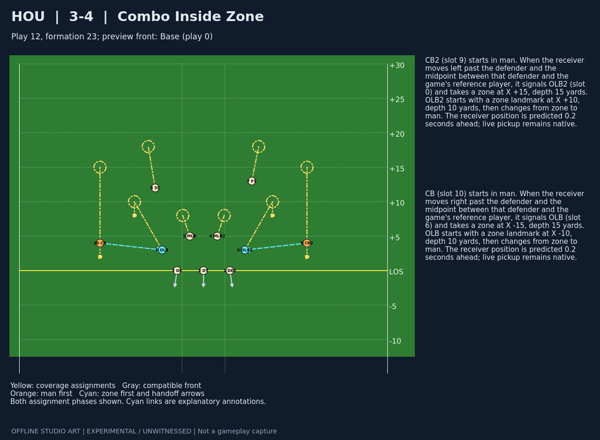](HOU-p012-f23.png) |
| HOU | Dime (f25) | Combo Inside Zone (p12) | CB2 (slot 9) starts in man. When the receiver moves left past the defender and the midpoint between that defender and the game's reference player, it signals OLB (slot 0) and takes a zone at X +15, depth 15 yards. OLB starts with a zone landmark at X +10, depth 10 yards, then changes from zone to man. The receiver position is predicted 0.2 seconds ahead; live pickup remains native.  CB (slot 10) starts in man. When the receiver moves right past the defender and the midpoint between that defender and the game's reference player, it signals CB3 (slot 6) and takes a zone at X -15, depth 15 yards. CB3 starts with a zone landmark at X -10, depth 10 yards, then changes from zone to man. The receiver position is predicted 0.2 seconds ahead; live pickup remains native. | [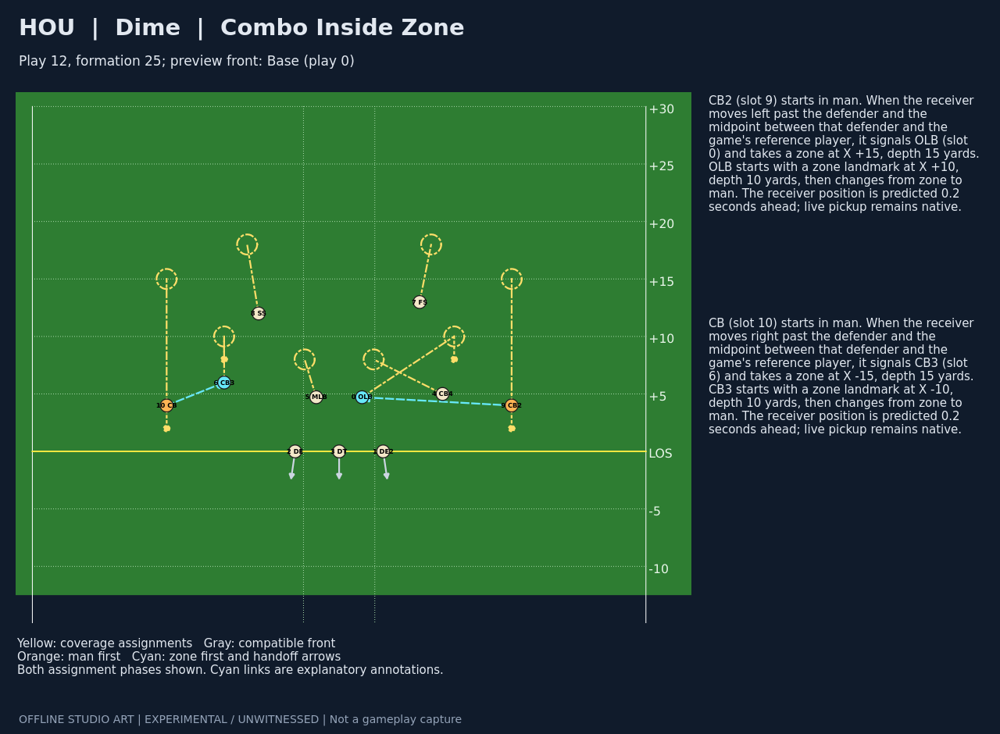](HOU-p012-f25.png) |
| HOU | 3-4 (f23) | Combo Strong Zone (p13) | CB2 (slot 9) starts in man. When the receiver moves left past the defender and the midpoint between that defender and the game's reference player, it signals OLB2 (slot 0) and takes a zone at X +14, depth 18 yards. OLB2 starts with a zone landmark at X +8, depth 10 yards, then changes from zone to man. The receiver position is predicted 0.2 seconds ahead; live pickup remains native. |  |
| HOU | Dime (f25) | Combo Weak Zone (p35) | CB (slot 10) starts in man. When the receiver moves right past the defender and the midpoint between that defender and the game's reference player, it signals MLB (slot 5) and takes a zone at X -15, depth 15 yards. MLB starts with a zone landmark at X -8, depth 8 yards, then changes from zone to man. The receiver position is predicted 0.2 seconds ahead; live pickup remains native. |  |
| IND | 4-3 (f28) | Combo Inside Zone (p12) | CB2 (slot 9) starts in man. When the receiver moves left past the defender and the midpoint between that defender and the game's reference player, it signals OLB2 (slot 4) and takes a zone at X +15, depth 18 yards. OLB2 starts with a zone landmark at X +8, depth 10 yards, then changes from zone to man. The receiver position is predicted 0.2 seconds ahead; live pickup remains native.  CB (slot 10) starts in man. When the receiver moves right past the defender and the midpoint between that defender and the game's reference player, it signals OLB (slot 6) and takes a zone at X -15, depth 18 yards. OLB starts with a zone landmark at X -8, depth 10 yards, then changes from zone to man. The receiver position is predicted 0.2 seconds ahead; live pickup remains native. |  |
| IND | Nickel (f29) | Combo Inside Zone (p12) | CB2 (slot 9) starts in man. When the receiver moves left past the defender and the midpoint between that defender and the game's reference player, it signals OLB (slot 4) and takes a zone at X +15, depth 18 yards. OLB starts with a zone landmark at X +8, depth 10 yards, then changes from zone to man. The receiver position is predicted 0.2 seconds ahead; live pickup remains native.  CB (slot 10) starts in man. When the receiver moves right past the defender and the midpoint between that defender and the game's reference player, it signals CB3 (slot 6) and takes a zone at X -15, depth 18 yards. CB3 starts with a zone landmark at X -8, depth 10 yards, then changes from zone to man. The receiver position is predicted 0.2 seconds ahead; live pickup remains native. |  |
| IND | Dime (f30) | Combo Inside Zone (p12) | CB2 (slot 9) starts in man. When the receiver moves left past the defender and the midpoint between that defender and the game's reference player, it signals CB4 (slot 4) and takes a zone at X +15, depth 18 yards. CB4 starts with a zone landmark at X +8, depth 10 yards, then changes from zone to man. The receiver position is predicted 0.2 seconds ahead; live pickup remains native.  CB (slot 10) starts in man. When the receiver moves right past the defender and the midpoint between that defender and the game's reference player, it signals CB3 (slot 6) and takes a zone at X -15, depth 18 yards. CB3 starts with a zone landmark at X -8, depth 10 yards, then changes from zone to man. The receiver position is predicted 0.2 seconds ahead; live pickup remains native. |  |
| IND | 4-3 (f28) | Weak Combo Strong Zone (p14) | CB2 (slot 9) starts in man. When the receiver goes beyond the defender and reaches 15 yards downfield, it signals FS (slot 7) and takes a zone at X +15, depth 9 yards. FS starts with a zone landmark at X +9, depth 12 yards, then changes from zone to man. The receiver position is predicted 0.2 seconds ahead; live pickup remains native. | [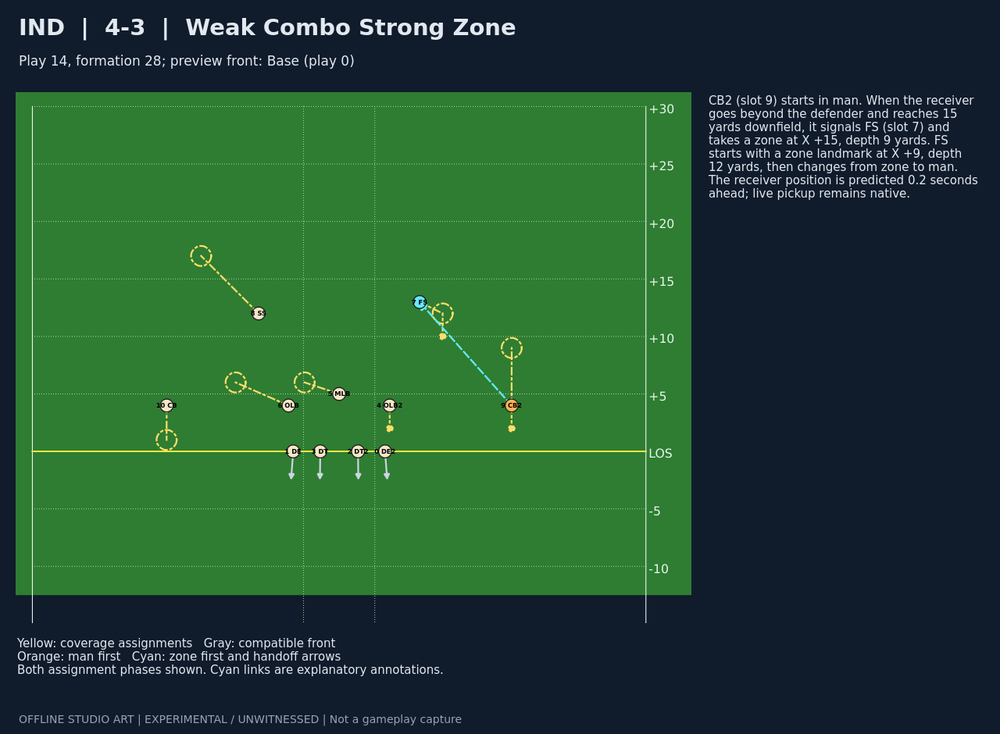](IND-p014-f28.png) |
| JAX | Nickel (f25) | Combo Strong Zone (p31) | OLB (slot 4) has a zone-to-man continuation, waiting for its own slot signal; its later man node names CB2 (slot 9) as partner. The stored partner slots are not reciprocal. Live effect is unproved.  CB2 (slot 9) has a man-to-zone rule when the receiver moves left past the defender and the midpoint between that defender and the game's reference player. It signals DE2 (slot 0), then takes a zone at X +14, depth 18 yards. The stored partner slots are not reciprocal. Live effect is unproved. | [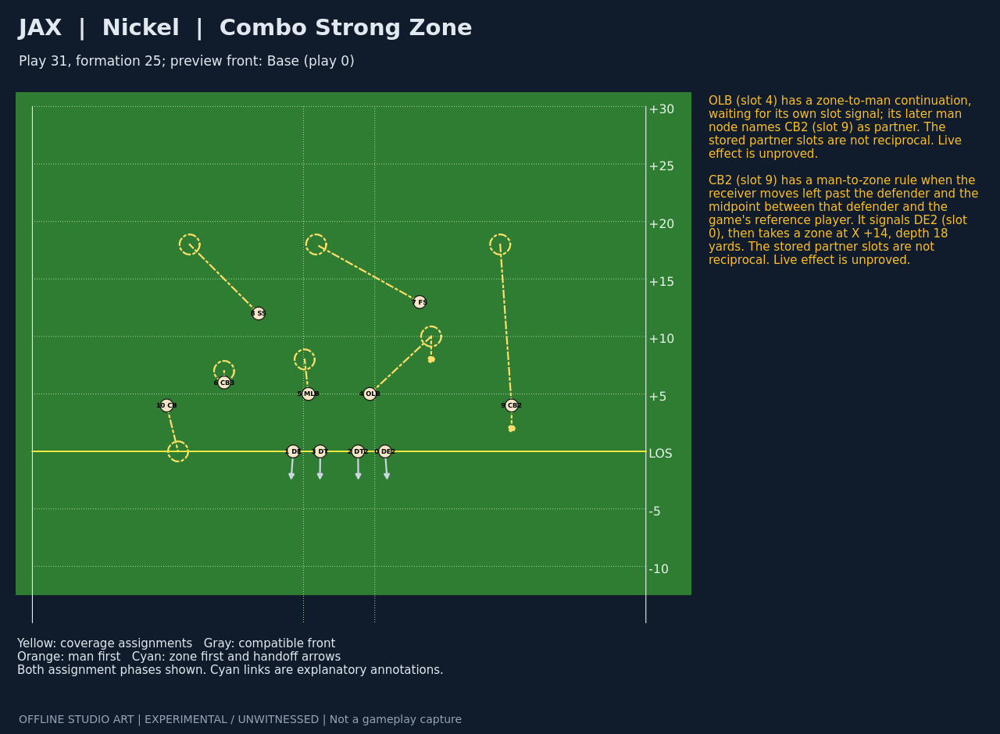](JAX-p031-f25.png) |
| JAX | Nickel (f25) | Combo Inside Zone (p32) | CB2 (slot 9) starts in man. When the receiver moves left past the defender and the midpoint between that defender and the game's reference player, it signals OLB (slot 4) and takes a zone at X +15, depth 18 yards. OLB starts with a zone landmark at X +8, depth 10 yards, then changes from zone to man. The receiver position is predicted 0.2 seconds ahead; live pickup remains native.  CB (slot 10) starts in man. When the receiver moves right past the defender and the midpoint between that defender and the game's reference player, it signals CB3 (slot 6) and takes a zone at X -15, depth 18 yards. CB3 starts with a zone landmark at X -8, depth 10 yards, then changes from zone to man. The receiver position is predicted 0.2 seconds ahead; live pickup remains native. |  |
| JAX | Dime (f26) | Combo Inside Zone (p32) | CB2 (slot 9) starts in man. When the receiver moves left past the defender and the midpoint between that defender and the game's reference player, it signals CB4 (slot 4) and takes a zone at X +15, depth 18 yards. CB4 starts with a zone landmark at X +8, depth 10 yards, then changes from zone to man. The receiver position is predicted 0.2 seconds ahead; live pickup remains native.  CB (slot 10) starts in man. When the receiver moves right past the defender and the midpoint between that defender and the game's reference player, it signals CB3 (slot 6) and takes a zone at X -15, depth 18 yards. CB3 starts with a zone landmark at X -8, depth 10 yards, then changes from zone to man. The receiver position is predicted 0.2 seconds ahead; live pickup remains native. |  |
| KC | 4-3 (f25) | Combo Inside Zone (p14) | CB2 (slot 9) starts in man. When the receiver moves left past the defender and the midpoint between that defender and the game's reference player, it signals OLB2 (slot 4) and takes a zone at X +15, depth 18 yards. OLB2 starts with a zone landmark at X +8, depth 10 yards, then changes from zone to man. The receiver position is predicted 0.2 seconds ahead; live pickup remains native.  CB (slot 10) starts in man. When the receiver moves right past the defender and the midpoint between that defender and the game's reference player, it signals OLB (slot 6) and takes a zone at X -15, depth 18 yards. OLB starts with a zone landmark at X -8, depth 10 yards, then changes from zone to man. The receiver position is predicted 0.2 seconds ahead; live pickup remains native. |  |
| KC | 4-3 (f25) | Combo Strong Zone (p27) | OLB2 (slot 4) has a zone-to-man continuation, waiting for its own slot signal; its later man node names CB2 (slot 9) as partner. The stored partner slots are not reciprocal. Live effect is unproved.  CB2 (slot 9) has a man-to-zone rule when the receiver moves left past the defender and the midpoint between that defender and the game's reference player. It signals DE2 (slot 0), then takes a zone at X +14, depth 18 yards. The stored partner slots are not reciprocal. Live effect is unproved. |  |
| KC | Nickel (f26) | Combo Strong Zone (p27) | OLB (slot 4) has a zone-to-man continuation, waiting for its own slot signal; its later man node names CB2 (slot 9) as partner. The stored partner slots are not reciprocal. Live effect is unproved.  CB2 (slot 9) has a man-to-zone rule when the receiver moves left past the defender and the midpoint between that defender and the game's reference player. It signals DE2 (slot 0), then takes a zone at X +14, depth 18 yards. The stored partner slots are not reciprocal. Live effect is unproved. |  |
| KC | Dime (f27) | Combo Strong Zone (p27) | CB4 (slot 4) has a zone-to-man continuation, waiting for its own slot signal; its later man node names CB2 (slot 9) as partner. The stored partner slots are not reciprocal. Live effect is unproved.  CB2 (slot 9) has a man-to-zone rule when the receiver moves left past the defender and the midpoint between that defender and the game's reference player. It signals DE2 (slot 0), then takes a zone at X +14, depth 18 yards. The stored partner slots are not reciprocal. Live effect is unproved. | [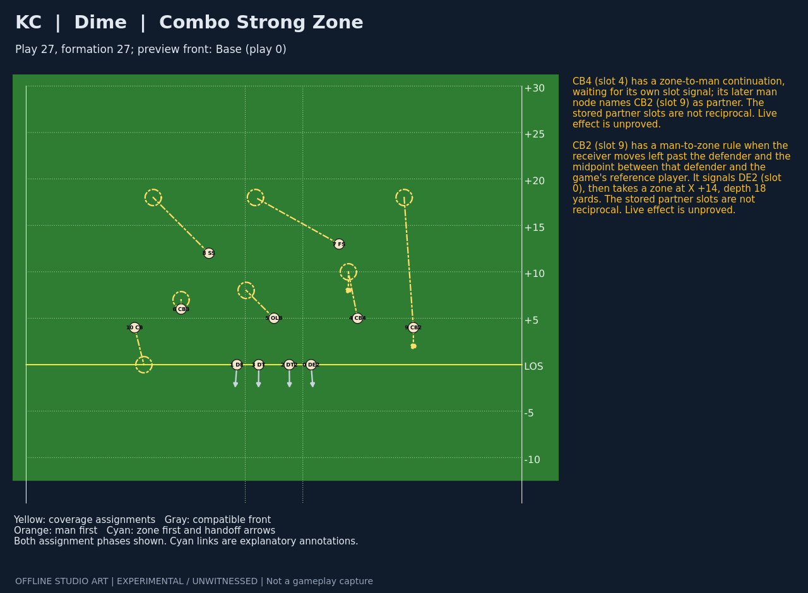](KC-p027-f27.png) |
| MIA | Nickel (f27) | Zone Double Steal (p25) | CB2 (slot 9) starts in man. When the receiver goes beyond the defender and reaches 15 yards downfield, it signals FS (slot 7) and takes a zone at X +15, depth 12 yards. FS starts with a zone landmark at X +15, depth 15 yards, then changes from zone to man. The receiver position is predicted 0.2 seconds ahead; live pickup remains native.  CB (slot 10) starts in man. When the receiver goes beyond the defender and reaches 15 yards downfield, it signals SS (slot 8) and takes a zone at X -15, depth 12 yards. SS starts with a zone landmark at X -15, depth 15 yards, then changes from zone to man. The receiver position is predicted 0.2 seconds ahead; live pickup remains native. | [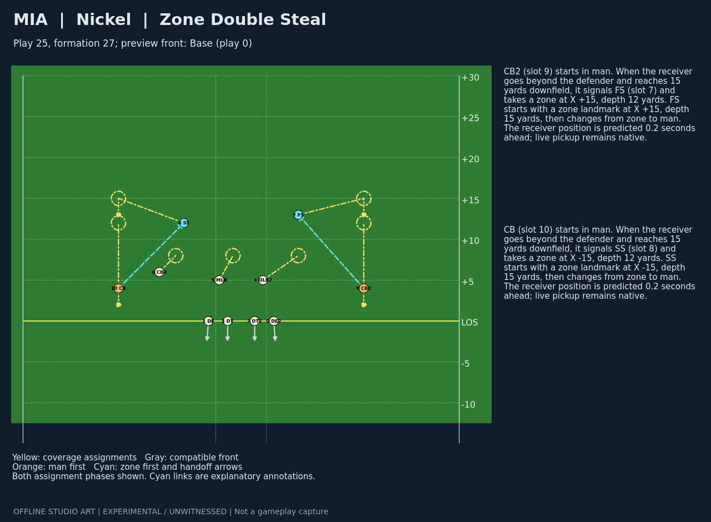](MIA-p025-f27.png) |
| MIN | All | No explicit exchange | Ordinary man and zone are excluded. | |
| NE | 3-4 (f25) | Combo Inside Zone (p158) | CB2 (slot 9) starts in man. When the receiver moves left past the defender and the midpoint between that defender and the game's reference player, it signals OLB2 (slot 0) and takes a zone at X +15, depth 15 yards. OLB2 starts with a zone landmark at X +10, depth 10 yards, then changes from zone to man. The receiver position is predicted 0.2 seconds ahead; live pickup remains native.  CB (slot 10) starts in man. When the receiver moves right past the defender and the midpoint between that defender and the game's reference player, it signals OLB (slot 6) and takes a zone at X -15, depth 15 yards. OLB starts with a zone landmark at X -10, depth 10 yards, then changes from zone to man. The receiver position is predicted 0.2 seconds ahead; live pickup remains native. |  |
| NE | Nickel (f26) | Combo Inside Zone (p158) | CB2 (slot 9) starts in man. When the receiver moves left past the defender and the midpoint between that defender and the game's reference player, it signals OLB2 (slot 0) and takes a zone at X +15, depth 15 yards. OLB2 starts with a zone landmark at X +10, depth 10 yards, then changes from zone to man. The receiver position is predicted 0.2 seconds ahead; live pickup remains native.  CB (slot 10) starts in man. When the receiver moves right past the defender and the midpoint between that defender and the game's reference player, it signals CB3 (slot 6) and takes a zone at X -15, depth 15 yards. CB3 starts with a zone landmark at X -10, depth 10 yards, then changes from zone to man. The receiver position is predicted 0.2 seconds ahead; live pickup remains native. |  |
| NE | Dime (f27) | Combo Inside Zone (p158) | CB2 (slot 9) starts in man. When the receiver moves left past the defender and the midpoint between that defender and the game's reference player, it signals OLB (slot 0) and takes a zone at X +15, depth 15 yards. OLB starts with a zone landmark at X +10, depth 10 yards, then changes from zone to man. The receiver position is predicted 0.2 seconds ahead; live pickup remains native.  CB (slot 10) starts in man. When the receiver moves right past the defender and the midpoint between that defender and the game's reference player, it signals CB3 (slot 6) and takes a zone at X -15, depth 15 yards. CB3 starts with a zone landmark at X -10, depth 10 yards, then changes from zone to man. The receiver position is predicted 0.2 seconds ahead; live pickup remains native. |  |
| NO | Nickel (f25) | Combo Inside Zone (p28) | CB2 (slot 9) starts in man. When the receiver moves left past the defender and the midpoint between that defender and the game's reference player, it signals OLB (slot 4) and takes a zone at X +15, depth 18 yards. OLB starts with a zone landmark at X +8, depth 10 yards, then changes from zone to man. The receiver position is predicted 0.2 seconds ahead; live pickup remains native.  CB (slot 10) starts in man. When the receiver moves right past the defender and the midpoint between that defender and the game's reference player, it signals CB3 (slot 6) and takes a zone at X -15, depth 18 yards. CB3 starts with a zone landmark at X -8, depth 10 yards, then changes from zone to man. The receiver position is predicted 0.2 seconds ahead; live pickup remains native. |  |
| NO | Dime (f26) | Combo Inside Zone (p28) | CB2 (slot 9) starts in man. When the receiver moves left past the defender and the midpoint between that defender and the game's reference player, it signals CB4 (slot 4) and takes a zone at X +15, depth 18 yards. CB4 starts with a zone landmark at X +8, depth 10 yards, then changes from zone to man. The receiver position is predicted 0.2 seconds ahead; live pickup remains native.  CB (slot 10) starts in man. When the receiver moves right past the defender and the midpoint between that defender and the game's reference player, it signals CB3 (slot 6) and takes a zone at X -15, depth 18 yards. CB3 starts with a zone landmark at X -8, depth 10 yards, then changes from zone to man. The receiver position is predicted 0.2 seconds ahead; live pickup remains native. |  |
| NYG | 4-3 (f26) | Combo Inside Zone (p15) | CB2 (slot 9) starts in man. When the receiver moves left past the defender and the midpoint between that defender and the game's reference player, it signals OLB2 (slot 4) and takes a zone at X +15, depth 18 yards. OLB2 starts with a zone landmark at X +8, depth 10 yards, then changes from zone to man. The receiver position is predicted 0.2 seconds ahead; live pickup remains native.  CB (slot 10) starts in man. When the receiver moves right past the defender and the midpoint between that defender and the game's reference player, it signals OLB (slot 6) and takes a zone at X -15, depth 18 yards. OLB starts with a zone landmark at X -8, depth 10 yards, then changes from zone to man. The receiver position is predicted 0.2 seconds ahead; live pickup remains native. | [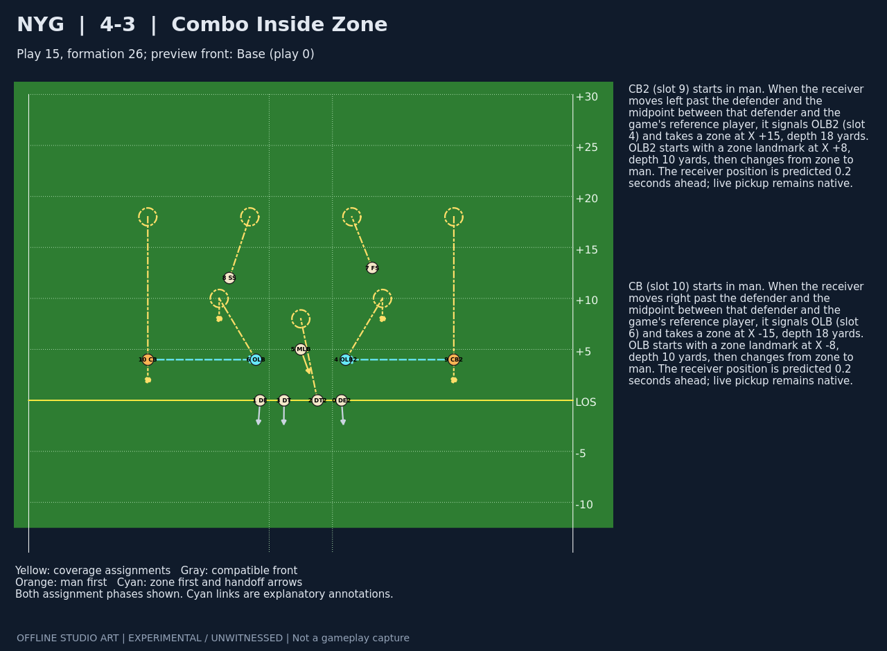](NYG-p015-f26.png) |
| NYG | Nickel (f27) | Combo Inside Zone (p15) | CB2 (slot 9) starts in man. When the receiver moves left past the defender and the midpoint between that defender and the game's reference player, it signals OLB (slot 4) and takes a zone at X +15, depth 18 yards. OLB starts with a zone landmark at X +8, depth 10 yards, then changes from zone to man. The receiver position is predicted 0.2 seconds ahead; live pickup remains native.  CB (slot 10) starts in man. When the receiver moves right past the defender and the midpoint between that defender and the game's reference player, it signals CB3 (slot 6) and takes a zone at X -15, depth 18 yards. CB3 starts with a zone landmark at X -8, depth 10 yards, then changes from zone to man. The receiver position is predicted 0.2 seconds ahead; live pickup remains native. |  |
| NYG | Dime (f28) | Combo Inside Zone (p15) | CB2 (slot 9) starts in man. When the receiver moves left past the defender and the midpoint between that defender and the game's reference player, it signals CB4 (slot 4) and takes a zone at X +15, depth 18 yards. CB4 starts with a zone landmark at X +8, depth 10 yards, then changes from zone to man. The receiver position is predicted 0.2 seconds ahead; live pickup remains native.  CB (slot 10) starts in man. When the receiver moves right past the defender and the midpoint between that defender and the game's reference player, it signals CB3 (slot 6) and takes a zone at X -15, depth 18 yards. CB3 starts with a zone landmark at X -8, depth 10 yards, then changes from zone to man. The receiver position is predicted 0.2 seconds ahead; live pickup remains native. | [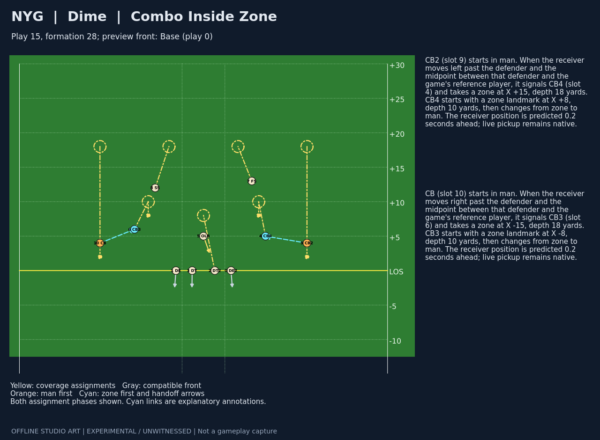](NYG-p015-f28.png) |
| NYG | 4-3 (f26) | Strong Bracket 1 (p57) | CB (slot 10) starts in man. When the receiver goes beyond the defender and reaches 15 yards downfield, it signals SS (slot 8) and takes a zone at X -15, depth 12 yards. SS starts with a zone landmark at X -15, depth 15 yards, then changes from zone to man. The receiver position is predicted 0.2 seconds ahead; live pickup remains native. | [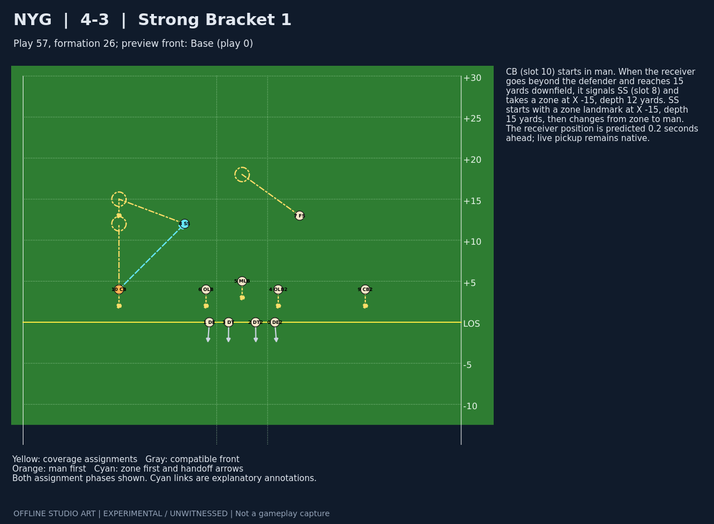](NYG-p057-f26.png) |
| NYG | Nickel (f27) | Strong Bracket 1 (p57) | CB (slot 10) starts in man. When the receiver goes beyond the defender and reaches 15 yards downfield, it signals SS (slot 8) and takes a zone at X -15, depth 12 yards. SS starts with a zone landmark at X -15, depth 15 yards, then changes from zone to man. The receiver position is predicted 0.2 seconds ahead; live pickup remains native. |  |
| NYG | Dime (f28) | Strong Bracket 1 (p57) | CB (slot 10) starts in man. When the receiver goes beyond the defender and reaches 15 yards downfield, it signals SS (slot 8) and takes a zone at X -15, depth 12 yards. SS starts with a zone landmark at X -15, depth 15 yards, then changes from zone to man. The receiver position is predicted 0.2 seconds ahead; live pickup remains native. | [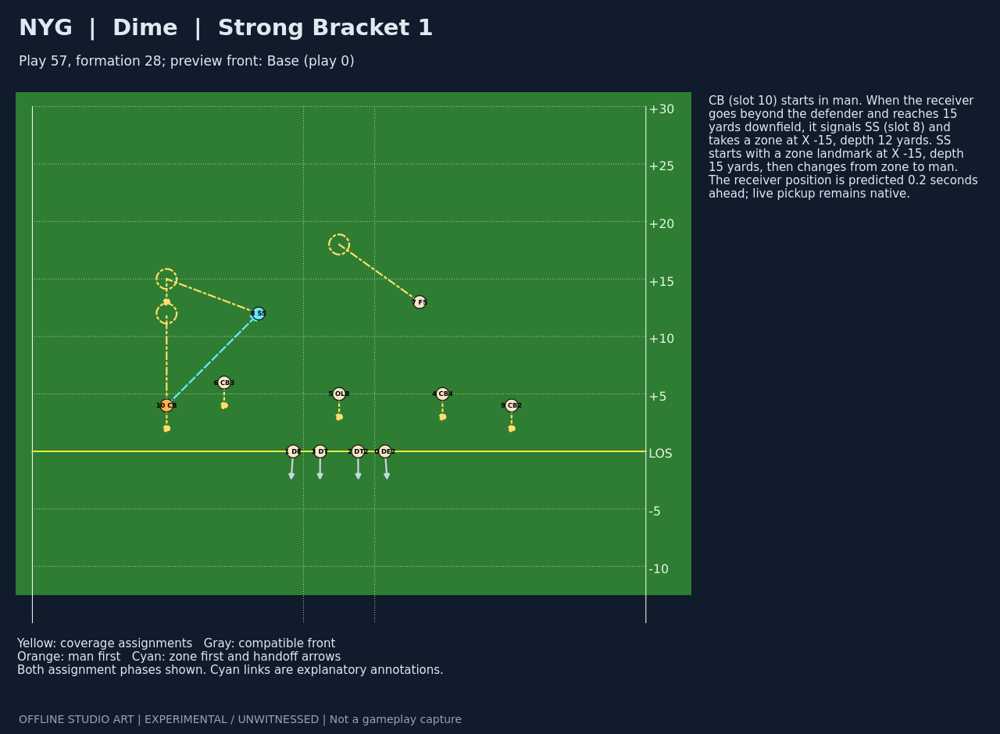](NYG-p057-f28.png) |
| NYG | 4-3 (f26) | Weak Bracket 1 (p58) | CB2 (slot 9) starts in man. When the receiver goes beyond the defender and reaches 15 yards downfield, it signals FS (slot 7) and takes a zone at X +15, depth 12 yards. FS starts with a zone landmark at X +15, depth 15 yards, then changes from zone to man. The receiver position is predicted 0.2 seconds ahead; live pickup remains native. | [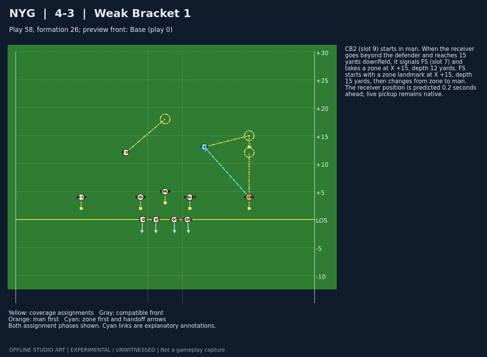](NYG-p058-f26.png) |
| NYG | Nickel (f27) | Weak Bracket 1 (p58) | CB2 (slot 9) starts in man. When the receiver goes beyond the defender and reaches 15 yards downfield, it signals FS (slot 7) and takes a zone at X +15, depth 12 yards. FS starts with a zone landmark at X +15, depth 15 yards, then changes from zone to man. The receiver position is predicted 0.2 seconds ahead; live pickup remains native. |  |
| NYG | Dime (f28) | Weak Bracket 1 (p58) | CB2 (slot 9) starts in man. When the receiver goes beyond the defender and reaches 15 yards downfield, it signals FS (slot 7) and takes a zone at X +15, depth 12 yards. FS starts with a zone landmark at X +15, depth 15 yards, then changes from zone to man. The receiver position is predicted 0.2 seconds ahead; live pickup remains native. |  |
| NYJ | 4-3 (f23) | Combo Inside Zone (p12) | CB2 (slot 9) starts in man. When the receiver moves left past the defender and the midpoint between that defender and the game's reference player, it signals OLB2 (slot 4) and takes a zone at X +15, depth 18 yards. OLB2 starts with a zone landmark at X +8, depth 10 yards, then changes from zone to man. The receiver position is predicted 0.2 seconds ahead; live pickup remains native.  CB (slot 10) starts in man. When the receiver moves right past the defender and the midpoint between that defender and the game's reference player, it signals OLB (slot 6) and takes a zone at X -15, depth 18 yards. OLB starts with a zone landmark at X -8, depth 10 yards, then changes from zone to man. The receiver position is predicted 0.2 seconds ahead; live pickup remains native. |  |
| NYJ | Nickel (f25) | Combo Inside Zone (p12) | CB2 (slot 9) starts in man. When the receiver moves left past the defender and the midpoint between that defender and the game's reference player, it signals OLB (slot 4) and takes a zone at X +15, depth 18 yards. OLB starts with a zone landmark at X +8, depth 10 yards, then changes from zone to man. The receiver position is predicted 0.2 seconds ahead; live pickup remains native.  CB (slot 10) starts in man. When the receiver moves right past the defender and the midpoint between that defender and the game's reference player, it signals CB3 (slot 6) and takes a zone at X -15, depth 18 yards. CB3 starts with a zone landmark at X -8, depth 10 yards, then changes from zone to man. The receiver position is predicted 0.2 seconds ahead; live pickup remains native. |  |
| NYJ | Dime (f26) | Combo Inside Zone (p12) | CB2 (slot 9) starts in man. When the receiver moves left past the defender and the midpoint between that defender and the game's reference player, it signals CB4 (slot 4) and takes a zone at X +15, depth 18 yards. CB4 starts with a zone landmark at X +8, depth 10 yards, then changes from zone to man. The receiver position is predicted 0.2 seconds ahead; live pickup remains native.  CB (slot 10) starts in man. When the receiver moves right past the defender and the midpoint between that defender and the game's reference player, it signals CB3 (slot 6) and takes a zone at X -15, depth 18 yards. CB3 starts with a zone landmark at X -8, depth 10 yards, then changes from zone to man. The receiver position is predicted 0.2 seconds ahead; live pickup remains native. |  |
| NYJ | 4-3 (f23) | Weak Combo Strong Zone (p14) | CB2 (slot 9) starts in man. When the receiver goes beyond the defender and reaches 15 yards downfield, it signals FS (slot 7) and takes a zone at X +15, depth 9 yards. FS starts with a zone landmark at X +9, depth 12 yards, then changes from zone to man. The receiver position is predicted 0.2 seconds ahead; live pickup remains native. |  |
| OAK | 3-4 (f26) | Inside Zone Odd (p111) | CB2 (slot 9) starts in man. When the receiver moves left past the defender and the midpoint between that defender and the game's reference player, it signals OLB2 (slot 0) and takes a zone at X +15, depth 15 yards. OLB2 starts with a zone landmark at X +10, depth 10 yards, then changes from zone to man. The receiver position is predicted 0.2 seconds ahead; live pickup remains native.  CB (slot 10) starts in man. When the receiver moves right past the defender and the midpoint between that defender and the game's reference player, it signals OLB (slot 6) and takes a zone at X -15, depth 15 yards. OLB starts with a zone landmark at X -10, depth 10 yards, then changes from zone to man. The receiver position is predicted 0.2 seconds ahead; live pickup remains native. | [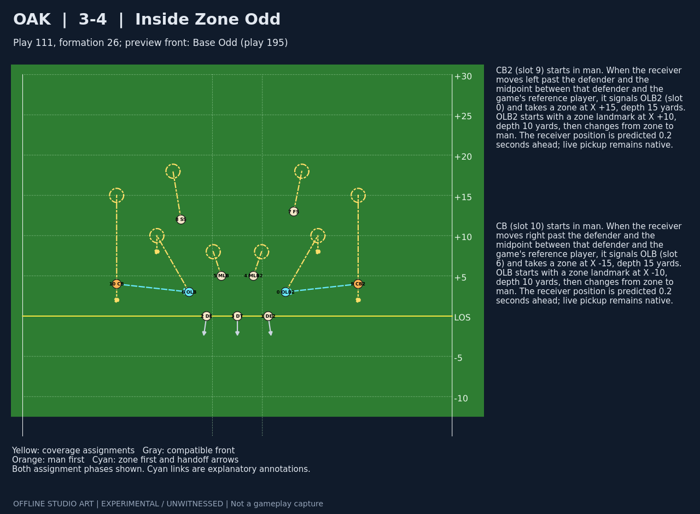](OAK-p111-f26.png) |
| OAK | 3-4 (f26) | Zone Double Steal (p153) | CB2 (slot 9) starts in man. When the receiver goes beyond the defender and reaches 15 yards downfield, it signals FS (slot 7) and takes a zone at X +15, depth 12 yards. FS starts with a zone landmark at X +15, depth 15 yards, then changes from zone to man. The receiver position is predicted 0.2 seconds ahead; live pickup remains native.  CB (slot 10) starts in man. When the receiver goes beyond the defender and reaches 15 yards downfield, it signals SS (slot 8) and takes a zone at X -15, depth 12 yards. SS starts with a zone landmark at X -15, depth 15 yards, then changes from zone to man. The receiver position is predicted 0.2 seconds ahead; live pickup remains native. | [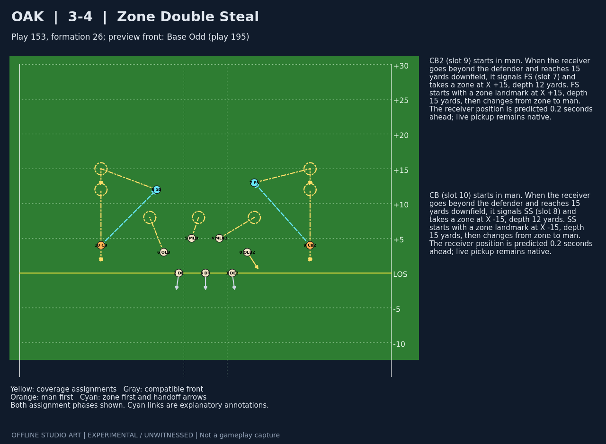](OAK-p153-f26.png) |
| PHI | Nickel (f25) | Combo Inside Zone (p15) | CB2 (slot 9) starts in man. When the receiver moves left past the defender and the midpoint between that defender and the game's reference player, it signals OLB2 (slot 4) and takes a zone at X +15, depth 18 yards. OLB2 starts with a zone landmark at X +8, depth 10 yards, then changes from zone to man. The receiver position is predicted 0.2 seconds ahead; live pickup remains native.  CB (slot 10) starts in man. When the receiver moves right past the defender and the midpoint between that defender and the game's reference player, it signals CB3 (slot 6) and takes a zone at X -15, depth 18 yards. CB3 starts with a zone landmark at X -8, depth 10 yards, then changes from zone to man. The receiver position is predicted 0.2 seconds ahead; live pickup remains native. |  |
| PHI | Dime (f26) | Combo Inside Zone (p15) | CB2 (slot 9) starts in man. When the receiver moves left past the defender and the midpoint between that defender and the game's reference player, it signals CB4 (slot 4) and takes a zone at X +15, depth 18 yards. CB4 starts with a zone landmark at X +8, depth 10 yards, then changes from zone to man. The receiver position is predicted 0.2 seconds ahead; live pickup remains native.  CB (slot 10) starts in man. When the receiver moves right past the defender and the midpoint between that defender and the game's reference player, it signals CB3 (slot 6) and takes a zone at X -15, depth 18 yards. CB3 starts with a zone landmark at X -8, depth 10 yards, then changes from zone to man. The receiver position is predicted 0.2 seconds ahead; live pickup remains native. |  |
| PHI | 4-3 (f24) | Strong Bracket 1 (p186) | CB (slot 10) starts in man. When the receiver goes beyond the defender and reaches 15 yards downfield, it signals SS (slot 8) and takes a zone at X -15, depth 12 yards. SS starts with a zone landmark at X -15, depth 15 yards, then changes from zone to man. The receiver position is predicted 0.2 seconds ahead; live pickup remains native. |  |
| PHI | Nickel (f25) | Strong Bracket 1 (p186) | CB (slot 10) starts in man. When the receiver goes beyond the defender and reaches 15 yards downfield, it signals SS (slot 8) and takes a zone at X -15, depth 12 yards. SS starts with a zone landmark at X -15, depth 15 yards, then changes from zone to man. The receiver position is predicted 0.2 seconds ahead; live pickup remains native. |  |
| PHI | Dime (f26) | Strong Bracket 1 (p186) | CB (slot 10) starts in man. When the receiver goes beyond the defender and reaches 15 yards downfield, it signals SS (slot 8) and takes a zone at X -15, depth 12 yards. SS starts with a zone landmark at X -15, depth 15 yards, then changes from zone to man. The receiver position is predicted 0.2 seconds ahead; live pickup remains native. | [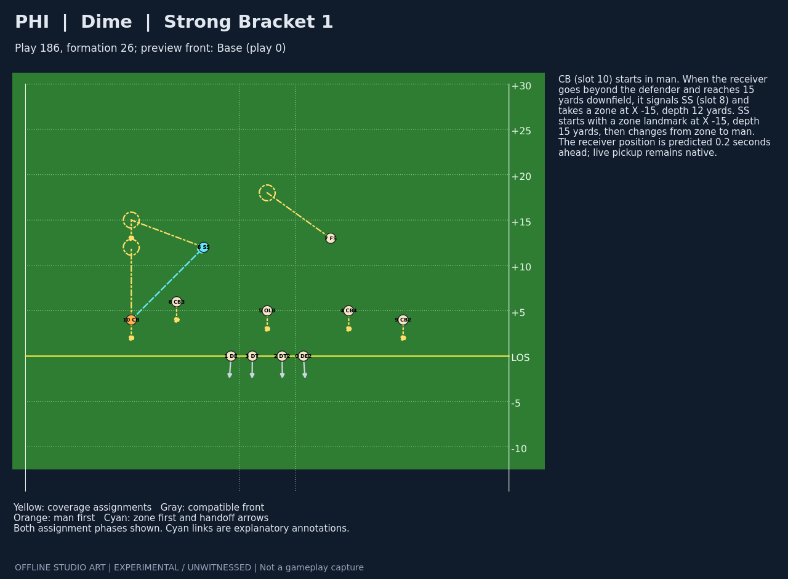](PHI-p186-f26.png) |
| PHI | 4-3 (f24) | Weak Bracket 1 (p187) | CB2 (slot 9) starts in man. When the receiver goes beyond the defender and reaches 15 yards downfield, it signals FS (slot 7) and takes a zone at X +15, depth 12 yards. FS starts with a zone landmark at X +15, depth 15 yards, then changes from zone to man. The receiver position is predicted 0.2 seconds ahead; live pickup remains native. |  |
| PHI | Nickel (f25) | Weak Bracket 1 (p187) | CB2 (slot 9) starts in man. When the receiver goes beyond the defender and reaches 15 yards downfield, it signals FS (slot 7) and takes a zone at X +15, depth 12 yards. FS starts with a zone landmark at X +15, depth 15 yards, then changes from zone to man. The receiver position is predicted 0.2 seconds ahead; live pickup remains native. |  |
| PHI | Dime (f26) | Weak Bracket 1 (p187) | CB2 (slot 9) starts in man. When the receiver goes beyond the defender and reaches 15 yards downfield, it signals FS (slot 7) and takes a zone at X +15, depth 12 yards. FS starts with a zone landmark at X +15, depth 15 yards, then changes from zone to man. The receiver position is predicted 0.2 seconds ahead; live pickup remains native. |  |
| PIT | 3-4 (f24) | Combo Inside Zone (p7) | CB2 (slot 9) starts in man. When the receiver moves left past the defender and the midpoint between that defender and the game's reference player, it signals OLB2 (slot 0) and takes a zone at X +15, depth 15 yards. OLB2 starts with a zone landmark at X +10, depth 10 yards, then changes from zone to man. The receiver position is predicted 0.2 seconds ahead; live pickup remains native.  CB (slot 10) starts in man. When the receiver moves right past the defender and the midpoint between that defender and the game's reference player, it signals OLB (slot 6) and takes a zone at X -15, depth 15 yards. OLB starts with a zone landmark at X -10, depth 10 yards, then changes from zone to man. The receiver position is predicted 0.2 seconds ahead; live pickup remains native. |  |
| PIT | Dime (f26) | Combo Inside Zone (p7) | CB2 (slot 9) starts in man. When the receiver moves left past the defender and the midpoint between that defender and the game's reference player, it signals OLB2 (slot 0) and takes a zone at X +15, depth 15 yards. OLB2 starts with a zone landmark at X +10, depth 10 yards, then changes from zone to man. The receiver position is predicted 0.2 seconds ahead; live pickup remains native.  CB (slot 10) starts in man. When the receiver moves right past the defender and the midpoint between that defender and the game's reference player, it signals CB3 (slot 6) and takes a zone at X -15, depth 15 yards. CB3 starts with a zone landmark at X -10, depth 10 yards, then changes from zone to man. The receiver position is predicted 0.2 seconds ahead; live pickup remains native. |  |
| PIT | 3-4 (f24) | Combo Strong Zone (p8) | CB2 (slot 9) starts in man. When the receiver moves left past the defender and the midpoint between that defender and the game's reference player, it signals OLB2 (slot 0) and takes a zone at X +14, depth 18 yards. OLB2 starts with a zone landmark at X +8, depth 10 yards, then changes from zone to man. The receiver position is predicted 0.2 seconds ahead; live pickup remains native. | [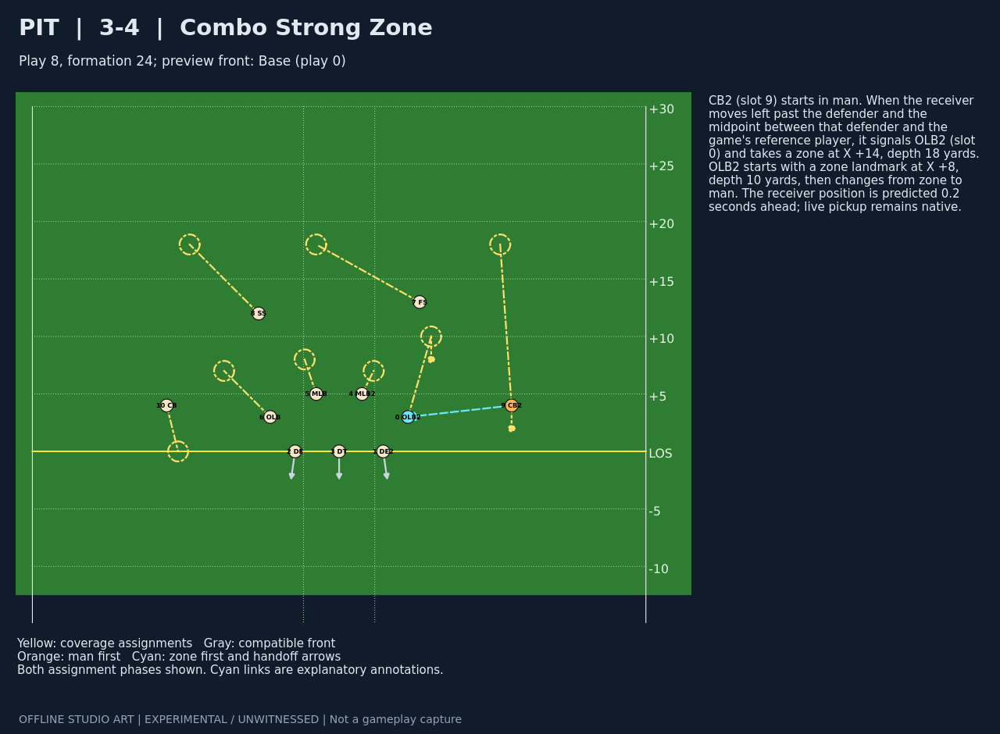](PIT-p008-f24.png) |
| PIT | Dime (f26) | Combo Weak Zone (p30) | CB (slot 10) starts in man. When the receiver moves right past the defender and the midpoint between that defender and the game's reference player, it signals OLB (slot 5) and takes a zone at X -15, depth 15 yards. OLB starts with a zone landmark at X -8, depth 8 yards, then changes from zone to man. The receiver position is predicted 0.2 seconds ahead; live pickup remains native. | [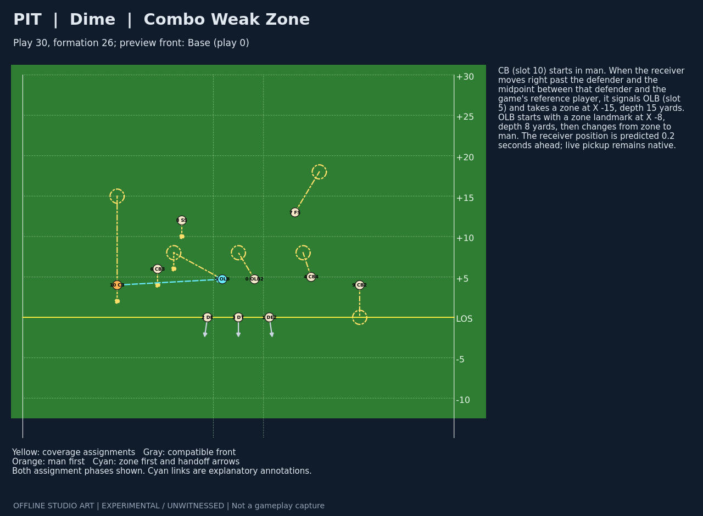](PIT-p030-f26.png) |
| PRACTICE | All | No explicit exchange | Ordinary man and zone are excluded. | |
| reference | Nickel (f29) | Combo Inside Zone (p23) | CB2 (slot 9) starts in man. When the receiver moves left past the defender and the midpoint between that defender and the game's reference player, it signals OLB (slot 4) and takes a zone at X +15, depth 18 yards. OLB starts with a zone landmark at X +8, depth 10 yards, then changes from zone to man. The receiver position is predicted 0.2 seconds ahead; live pickup remains native.  CB (slot 10) starts in man. When the receiver moves right past the defender and the midpoint between that defender and the game's reference player, it signals CB3 (slot 6) and takes a zone at X -15, depth 18 yards. CB3 starts with a zone landmark at X -8, depth 10 yards, then changes from zone to man. The receiver position is predicted 0.2 seconds ahead; live pickup remains native. | [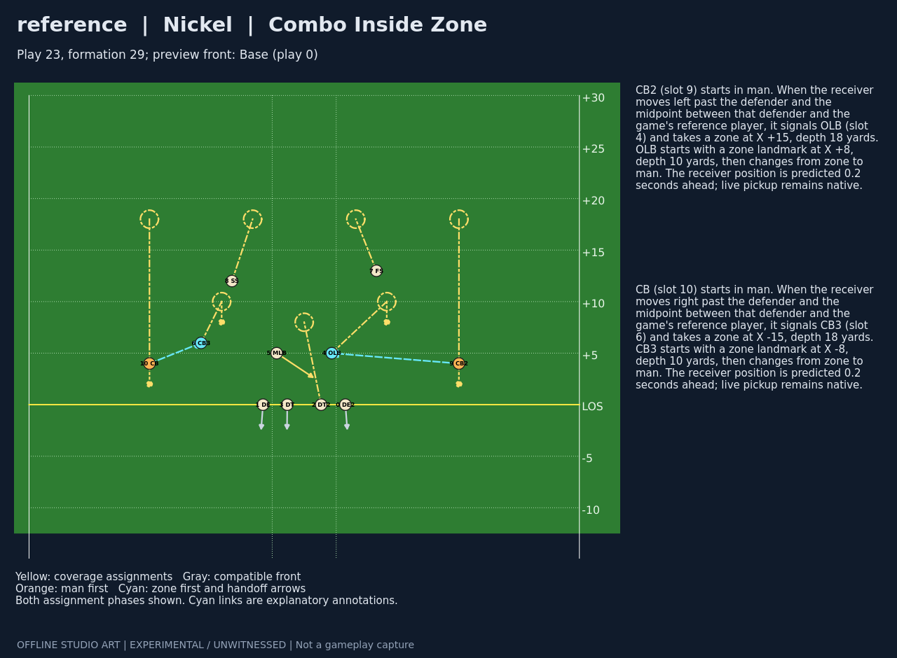](reference-p023-f29.png) |
| SD | 3-4 (f24) | Combo Inside Zone (p177) | CB2 (slot 9) starts in man. When the receiver moves left past the defender and the midpoint between that defender and the game's reference player, it signals OLB2 (slot 0) and takes a zone at X +15, depth 15 yards. OLB2 starts with a zone landmark at X +10, depth 10 yards, then changes from zone to man. The receiver position is predicted 0.2 seconds ahead; live pickup remains native.  CB (slot 10) starts in man. When the receiver moves right past the defender and the midpoint between that defender and the game's reference player, it signals OLB (slot 6) and takes a zone at X -15, depth 15 yards. OLB starts with a zone landmark at X -10, depth 10 yards, then changes from zone to man. The receiver position is predicted 0.2 seconds ahead; live pickup remains native. |  |
| SD | Nickel (f25) | Combo Inside Zone (p177) | CB2 (slot 9) starts in man. When the receiver moves left past the defender and the midpoint between that defender and the game's reference player, it signals OLB2 (slot 0) and takes a zone at X +15, depth 15 yards. OLB2 starts with a zone landmark at X +10, depth 10 yards, then changes from zone to man. The receiver position is predicted 0.2 seconds ahead; live pickup remains native.  CB (slot 10) starts in man. When the receiver moves right past the defender and the midpoint between that defender and the game's reference player, it signals CB3 (slot 6) and takes a zone at X -15, depth 15 yards. CB3 starts with a zone landmark at X -10, depth 10 yards, then changes from zone to man. The receiver position is predicted 0.2 seconds ahead; live pickup remains native. |  |
| SD | Nickel (f25) | Combo Strong Zone (p178) | CB2 (slot 9) starts in man. When the receiver moves left past the defender and the midpoint between that defender and the game's reference player, it signals OLB2 (slot 0) and takes a zone at X +14, depth 18 yards. OLB2 starts with a zone landmark at X +8, depth 10 yards, then changes from zone to man. The receiver position is predicted 0.2 seconds ahead; live pickup remains native. | [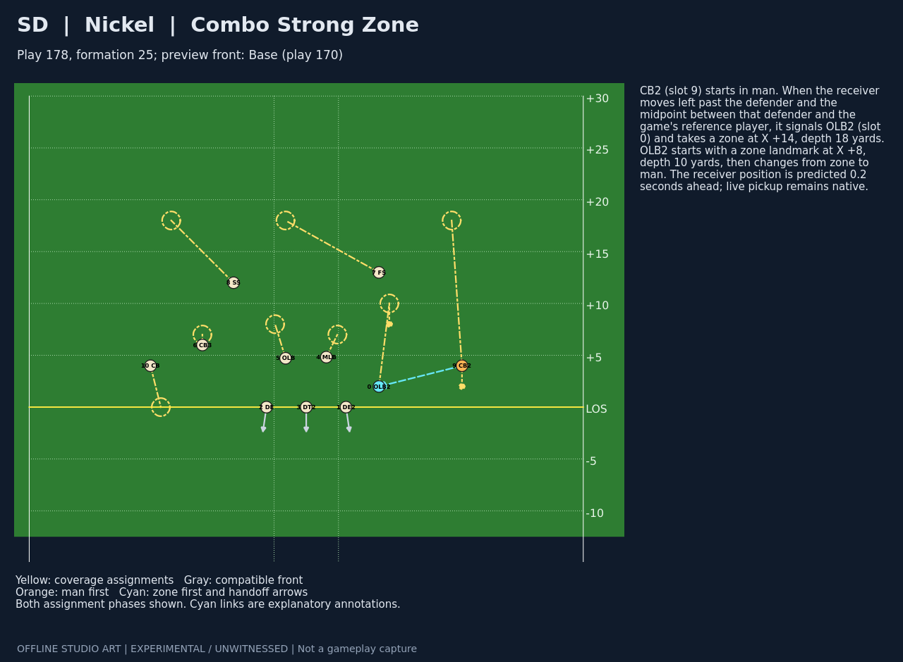](SD-p178-f25.png) |
| SD | Dime (f26) | Combo Weak Zone (p200) | CB (slot 10) starts in man. When the receiver moves right past the defender and the midpoint between that defender and the game's reference player, it signals OLB (slot 5) and takes a zone at X -15, depth 15 yards. OLB starts with a zone landmark at X -8, depth 8 yards, then changes from zone to man. The receiver position is predicted 0.2 seconds ahead; live pickup remains native. |  |
| SEA | Nickel (f27) | Combo Inside Zone (p15) | CB2 (slot 9) starts in man. When the receiver moves left past the defender and the midpoint between that defender and the game's reference player, it signals OLB (slot 4) and takes a zone at X +15, depth 18 yards. OLB starts with a zone landmark at X +8, depth 10 yards, then changes from zone to man. The receiver position is predicted 0.2 seconds ahead; live pickup remains native.  CB (slot 10) starts in man. When the receiver moves right past the defender and the midpoint between that defender and the game's reference player, it signals CB3 (slot 6) and takes a zone at X -15, depth 18 yards. CB3 starts with a zone landmark at X -8, depth 10 yards, then changes from zone to man. The receiver position is predicted 0.2 seconds ahead; live pickup remains native. |  |
| SEA | Dime (f28) | Combo Inside Zone (p15) | CB2 (slot 9) starts in man. When the receiver moves left past the defender and the midpoint between that defender and the game's reference player, it signals CB4 (slot 4) and takes a zone at X +15, depth 18 yards. CB4 starts with a zone landmark at X +8, depth 10 yards, then changes from zone to man. The receiver position is predicted 0.2 seconds ahead; live pickup remains native.  CB (slot 10) starts in man. When the receiver moves right past the defender and the midpoint between that defender and the game's reference player, it signals CB3 (slot 6) and takes a zone at X -15, depth 18 yards. CB3 starts with a zone landmark at X -8, depth 10 yards, then changes from zone to man. The receiver position is predicted 0.2 seconds ahead; live pickup remains native. | [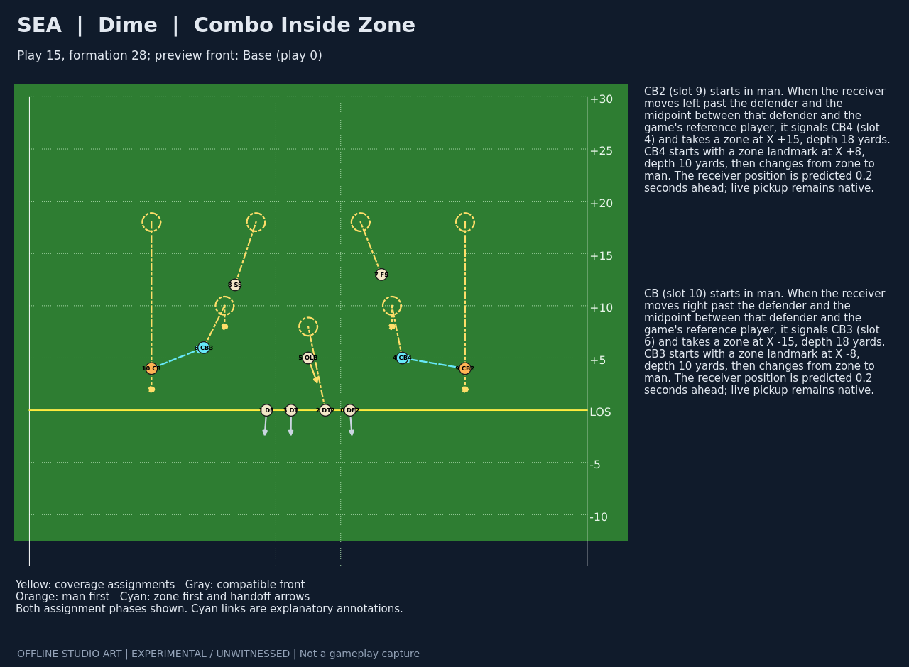](SEA-p015-f28.png) |
| SF | Nickel (f23) | Combo Inside Zone (p28) | CB2 (slot 9) starts in man. When the receiver moves left past the defender and the midpoint between that defender and the game's reference player, it signals OLB (slot 4) and takes a zone at X +15, depth 18 yards. OLB starts with a zone landmark at X +8, depth 10 yards, then changes from zone to man. The receiver position is predicted 0.2 seconds ahead; live pickup remains native.  CB (slot 10) starts in man. When the receiver moves right past the defender and the midpoint between that defender and the game's reference player, it signals CB3 (slot 6) and takes a zone at X -15, depth 18 yards. CB3 starts with a zone landmark at X -8, depth 10 yards, then changes from zone to man. The receiver position is predicted 0.2 seconds ahead; live pickup remains native. |  |
| SF | Dime (f24) | Combo Inside Zone (p28) | CB2 (slot 9) starts in man. When the receiver moves left past the defender and the midpoint between that defender and the game's reference player, it signals CB4 (slot 4) and takes a zone at X +15, depth 18 yards. CB4 starts with a zone landmark at X +8, depth 10 yards, then changes from zone to man. The receiver position is predicted 0.2 seconds ahead; live pickup remains native.  CB (slot 10) starts in man. When the receiver moves right past the defender and the midpoint between that defender and the game's reference player, it signals CB3 (slot 6) and takes a zone at X -15, depth 18 yards. CB3 starts with a zone landmark at X -8, depth 10 yards, then changes from zone to man. The receiver position is predicted 0.2 seconds ahead; live pickup remains native. |  |
| STL | 4-3 (f28) | Combo Inside Zone (p125) | CB2 (slot 9) starts in man. When the receiver moves left past the defender and the midpoint between that defender and the game's reference player, it signals OLB2 (slot 4) and takes a zone at X +15, depth 18 yards. OLB2 starts with a zone landmark at X +8, depth 10 yards, then changes from zone to man. The receiver position is predicted 0.2 seconds ahead; live pickup remains native.  CB (slot 10) starts in man. When the receiver moves right past the defender and the midpoint between that defender and the game's reference player, it signals OLB (slot 6) and takes a zone at X -15, depth 18 yards. OLB starts with a zone landmark at X -8, depth 10 yards, then changes from zone to man. The receiver position is predicted 0.2 seconds ahead; live pickup remains native. |  |
| STL | Nickel (f29) | Combo Inside Zone (p125) | CB2 (slot 9) starts in man. When the receiver moves left past the defender and the midpoint between that defender and the game's reference player, it signals OLB (slot 4) and takes a zone at X +15, depth 18 yards. OLB starts with a zone landmark at X +8, depth 10 yards, then changes from zone to man. The receiver position is predicted 0.2 seconds ahead; live pickup remains native.  CB (slot 10) starts in man. When the receiver moves right past the defender and the midpoint between that defender and the game's reference player, it signals CB3 (slot 6) and takes a zone at X -15, depth 18 yards. CB3 starts with a zone landmark at X -8, depth 10 yards, then changes from zone to man. The receiver position is predicted 0.2 seconds ahead; live pickup remains native. |  |
| STL | Dime (f30) | Combo Inside Zone (p125) | CB2 (slot 9) starts in man. When the receiver moves left past the defender and the midpoint between that defender and the game's reference player, it signals CB4 (slot 4) and takes a zone at X +15, depth 18 yards. CB4 starts with a zone landmark at X +8, depth 10 yards, then changes from zone to man. The receiver position is predicted 0.2 seconds ahead; live pickup remains native.  CB (slot 10) starts in man. When the receiver moves right past the defender and the midpoint between that defender and the game's reference player, it signals CB3 (slot 6) and takes a zone at X -15, depth 18 yards. CB3 starts with a zone landmark at X -8, depth 10 yards, then changes from zone to man. The receiver position is predicted 0.2 seconds ahead; live pickup remains native. |  |
| TB | 4-3 (f32) | Combo Inside Zone (p12) | CB2 (slot 9) starts in man. When the receiver moves left past the defender and the midpoint between that defender and the game's reference player, it signals OLB2 (slot 4) and takes a zone at X +15, depth 18 yards. OLB2 starts with a zone landmark at X +8, depth 10 yards, then changes from zone to man. The receiver position is predicted 0.2 seconds ahead; live pickup remains native.  CB (slot 10) starts in man. When the receiver moves right past the defender and the midpoint between that defender and the game's reference player, it signals OLB (slot 6) and takes a zone at X -15, depth 18 yards. OLB starts with a zone landmark at X -8, depth 10 yards, then changes from zone to man. The receiver position is predicted 0.2 seconds ahead; live pickup remains native. |  |
| TB | Nickel (f33) | Combo Inside Zone (p12) | CB2 (slot 9) starts in man. When the receiver moves left past the defender and the midpoint between that defender and the game's reference player, it signals OLB (slot 4) and takes a zone at X +15, depth 18 yards. OLB starts with a zone landmark at X +8, depth 10 yards, then changes from zone to man. The receiver position is predicted 0.2 seconds ahead; live pickup remains native.  CB (slot 10) starts in man. When the receiver moves right past the defender and the midpoint between that defender and the game's reference player, it signals CB3 (slot 6) and takes a zone at X -15, depth 18 yards. CB3 starts with a zone landmark at X -8, depth 10 yards, then changes from zone to man. The receiver position is predicted 0.2 seconds ahead; live pickup remains native. |  |
| TB | Dime (f34) | Combo Inside Zone (p12) | CB2 (slot 9) starts in man. When the receiver moves left past the defender and the midpoint between that defender and the game's reference player, it signals CB4 (slot 4) and takes a zone at X +15, depth 18 yards. CB4 starts with a zone landmark at X +8, depth 10 yards, then changes from zone to man. The receiver position is predicted 0.2 seconds ahead; live pickup remains native.  CB (slot 10) starts in man. When the receiver moves right past the defender and the midpoint between that defender and the game's reference player, it signals CB3 (slot 6) and takes a zone at X -15, depth 18 yards. CB3 starts with a zone landmark at X -8, depth 10 yards, then changes from zone to man. The receiver position is predicted 0.2 seconds ahead; live pickup remains native. |  |
| TB | 4-3 (f32) | Weak Combo Strong Zone (p14) | CB2 (slot 9) starts in man. When the receiver goes beyond the defender and reaches 15 yards downfield, it signals FS (slot 7) and takes a zone at X +15, depth 9 yards. FS starts with a zone landmark at X +9, depth 12 yards, then changes from zone to man. The receiver position is predicted 0.2 seconds ahead; live pickup remains native. |  |
| TEN | 4-3 (f21) | Combo Inside Zone (p14) | CB2 (slot 9) starts in man. When the receiver moves left past the defender and the midpoint between that defender and the game's reference player, it signals OLB2 (slot 4) and takes a zone at X +15, depth 18 yards. OLB2 starts with a zone landmark at X +8, depth 10 yards, then changes from zone to man. The receiver position is predicted 0.2 seconds ahead; live pickup remains native.  CB (slot 10) starts in man. When the receiver moves right past the defender and the midpoint between that defender and the game's reference player, it signals OLB (slot 6) and takes a zone at X -15, depth 18 yards. OLB starts with a zone landmark at X -8, depth 10 yards, then changes from zone to man. The receiver position is predicted 0.2 seconds ahead; live pickup remains native. |  |
| TEN | Nickel (f22) | Combo Strong Zone (p28) | OLB (slot 4) has a zone-to-man continuation, waiting for its own slot signal; its later man node names CB2 (slot 9) as partner. The stored partner slots are not reciprocal. Live effect is unproved.  CB2 (slot 9) has a man-to-zone rule when the receiver moves left past the defender and the midpoint between that defender and the game's reference player. It signals DE2 (slot 0), then takes a zone at X +14, depth 18 yards. The stored partner slots are not reciprocal. Live effect is unproved. |  |
| TEN | Dime (f23) | Combo Strong Zone (p28) | CB3 (slot 4) has a zone-to-man continuation, waiting for its own slot signal; its later man node names CB2 (slot 9) as partner. The stored partner slots are not reciprocal. Live effect is unproved.  CB2 (slot 9) has a man-to-zone rule when the receiver moves left past the defender and the midpoint between that defender and the game's reference player. It signals DE2 (slot 0), then takes a zone at X +14, depth 18 yards. The stored partner slots are not reciprocal. Live effect is unproved. |  |
| WAS | Nickel (f26) | Zone Double Steal (p25) | CB2 (slot 9) starts in man. When the receiver goes beyond the defender and reaches 15 yards downfield, it signals FS (slot 7) and takes a zone at X +15, depth 12 yards. FS starts with a zone landmark at X +15, depth 15 yards, then changes from zone to man. The receiver position is predicted 0.2 seconds ahead; live pickup remains native.  CB (slot 10) starts in man. When the receiver goes beyond the defender and reaches 15 yards downfield, it signals SS (slot 8) and takes a zone at X -15, depth 12 yards. SS starts with a zone landmark at X -15, depth 15 yards, then changes from zone to man. The receiver position is predicted 0.2 seconds ahead; live pickup remains native. |  |
| WAS | Dime (f27) | Combo Strong Zone (p35) | CB4 (slot 4) has a zone-to-man continuation, waiting for its own slot signal; its later man node names CB2 (slot 9) as partner. The stored partner slots are not reciprocal. Live effect is unproved.  CB2 (slot 9) has a man-to-zone rule when the receiver moves left past the defender and the midpoint between that defender and the game's reference player. It signals DE2 (slot 0), then takes a zone at X +14, depth 18 yards. The stored partner slots are not reciprocal. Live effect is unproved. |  |
| WCO | 3-4 (f28) | Combo Strong Zone (p34) | CB2 (slot 9) starts in man. When the receiver moves left past the defender and the midpoint between that defender and the game's reference player, it signals OLB2 (slot 0) and takes a zone at X +14, depth 18 yards. OLB2 starts with a zone landmark at X +8, depth 10 yards, then changes from zone to man. The receiver position is predicted 0.2 seconds ahead; live pickup remains native. | [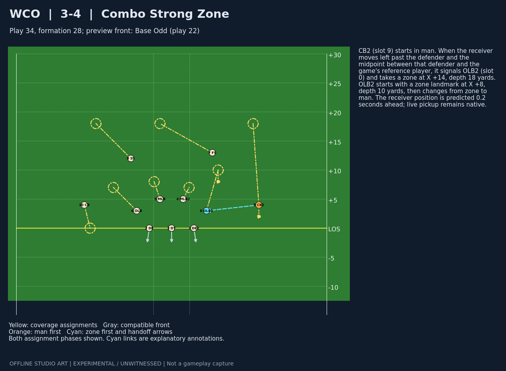](WCO-p034-f28.png) |
| WCO | 3-4 (f28) | Combo Inside Zone (p39) | CB2 (slot 9) starts in man. When the receiver moves left past the defender and the midpoint between that defender and the game's reference player, it signals OLB2 (slot 0) and takes a zone at X +15, depth 15 yards. OLB2 starts with a zone landmark at X +10, depth 10 yards, then changes from zone to man. The receiver position is predicted 0.2 seconds ahead; live pickup remains native.  CB (slot 10) starts in man. When the receiver moves right past the defender and the midpoint between that defender and the game's reference player, it signals OLB (slot 6) and takes a zone at X -15, depth 15 yards. OLB starts with a zone landmark at X -10, depth 10 yards, then changes from zone to man. The receiver position is predicted 0.2 seconds ahead; live pickup remains native. |  |
