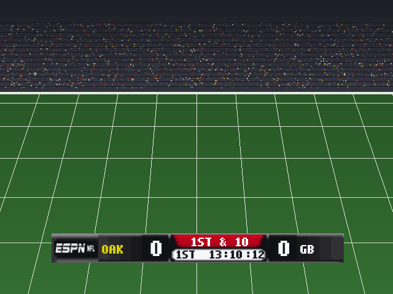
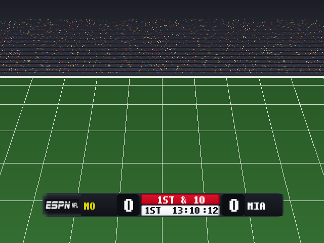
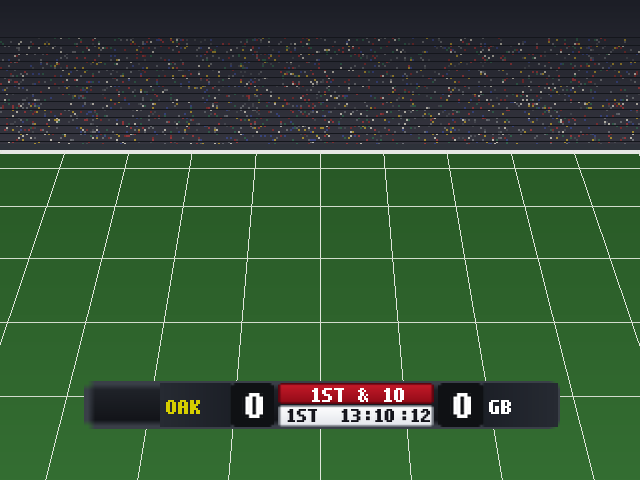
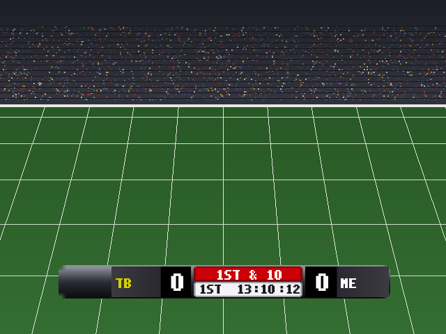
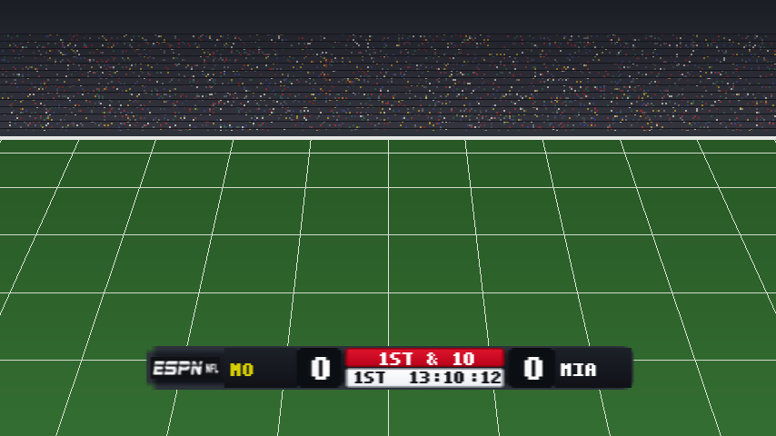
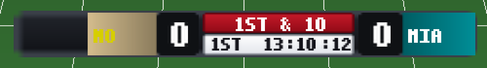

# Scorebar Studio: a two-minute guide

EXPERIMENTAL / UNWITNESSED. The Scorebar page in 2K5 Mod Studio lets you design
the in-game ESPN scorebar without any technical knowledge. You pick a preset,
recolour each part or drop in your own pictures, watch it live on a field, save
it as a folder, and hand that folder to Build. The existing **Experimental ESPN
scorebar** option installs it.


## What you can and cannot change

The game's scorebar is one small picture (a 64 x 64 atlas) cut into eight fixed
cells. This page paints those cells. The game itself draws everything else:

* team names, scores, the down and distance, quarter, clock and play clock come
  from the game's own fonts at fixed positions; the team with the ball turns yellow;
* one bar is shown for every team. **Team colours** on the page recolour the
  blocks in the preview only;
* no new cells, fonts, hooks or live timeout marks. Those need runtime work.

The preview text is a stand-in drawn from the staged broadcast glyph sheet, so it
reads in capitals ("1ST & 10"). The game's own fonts decide the real look.

## The parts of the bar

| Part | What it is | Tile size | On screen |
| --- | --- | --- | --- |
| Bar frame | the whole bar behind everything | 64 x 8 | 476 x 48 |
| ESPN mark | the network mark cell on the left | 64 x 16 | 68 x 24 |
| Away team block | behind the away name | 32 x 16 | 114 x 44 |
| Away score | the right part of the away block | 12 x 16 | 43 x 44 |
| Home team block | behind the home name | 32 x 16 | 120 x 44 |
| Home score | the left part of the home block | 12 x 16 | 45 x 44 |
| Down and distance banner | the red banner | 64 x 12 | 156 x 21 |
| Clock strip | quarter, clock and play clock | 64 x 12 | 156 x 22 |

Tiles are tiny and the game stretches them, so a one-pixel border on the frame is
about seven by six pixels on screen. Rounding and border widths on the page are
tile pixels. The clock strip must stay light: the game writes its clock text in
near-black. The page warns you when a part will hide the game's text.

## Two minutes, start to finish

1. Open **Scorebar** in the sidebar. The shipped **Reference (v10)** bar is loaded.
2. Choose a preset on the right and press **Start from this preset**:
   * **Reference (v10)**: every part is a picture from the shipped kit; save it
     unchanged and the PNGs are pixel for pixel identical;
   * **Fable ESPN template**: the Fable broadcast design's colours on the fixed cells;
   * **Plain dark**: colours only, with an empty mark cell for your own picture;
   * **Retail-like**: an approximation of the original scoreboard from colours
     alone. No retail pixels are copied and the original mark cell stays empty.
3. Click a part on the left. Use **Colour**, **Blend two or three colours**,
   **Corner rounding**, **Draw a border** and **Opacity**. Every change shows in
   the preview at once. Undo and Redo (Ctrl+Z, Ctrl+Shift+Z) work on every step.
4. Press **Use my image...** to put your own picture on a part. It is fitted to
   the part's on-screen shape (**Fit inside**, **Fill and crop** or **Stretch to
   fit**) and reduced to the tile size. **Round the picture's corners** clips it to
   the part's rounding. **Use colours instead** takes the picture off again.
5. Check the **Sample state** (1st & 10, 4th & 1, Timeouts, Two-minute), toggle
   **Widescreen 16:9** and **2x zoom**, and try **Team colours** to see the blocks
   in two teams' colours (preview only).
6. Watch the line under the preview: colours used against your colour limit, and
   an estimate of the game's 2,400-byte scorebar slot. Blends are reduced to the
   colour limit automatically; if the estimate says it does not fit, simplify.
7. Press **Save folder...** and pick a folder. The page writes `layout.json`, the
   `1x/` and `2x/` PNGs, copies of your pictures in `images/`, and
   `scorebar_studio.json` with your settings, then checks the folder with the
   same compiler Build uses.
8. Press **Use in Build**. The folder lands in the Build tab's scorebar folder
   field. Tick **Experimental ESPN scorebar** there and build a disc copy.


## The four presets

| Reference (v10) | Fable ESPN template |
| --- | --- |
|  |  |

| Plain dark | Retail-like |
| --- | --- |
|  |  |

## Sample states, widescreen and team colours

The four sample states only change the stand-in text and marks; the Timeouts
state shows where runtime timeout marks would sit, which the static bar does
not draw.


Widescreen contracts the bar by 27/32 about the centre before the 16:9 stretch,
as the widescreen option does in the game.



Team colours recolour the two blocks for the preview only. The saved bar is the
same for every team.



## Opening folders

**Open folder...** opens a folder saved here (with all its settings) or any
scorebar template folder, such as the shipped `docs/scorebug_template`. A plain
template opens as eight picture parts with exact pixels, and saving it elsewhere
writes the same PNG bytes back. Repaint a part with **Use colours instead**.

## From the command line

```sh
python3 -m mod_editor.core.nfl2k5_scorebug_author presets
python3 -m mod_editor.core.nfl2k5_scorebug_author export --preset plain_dark --folder /path/to/my-scorebar
python3 -m mod_editor.core.nfl2k5_scorebug_author preview --open /path/to/my-scorebar --out preview.png --widescreen
python3 -m mod_editor.core.nfl2k5_scorebug_author validate --folder /path/to/my-scorebar
```

Presets live in `data/nfl2k5_scorebug_studio_presets.json`. A new folder preset
(for example an exact ESPN bar) is one JSON row with a `folder`; no code changes.

## Limits, plainly

* One static bar for every team. Team art at runtime is a separate, diagnostic feature.
* No live fonts, no new cells, no live timeouts. Live text is the game's.
* The slot figure is an estimate; Build's exact fixed-span check is final.
* Nothing here has been watched in-game yet. Build a disc copy and look.
