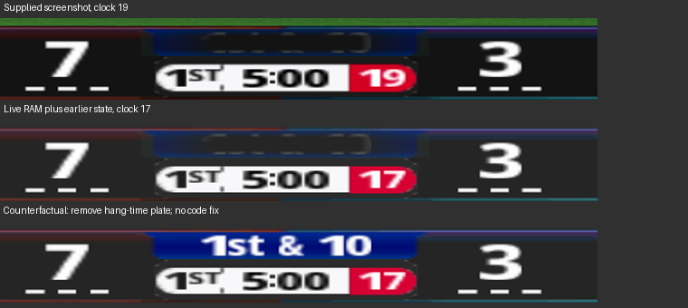

# b72-s7: live vertices correct; hang-time overdraw candidate, strict reproduction fails

The live down-label vertices have the intended white diffuse and glyph UVs. There is no field colour/index mismatch in the captured vertex data. The later `zz_ESPN_bug1` quad is an event plate, not the brand, and it covers the label in the available composite. This is a concrete overdraw candidate, but the composite misses the required luminance tolerance: mean 37.64 versus screenshot 19.66, error 17.98. Neither hypothesis reaches the requested complete cause-and-reproduction proof. No runtime fix or fitted multiplier is applied.

## 1. Live vertex data, compiler and native fixture

The input is the requested 59,207,680-byte physical RAM dump. [Input identities](inputs.json) include its hash and establish that the supplied hub `s6_reports/earlier_hud_draws.json` is byte-identical to the inherited report. The resident scene is physical `0x01e75900`, CPU direct alias `0x81e75900`. The resident position stream is `0x01e77f60 + vertex*6`; attributes are `0x01e78620 + vertex*10`, with diffuse at +0, signed-normalized UV shorts at +4/+6 and the transform index at +8. The label's first diffuse word is at `0x01e78b98`.

[QUADS.md](QUADS.md) lists all 47 owned quads, including hidden and unused field slots. [vertices.json](vertices.json) contains all four vertices of every quad, their physical addresses, raw positions, raw and normalized UVs, diffuse, projected bounds, matched glyphs, compiled fields and source cell boxes. The other 98 resident vertices are outside the compiled 47-quad allocation. Specular is not stored in this ten-byte attribute record: v4/v5 array formats are `0x2` (disabled), and the captured program does not consume those attributes. An absent specular stream must not be reported as a measured black or white value.

The most relevant active quads are:

| Field index / role | First vertices | Glyphs | Live diffuse on every corner | Packed UV cell bounds in the 256x512 atlas |
|---|---|---|---|---|
| 7 / down | 140, 144, 152, 160, 164 | `1`, `st`, `&`, `1`, `0` | `0xffffffff` | (234,194,242,206); (208,193,219,205); (246,170,254,182); (234,194,242,206); (246,184,254,196) |
| 0 / away score | 52 | `7` | `0xfffdfdfd` | (183,170,195,191) |
| 1 / home score | 64 | `3` | `0xfffdfdfd` | (127,160,139,181) |
| 2 / clock | 76, 80, 84, 88 | `5:00` | `0xff000000` | (71,200,76,211); (246,86,246,93); (248,60,253,71) twice |
| 3 / play clock | 96, 100 | `17` | `0xffffffff` | (55,201,62,211); (137,197,144,207) |
| 4 / quarter | 104, 108 | `1ST` | `0xff1e1e1e` | (55,201,62,211); (164,197,174,204) |

The label spaces at 148 and 156 have zero area and zero diffuse alpha; 168 is the unused final slot. They cannot darken a glyph. The colon uses the compiler's centre coordinate for a one-pixel cell; its equal U endpoints are intentional. In packed position space, the five label glyphs span X=-905..4026, Y=-7751..-6780, Z=2301. Both score glyphs span Y=-8916..-7201 at the same Z; the clock spans Y=-9402..-8528. The full table retains each corner.

All 3,804 bytes of the RAM field/glyph/static table equal a fresh compilation of the pre-s5 layout and template at `ec5d68d4`, including the eight field rows. In particular, field 7 at physical `0x01e79b28` contains source=7, vertex=140, capacity=8, glyph table offset=17680, glyph count=27 and colour=`0xffffffff`. Clock field 2 at `0x01e79a10` uses source=5 and black; quarter field 4 at `0x01e79a80` uses source=4 and `0xff1e1e1e`. These source indices select formatters, not entries in a separate colour table.

The current s5/s6 layout has already changed clock and quarter to white. Comparing this older dump only to the current layout would falsely classify those two intended baseline colours as corrupt. The baseline comparison above uses the actual matching table revision and preserves the current team colours.

The compiler writes the colour in each field's own row at `mod_editor/core/nfl2k5_scorebug_sprite.py:360`. The owner writes that row's UVs at `tools/scorebug_sprite/runtime.c:159-161` and its colour at line 163 through `color()` at lines 35-36. There is no evidence here of a stale colour slot, a team tint leaking into the label, or a field index being used as a colour index. A native fixture using SF 7 at BUF 3, 1st-and-10, 5:00, quarter 1 and play clock 17 matches **all 47 quads byte-for-byte** in both vertex streams. [Native comparison](native_comparison.json) records zero field and zero static-quad mismatches.

The input timing has a concrete inconsistency: the screenshot says play clock **19**, while RAM UVs decode unambiguously to **17**. The GPU state is from the still earlier 13:55:28 window. These cannot be represented as one frozen draw snapshot. Also, s6's `analyze_capture.py:168-186` already read the label diffuse and UVs from live RAM; the statement that s5 used a fixture should not be extended to s6.

## 2. Every later draw in the supplied HUD inventory

The label is inferred draw 392. [overdraw.json](overdraw.json) lists every quad of all three subsequent draws, including geometry that does not intersect the label. Indices are the resident RAM descriptors, because the stock trace omitted ARRAY_ELEMENT16 values. Projected coordinates below use the captured c8, c27..29 and c0..3 values with the existing 40-pixel horizontal crop. This is independent of the native fixture geometry.

| Draw | Material / actual role | Texture physical offset | Diffuse | Label intersection |
|---|---|---|---|---|
| 393 | `yscore_buga`, scores and clocks | `0x01e55480` | Scores `0xfffdfdfd`, clock black, quarter `0xff1e1e1e`, play clock white | None |
| 394 | `zscore_buga`, away logo | `0x01e50080` | White | None |
| 395 | `zz_ESPN_bug1`, **hang-time event plate**, vertex 184 | `0x01e55480`, palette `0x01e75480` | White | Entire active label box |

All use observed blend enable=1, SRC_ALPHA=`0x302`, ONE_MINUS_SRC_ALPHA=`0x303`, ADD=`0x8006`. The hang plate has the same observed fragment state as the label. Its four UVs address the `(249,90,251,92)` event cell; all four texels are opaque RGB=(37,37,37). The plate projects to `(274.996,408.825)-(364.338,425.424)` and covers the label bounds `(293.338,410.902)-(346.666,423.348)`, intersection area 663.71 HUD pixels squared. Bilinear sampling of the small cell's transparent gutter leaves lighter edges in the composite.

The s6 report's role for draw 395 was wrong. The actual watermark is vertex 48 in earlier draw 389 (`score_buga`). The compiler's event allocation at `nfl2k5_scorebug_sprite.py:334` assigns vertex 184 to `hang time`. Material names inherited from retail are not reliable role names.

The three other event plates at 172, 176 and 180 also occupy the label rectangle, but their RAM material flags are `0x80000001`, so they are hidden and absent from the supplied visible draw inventory. They are not secretly included in the composite. This accounts for the full supplied HUD inventory; it is not a claim to have recovered every subsequent draw in the complete frame.

## 3. Composite, visibility discrepancy and stopping gate

The model reuses `projection.render_native`, the s5 bilinear raster and fragment pipeline, and s6's exact P8 decoder. Only the input adapter supplies live vertices, live textures, descriptor order and captured projection constants. The screenshot's visible picture rectangle supplies the geometric scale. No colour gain, bias, gamma adjustment or new multiplier is used. The same explicit interior rectangle as s6, display `(555,631)-(646,645)`, is measured in every image.

| Input | Interior min | Interior mean | Interior max |
|---|---:|---:|---:|
| Supplied screenshot | 18.4452 | 19.6564 | 32.7874 |
| Live-data composite with hang plate | 37.0000 | 37.6404 | 50.0000 |
| Absolute error | **18.5548** | **17.9840** | **17.2126** |
| Remove only hang plate, counterfactual | 16.3146 | 120.0963 | 255.0000 |

[model.json](model.json), [composite](composite.png), [counterfactual](without_hang_counterfactual.png). The counterfactual restores bright letters, but it is not a validated code change, a successful within-15 reproduction, or an all-team contrast proof. The observed dark silhouette is consistent with the event plate; the required numeric gate fails for all three reported statistics.

The hang-time binding itself is correct: `runtime.c:101` binds `0xa95aec` to logical material 10, which `material()` at line 32 maps to native material 8, CPU `0x81e75ec0`. The main per-frame reset at line 171 iterates logical materials 3 through 9 and does **not** include this event material. Changing this mapping or clearing another field's colour would be unjustified.

The RAM event record at VA `0xa95aa8`, physical `0x00b90aa8`, has binding=1, request=0, minimum=0 and slide=0, while its material has visible flags=`0x80000000`. The inactive FUMBLE/FLAG/ball-on records are hidden. This is the notable visibility discrepancy, but these values come from different physical regions of an unsynchronized capture. The sole recursive page-directory candidate at physical `0x0000f000` maps the global scene pointer to the independently known resident scene; no CPU VA was blindly used as a physical offset.

The dumped native update code at `0xfcf6b..0xfcf8c` compares slide-minus-minimum with 3.0 and writes the material's hidden bit. The bounded offline replay of dumped `0xfce70`, with dt=0 and only `FC9C0` replaced by `RET 4` to retain captured requests, completes and records **one** write to the hang plate flags: PC `0xfcf8c`, value `0x80000001`. It stays hidden through the remainder of the native frame and owner update. [Replay receipt](native_comparison.json), [dumped update disassembly](disasm_fce70.txt), [owner material-reset disassembly](disasm_14db65d.txt). The ordinary native fixture also hides it. This does not identify a bad writer that deterministically re-enables the inactive plate.

Decision: the label vertex hypothesis is disproved for the supplied RAM. Hang-time overdraw is a materially stronger lead than the s6 brand interpretation, but neither the strict reproduction nor the erroneous visibility-write path is established. Following the requested stopping rule, no shipping code, art, table, visibility policy, team palette, allocator or RX bytes are changed. RX remains 4,086/4,096 with ten spare bytes. No release, disc build, emulator session or new in-game result is claimed.

The existing s6 capture specification remains sufficient. If another capture is taken, its existing per-draw vertex/index/state/framebuffer requirements should specifically include the before/after image for `zz_ESPN_bug1`, hang record `0xa95aa8`, binding `0xa95aec` and writes to material flags `0x81e75ec8` for this resident instance. Addresses can move in another run. Do not publish the counterfactual as a fix.

Reproduce the evidence with `python3 reports/b72_s7/analyze_vertices.py`. It reads the external RAM, screenshot and hub report, uses the existing baseline compiler/native fixture, and writes only derived reports and renders.
