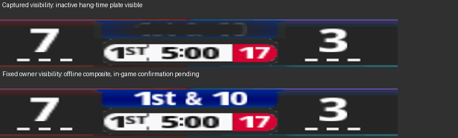
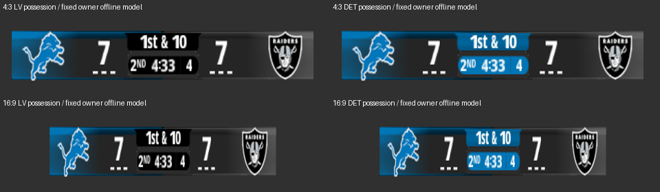

# b72-s8: inactive event plates hidden by the sprite owner

The rebuilt owner makes all four event plates follow their event records every frame. Offline retained native execution and the captured-RAM visibility replay pass. The live-data composite restores bright `1st & 10` lettering. Noah's test disc is the final in-game gate; no in-game result is claimed.

The shipping change is in `tools/scorebug_sprite/runtime.c`, regenerated into `mod_editor/core/nfl2k5_scorebug_sprite_code.py`. The existing loop covers logical 3 through 9, the regular bar and logos. It clears the hidden bit, so merely extending it through logical 10 would make hang time visible. Every event material is outside that loop:

| Event | Record | Logical material | Native material | First vertex |
|---|---|---:|---:|---:|
| Hang time | `0xa95aa8` | 10 | 8 | 184 |
| Flag | `0xa95b18` | 2 | 1 | 180 |
| Ball on | `0xa95b88` | 1 | 0 | 176 |
| Fumble | `0xa95bf8` | 0 | 5 | 172 |

The new loop visits those four native records and writes each bound material's hidden bit from the existing `element_visible` predicate. Binding availability and the current slide determine visibility. Pending requests do not show an unopened plate; an event with a cleared request can remain visible while closing. Once its slide reaches its minimum, it is hidden. The same predicate already controls the down-label suppression and preserves the native unordered floating-point behavior. Null material pointers are skipped. All other material flag bits are preserved.

The regular-material lookup now packs its existing logical 3..10 mapping into eight nibbles. The missing-logo checks are folded into that same reset loop. Native tests verify all seven regular material slots, hang-time binding, the other event bindings, and that the layout's complete event-material set is exactly `{0,1,2,10}`. This is the complete current event allocation, not a partial hang-only repair.

The final RX owner uses **4,076 of 4,096 bytes**, ten fewer than the base and leaving 20 spare. RW remains 128 bytes. Both aspect appendices remain **324,832 bytes**, unchanged from s5/s7, with 34 textures, one scene, 47 quads and no added FONT. No allocation, hook site or resource size grows. The intermediate 4,096-byte candidate failed two existing padding assertions; the final implementation retains those assertions and their padding.

`tests/mod_editor/test_nfl2k5_scorebug_down_visibility.py` keeps one native machine per aspect through 675 consecutive frames: standard down, punt/hang time, next snap, ball-on, next snap, flag, next snap, fumble, next snap. It runs native request generation, slide integration, the installed owner and the native draw walk. Event, slide and material state are never reseeded between stages. Every frame checks all four plates against their record, and every eligible non-event pre-snap frame has the five bright down-label glyphs. Existing tests retain kickoff semantics and all four downs. The separate stale-flag regression seeds the opposite visibility at the owner boundary and proves recovery in both directions, including unavailable bindings and null material pointers.

`sequences.json` contains every frame, both aspects and stage-end native submission receipts. Gameplay/world query boundaries are supplied by the harness, including the kick/punt play-kind input. This is native CPU execution in Unicorn, not an emulator playthrough or GPU witness.

`both_aspects.png` also renders Raiders and Lions possession with the final owner at both aspect settings. All four fixtures hide every event plate and retain label pixels at 255. `fixture_renders.json` records the measured glyph bounds and luminance. These are crops from the native 640-pixel HUD raster before display stretching, so the widescreen row is horizontally compressed at this stage.

`live_owner.json` records execution of the rebuilt `sprite_update` on the s7 captured RAM, with an explicitly relocated owner and synthetic State/stack. Exactly one visibility bit changes: native material 8 becomes hidden. The raster consumes those actual output visibility bits while retaining s7's captured vertices, guest textures, draw order, projection and earlier GPU state. No colour adjustment or gain is introduced.

| Same label interior `(555,631)-(646,645)` | Minimum | Mean | Maximum |
|---|---:|---:|---:|
| Captured visible hang plate | 37.00 | 37.64 | 50.00 |
| Rebuilt owner visibility | 16.31 | **120.10** | **255.00** |

See `luminance.json`, `fixed_live_composite.png` and `fixed_raster.json`. The original RAM, screenshot and GPU state were not synchronized, as s7 already documented. This job does not reopen that investigation or impose its former screenshot tolerance gate. The repair and offline evidence are ready for the requested test disc.

s5's team colours, layout and template and all s6/s7 diagnostics remain byte-identical to the base. `owner_scan.json` records that audit, RX/RW permissions, absolute-write scan, hook ownership and idempotency. `VALIDATION.md` records the final tests and both closures. The cave manifest retains inherited stale source fingerprints and needs integrator regeneration for the final stack. `TEST_DISC.md` gives the exact option combination and Noah's three checks.

Reproduce the offline evidence with `python3 reports/b72_s8/prove.py`. No disc, emulator session, installer, upload or release is produced by this job.
